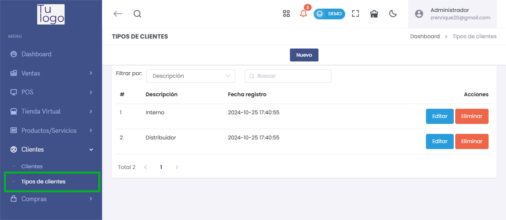
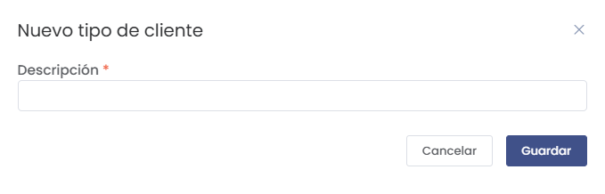

# Tipos de Cliente

En esta sección puedes gestionar los tipos de clientes disponibles en tu sistema, permitiendo clasificarlos según la necesidad del negocio.

---

## Acceso a Tipos de Cliente

1. **Navega a la sección "Clientes"** en el menú lateral.
2. Selecciona **Tipos de Clientes**.

---

## Visualización de Tipos de Cliente

En esta pantalla encontrarás los tipos de clientes registrados, con las siguientes opciones:

- **Descripción**: Nombre o tipo del cliente.
- **Fecha de Registro**: Fecha en que fue creado.
- **Acciones**: Opciones para editar o eliminar.

---

## Crear un Nuevo Tipo de Cliente

1. Haz clic en **Nuevo** para agregar un tipo de cliente.

2. **Ingresa la Descripción** del nuevo tipo de cliente.
3. Haz clic en **Guardar** para registrar el tipo.

---

## Editar un Tipo de Cliente

1. En la lista de tipos de clientes, selecciona **Editar** en el tipo que deseas modificar.

2. **Modifica la descripción** si es necesario.
3. Haz clic en **Guardar** para actualizar la información.

---

## Eliminar un Tipo de Cliente

1. Selecciona **Eliminar** junto al tipo de cliente que desees borrar.

> **Nota:** Asegúrate de que el tipo de cliente no esté asociado a ninguna transacción antes de eliminarlo.

---

