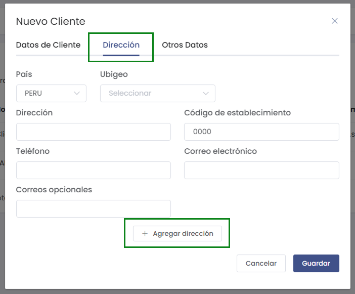

# Asignar Consignado

En este artículo aprenderás cómo asignar un consignado a un cliente. Sigue los pasos detallados a continuación para realizar el proceso correctamente.

## 1. Ingresar al módulo de Clientes

Dirígete al menú lateral y selecciona la opción **Clientes**. Luego haz clic en el botón **Nuevo** para crear un nuevo cliente o edita uno existente.

## 2. Completar los datos del cliente

Llena los campos requeridos en el formulario de cliente, como país, dirección, teléfono, etc.

## 3. Agregar consignado

Marca la casilla **¿Agregar consignado?** para habilitar la sección de consignado.

:::note
Si no marcas la casilla, no se mostrará la opción para asignar consignado.
:::

## 4. Seleccionar o crear un consignado

Aparecerá la sección **Consignado**. Puedes seleccionar un consignado existente o crear uno nuevo haciendo clic en **[+ Nuevo]**.

### Crear un nuevo consignado

Al hacer clic en **[+ Nuevo]**, se abrirá un formulario donde deberás ingresar los siguientes datos:

1. **Tipo Doc. Identidad:** Selecciona el tipo de documento (DNI, RUC, etc.).
2. **Número:** Ingresa el número de documento.
3. **Nombre:** Escribe el nombre del consignado.
4. **Teléfono:** Ingresa el teléfono de contacto.

:::danger Campos Obligatorios
Los campos marcados con asterisco (**"*"**) son de carácter obligatorio y deben ser completados para poder guardar el registro del consignado correctamente. No podrás continuar si alguno de estos campos queda vacío.
:::

Completa los campos y haz clic en **Guardar**.

:::tip
El consignado creado estará disponible para ser seleccionado en la lista desplegable.
:::

## 5. Guardar los cambios

Una vez seleccionado el consignado, haz clic en **Guardar** para registrar la información del cliente junto con el consignado asignado.

:::danger IMPORTANTE
El consignado solo se asignará si la casilla **¿Agregar consignado?** está marcada y se ha seleccionado o creado un consignado válido.
:::

## Notas adicionales

- Puedes agregar varios consignados repitiendo el proceso.
- Si necesitas editar un consignado, deberás hacerlo desde la sección correspondiente de consignados.

---

## Informacion Adicional

### ¿Puedo asignar el mismo consignado con diferentes direcciones?

Sí, puedes asignar el mismo consignado a un cliente y vincularlo con diferentes direcciones. Al agregar o editar un consignado, tendrás la opción de seleccionar o registrar una dirección específica para ese consignado.

:::note
Esto es útil si tu consignado realiza entregas o retiros en más de una ubicación.
:::

### ¿Qué sucede al seleccionar el cliente en el módulo de ventas?

Cuando vas al módulo de **Ventas**.

Al momento cuando seleccionas un cliente que tiene consignados asignados, el sistema mostrará automáticamente la información del consignado y sus direcciones asociadas, sin necesidad de abrir información personal adicional.

:::info
Solo debes elegir el cliente y, si tiene consignados y varias direcciones, podrás seleccionar la que corresponda para la venta.
:::

### ¿Puedo elegir entre varias direcciones del cliente?

Sí, si el cliente tiene registradas varias direcciones, podrás seleccionar la dirección deseada al momento de realizar la venta, boleta, factura o nota de venta.

### ¿Dónde se visualiza el consignado y la dirección seleccionada?

La información del consignado y la dirección seleccionada se reflejarán en los siguientes documentos y formatos:

- **Ticket de venta**
- **PDF de comprobante**
- **Formato A4**
- **Ticket de 80mm**
- **Formato Default**

:::info
Esto asegura que tanto el consignado como la dirección elegida sean visibles y correctos en todos los formatos de impresión y emisión de comprobantes.
:::

---
