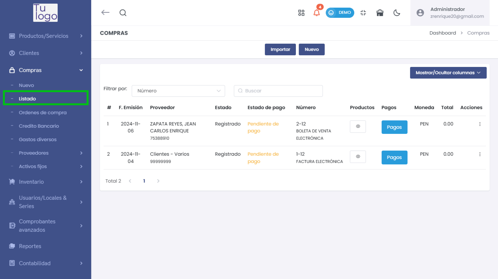
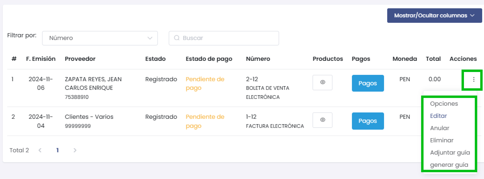
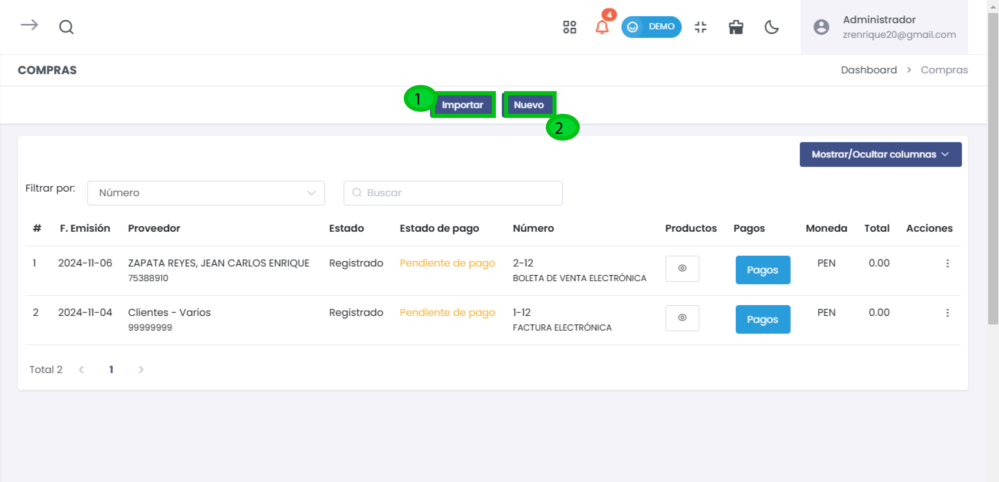
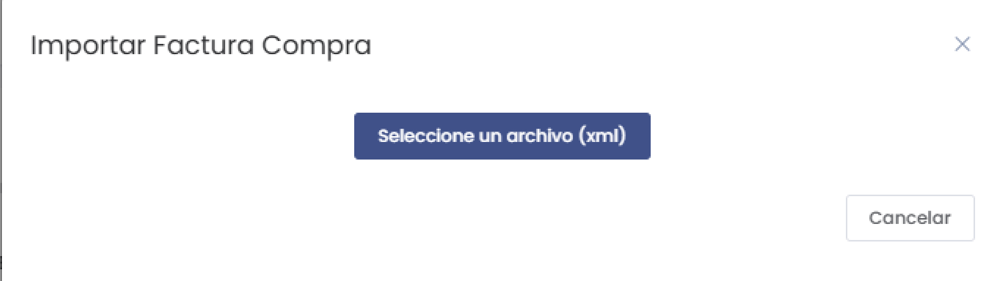
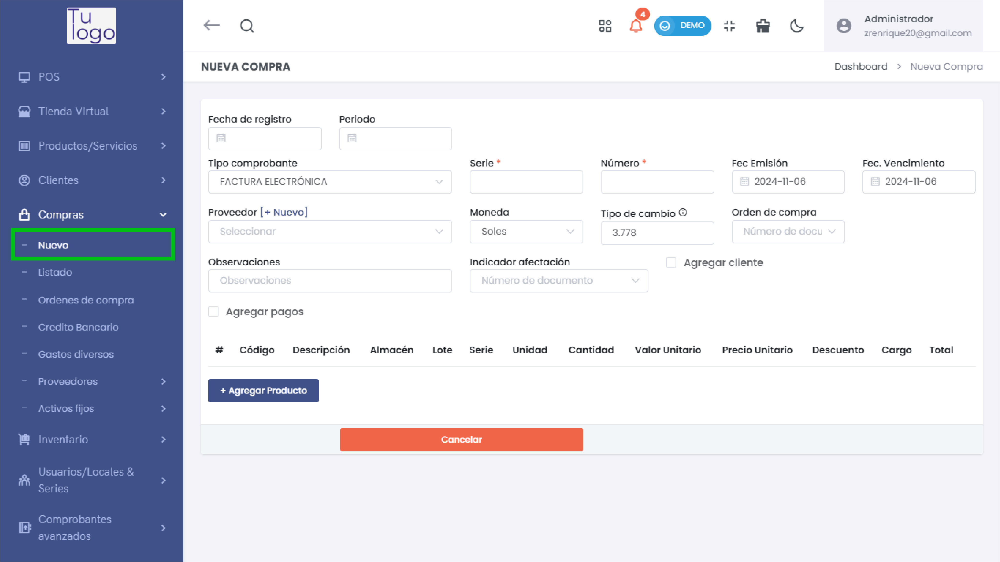

#  Compras - Listado

## Listado de Compras
En esta sección, puedes ver el historial de todas las compras registradas. Usa los filtros para buscar por **Número**, **Proveedor** o **Estado de pago**.

### Campos Principales
* **F. Emisión:** Fecha en la que se emitió el comprobante de la compra.
* **Proveedor:** Nombre del proveedor y su número de identificación.
* **Estado:** Estado actual de la compra (e.g., Registrado).
* **Estado de pago:** Muestra si el pago está pendiente o completado.
* **Número:** Número de comprobante y tipo (e.g., Boleta de Venta Electrónica, Factura Electrónica).
* **Productos:** Permite visualizar los productos de la compra.
* **Pagos:** Permite gestionar los pagos asociados a la compra.
* **Moneda:** Muestra la moneda utilizada en la compra.
* **Total:** Monto total de la compra.

### Opciones del Menú (tres puntos)
En el menú de opciones, puedes realizar las siguientes acciones para cada compra registrada:

* **Editar:** Modifica los detalles de la compra seleccionada.
* **Anular:** Anula la compra en caso de error o cancelación.
* **Eliminar:** Elimina la compra del registro.
* **Adjuntar guía:** Agrega una guía de remisión a la compra.
* **Generar guía:** Crea una nueva guía de remisión para la compra.

:::danger importante
Para más detalles sobre cómo generar una guía de remisión, consulta el artículo: [Generar Guías de Remisión](https://fastura.github.io/documentacion/comprobantes-avanzados/Generar-gu%C3%ADas-de-remision).
:::

### Funcionalidades Adicionales
* **Mostrar/Ocultar columnas:** Personaliza las columnas visibles en el listado para ajustar la información según tus necesidades.
* **Filtrar por:** Utiliza los filtros para buscar compras específicas por **Número**, **Proveedor**, **Estado de pago**, entre otros criterios.
* **Buscar:** Barra de búsqueda para encontrar compras rápidamente.

### Botones de Importar y Nuevo

* **Importar:** Permite cargar una factura de compra en formato XML para registrar automáticamente la información en el sistema.

* **Nuevo:** Redirige a la sección de **Nueva Compra** para registrar una nueva compra manualmente.

Para más detalles sobre cómo registrar una nueva compra, revisa el siguiente artículo: [Artículo - Nueva Compra](https://fastura.github.io/documentacion/Pro-X/Compras/Nuevo)
