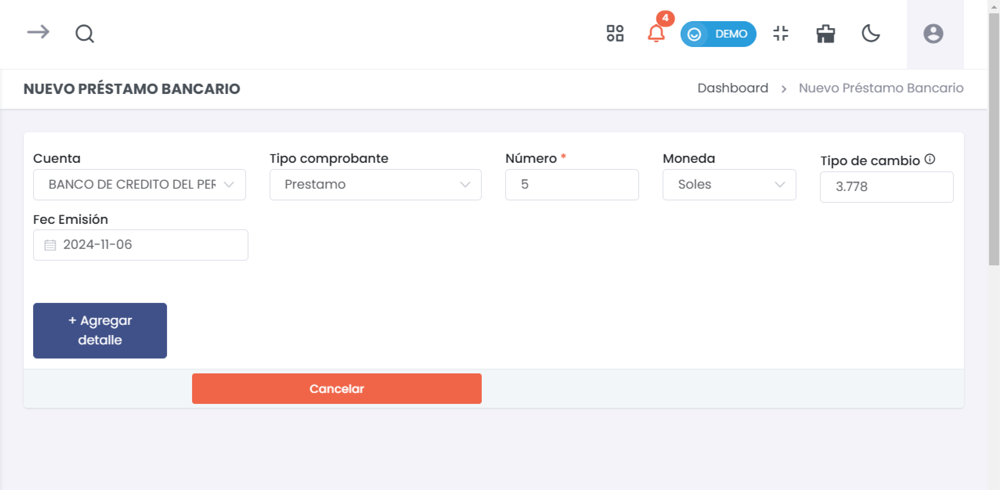
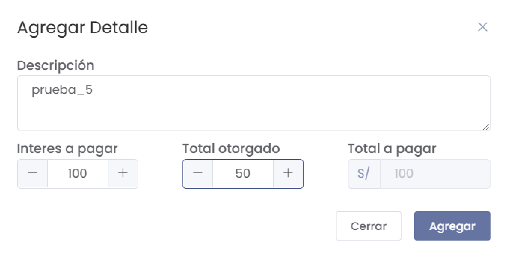
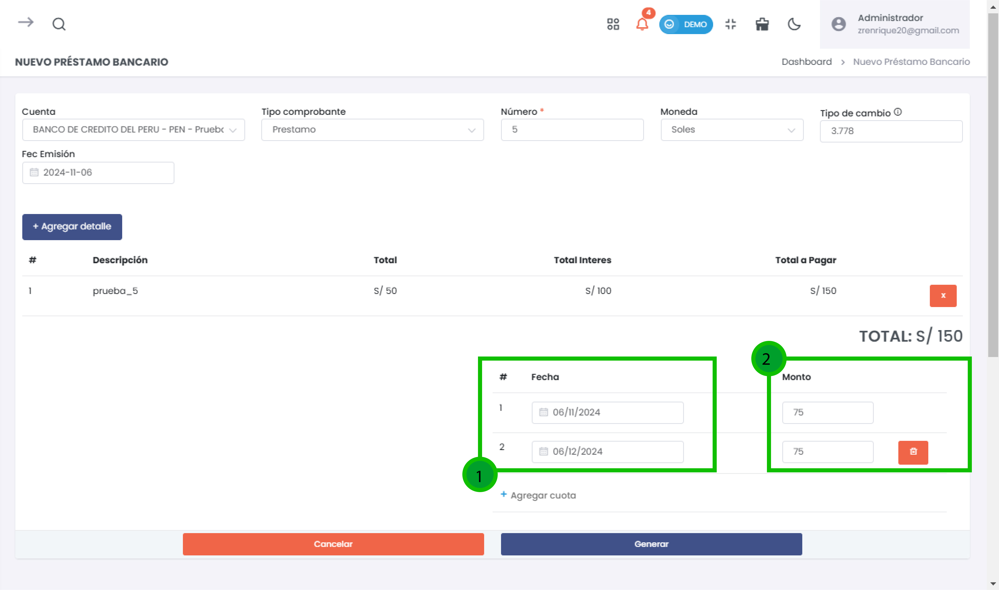
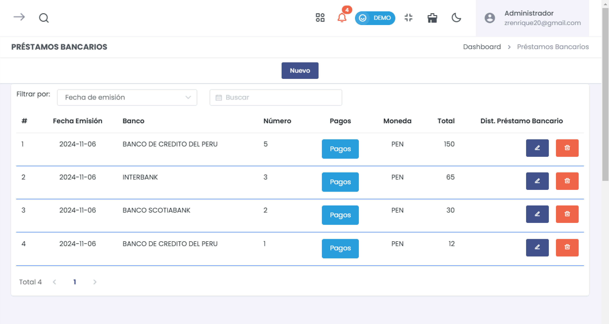

# Crédito Bancario

Este módulo permite registrar y gestionar los préstamos bancarios en el sistema, proporcionando detalles sobre la cuenta, el tipo de comprobante, el número de préstamo y otros datos relacionados.

## Acceso al Módulo
Ingresa al módulo de **Compras** y selecciona la subcategoría **Crédito Bancario** para gestionar los préstamos bancarios.

## 1. Nuevo Préstamo Bancario

### Formulario de Registro de Préstamo

1. **Cuenta**: Selecciona la cuenta bancaria asociada al préstamo.
2. **Tipo Comprobante**: Selecciona el tipo de comprobante, como Préstamo.
3. **Número**: Ingresa el número de referencia del préstamo.
4. **Moneda**: Selecciona la moneda en la que se realizó el préstamo.
5. **Tipo de cambio**: Indica el tipo de cambio actual, si aplica.
6. **Fecha de Emisión**: Selecciona la fecha en que se emitió el préstamo.

:::danger importante
Los campos con * son obligatorios 
:::

### Agregar Detalle del Préstamo

Para añadir los detalles del préstamo, como el total otorgado y los intereses, sigue estos pasos:

1. Haz clic en **+ Agregar detalle** para añadir una nueva entrada.
2. **Descripción**: Ingresa una descripción para el detalle del préstamo.
3. **Interes a pagar**: Indica el monto de interés a pagar.
4. **Total otorgado**: Introduce el monto total otorgado en el préstamo.
5. **Total a pagar**: El sistema calcula automáticamente el total a pagar sumando el monto otorgado y el interés.
6. Haz clic en **Agregar** para guardar el detalle.

### Gestión de Cuotas

Después de agregar los detalles del préstamo, puedes definir las cuotas de pago:

1. **Fecha**: Selecciona la fecha de vencimiento de cada cuota.
2. **Monto**: Introduce el monto correspondiente a cada cuota.
3. Haz clic en **+ Agregar cuota** para añadir más cuotas si es necesario.

### Acciones Disponibles

1. **Cancelar**: Cancela el registro del préstamo bancario.
2. **Generar**: Guarda y finaliza el registro del préstamo en el sistema.

## 2. Confirmación de Préstamo Bancario Registrado

Una vez registrado el préstamo bancario, se mostrará un mensaje de confirmación con opciones adicionales:

1. **Ir al listado**: Redirige al listado de todos los préstamos bancarios registrados.
2. **Nuevo Préstamo Bancario**: Permite registrar otro préstamo.

## 3. Listado de Préstamos Bancarios

En esta sección, puedes ver el historial de todos los préstamos bancarios registrados. Usa los filtros para buscar por **Fecha de emisión**, **Banco** o **Número**.

### Campos Principales

* **Fecha Emisión**: Fecha en la que se emitió el préstamo.
* **Banco**: Nombre del banco asociado al préstamo.
* **Número**: Número de referencia del préstamo.
* **Pagos**: Permite gestionar los pagos asociados al préstamo.
* **Moneda**: Muestra la moneda en la que se otorgó el préstamo.
* **Total**: Monto total del préstamo.
* **Dist. Préstamo Bancario**: Permite distribuir el préstamo en el sistema.

### Opciones del Menú (íconos)

1. **Editar** (ícono de lápiz): Modifica los detalles del préstamo bancario seleccionado.
2. **Eliminar** (ícono de papelera): Elimina el préstamo bancario del registro.

---

