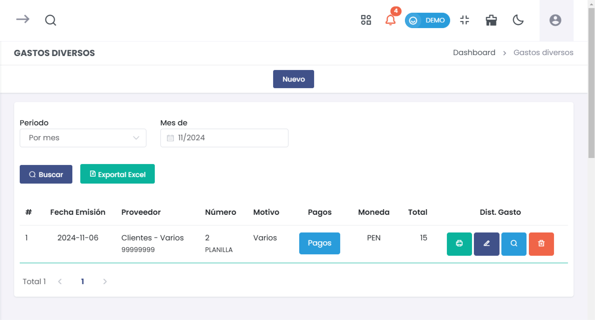

# Gastos Diversos

Este módulo permite registrar y gestionar los gastos diversos en el sistema, detallando los métodos de gasto, destinos y montos, así como el motivo y proveedor del gasto.

## Acceso al Módulo
Ingresa al módulo de **Compras** y selecciona la subcategoría **Gastos Diversos** para gestionar los distintos gastos registrados en el sistema.

## 1. Nuevo Gasto

### Formulario de Registro de Gasto

1. **Tipo Comprobante**: Selecciona el tipo de comprobante para el gasto, como Planilla o Factura.
2. **Número**: Ingresa el número de referencia del comprobante.
3. **Moneda**: Selecciona la moneda en la que se realizó el gasto.
4. **Fecha de Emisión**: Selecciona la fecha en la que se emitió el comprobante.
5. **Tipo de cambio**: Indica el tipo de cambio, si aplica.
6. **Proveedor**: Selecciona el proveedor desde la lista o agrega uno nuevo haciendo clic en **[+ Nuevo]**.
7. **Motivo**: Ingresa el motivo del gasto, como "Varios", "Transporte", entre otros.
8. **Método de gasto**: Selecciona el método de gasto, como Caja General.
9. **Destino**: Especifica el destino del gasto, si es necesario.
10. **Referencia**: Agrega una referencia adicional para el gasto.
11. **Monto**: Ingresa el monto del gasto en la moneda seleccionada.

### Agregar Detalle del Gasto

Para añadir detalles específicos al gasto, como una descripción y el monto correspondiente:

1. Haz clic en **+ Agregar detalle** para añadir un nuevo ítem de gasto.
2. **Descripción**: Proporciona una breve descripción del ítem.
3. **Total**: Indica el total de este ítem de gasto.

### Acciones Disponibles

1. **Cancelar**: Cancela el registro del gasto.
2. **Generar**: Guarda y finaliza el registro del gasto en el sistema.

## 2. Confirmación de Gasto Registrado

Una vez registrado el gasto, se mostrará un mensaje de confirmación con opciones adicionales:

1. **Imprimir A4**: Permite imprimir un comprobante en formato A4.
2. **Ir al listado**: Redirige al listado de todos los gastos registrados.
3. **Nuevo gasto**: Permite registrar otro gasto.

## 3. Listado de Gastos Diversos

En esta sección, puedes ver el historial de todos los gastos diversos registrados. Utiliza los filtros para buscar por **Periodo**.

### Campos Principales

* **Fecha Emisión**: Fecha en que se emitió el gasto.
* **Proveedor**: Nombre del proveedor y su número de identificación.
* **Número**: Número de referencia del comprobante del gasto.
* **Motivo**: Motivo del gasto (e.g., Varios, Transporte).
* **Pagos**: Permite gestionar los pagos asociados al gasto.
* **Moneda**: Muestra la moneda en la que se realizó el gasto.
* **Total**: Monto total del gasto.
* **Dist. Gasto**: Permite distribuir el gasto en el sistema.

### Opciones del Menú 

1. **Editar** : Modifica los detalles del gasto registrado.
2. **Eliminar** : Elimina el gasto del registro.
3. **Buscar** : Busca y filtra detalles del gasto.
4. **Imprimir** : Descargar en formato pdf.

---

