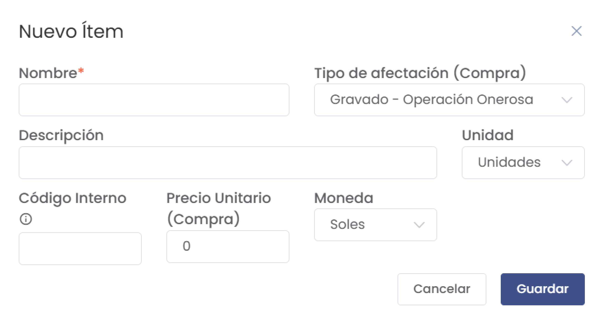

# Ítems

Esta sección documenta la gestión de ítems en el sistema. Aquí podrás registrar, editar, y visualizar los ítems que forman parte del inventario de la empresa. Cada ítem tiene sus características y opciones de configuración.

---

## **1. Acceso al Módulo**
- Desde el menú lateral, navega a **Compras > Activos Fijos > Ítems** para acceder a la lista de ítems registrados.

   

---

## **2. Lista de Ítems**
- La interfaz muestra la lista de ítems con columnas como:
  - **#**: Número de registro.
  - **Cód. Interno**: Código personalizado asignado al ítem.
  - **Unidad**: Unidad de medida para el ítem.
  - **Nombre** y **Descripción**: Detalles básicos del ítem.
  - **P. Unitario (Compra)**: Precio unitario de compra.

   

### Filtrar Ítems
- Utiliza **Filtrar por** para buscar ítems por **Nombre** o **Código interno**.
- Ingresa un término de búsqueda en el campo **Buscar** para filtrar los resultados en tiempo real.

---

## **3. Crear un Nuevo Ítem**
- Haz clic en **Nuevo** para agregar un nuevo producto o ítem.
- Completa el formulario con los datos básicos del ítem:

   

   - **Nombre**: Nombre del ítem (campo obligatorio).
   - **Descripción**: Breve descripción del ítem.
   - **Moneda y Precio Unitario (Compra)**: Define la moneda y el precio unitario de compra.
   - **Unidad**: Selecciona la unidad de medida (Ej.: NIU).
   - **Tipo de afectación (Compra)**: Define la afectación fiscal, como **Gravado - Operación Onerosa**.
   - **Código Interno**: Asigna un código interno al ítem si es necesario.

### Guardar el Ítem
- Al finalizar la configuración, haz clic en **Guardar** para registrar el nuevo ítem en el sistema.

---

## **4. Acciones de Gestión**
- **Editar**: Permite modificar los detalles de un ítem.
- **Eliminar**: Borra un ítem de la lista (acción irreversible).
