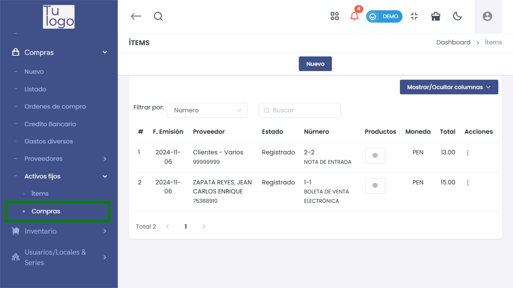
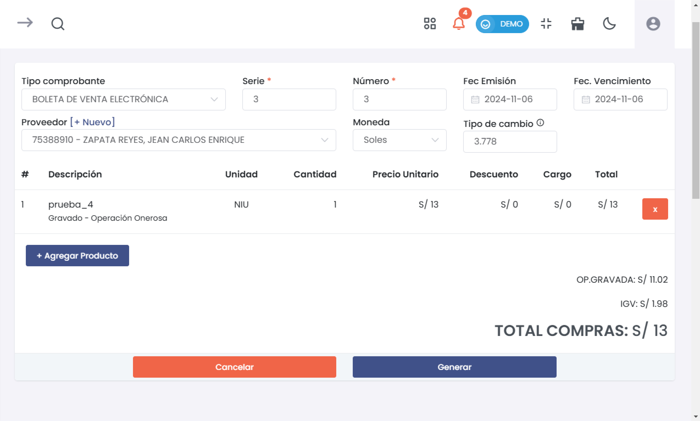
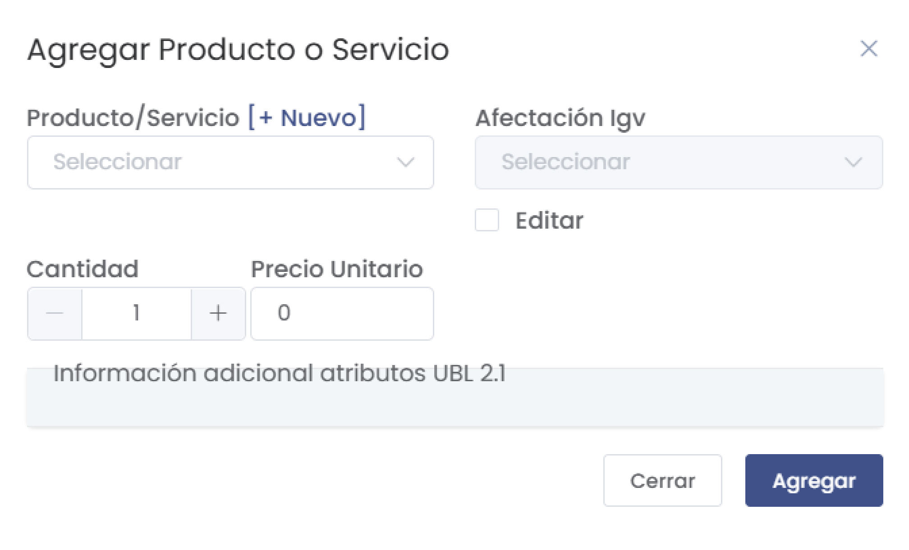
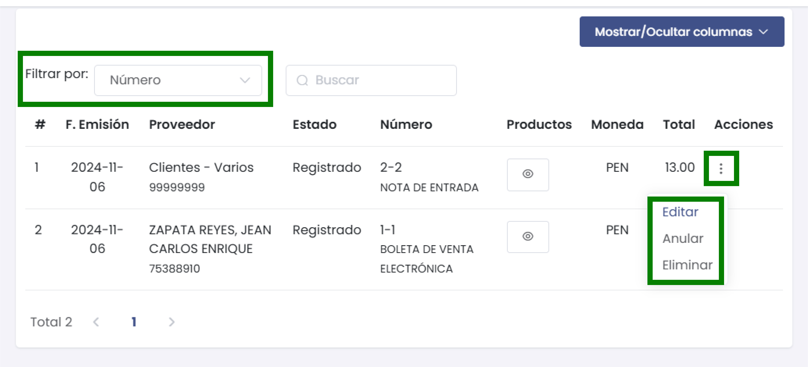
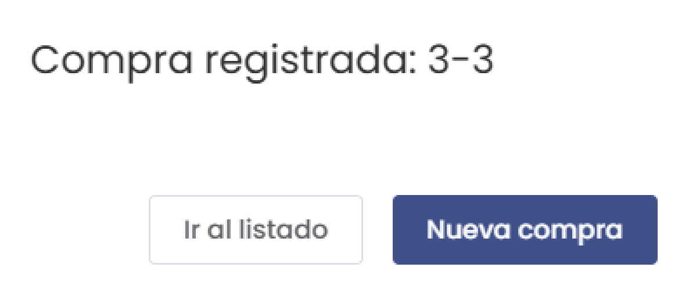

# Activos Fijos - Compras 

Esta guía detalla el proceso de gestión de compras en la sección de **Activos Fijos** del sistema, optimizando la administración de activos y permitiendo un control eficiente de las adquisiciones.

---

## **1. Nueva Compra de Activo Fijo**

Para registrar una nueva compra de un activo fijo, sigue estos pasos.

1. **Acceso al Módulo**  
   Ingresa al módulo de **Compras**, despliega el menú y selecciona **Activos Fijos > Compras**.

   

---

## **2. Campos de Nueva Compra**

Completa los campos necesarios para registrar una compra de activo fijo.

- **Tipo de Comprobante:** Selecciona el tipo de comprobante,en este ejemplo Boleta de Venta Electrónica.
- **Serie y Número:** Ingresa la serie y el número correspondientes del comprobante.
- **Proveedor:** Selecciona el proveedor o agrega uno nuevo si es necesario.
- **Fecha de Emisión y Vencimiento:** Define las fechas de emisión y vencimiento del comprobante.
- **Moneda y Tipo de Cambio:** Selecciona la moneda e ingresa el tipo de cambio si corresponde.

---

## **3. Agregar Producto o Servicio a la Compra**

Añade los productos o servicios correspondientes al activo fijo que deseas adquirir.

1. **Producto/Servicio:** Selecciona el producto o servicio que deseas agregar.
2. **Afectación IGV:** Especifica el tipo de afectación fiscal para el producto o servicio.
3. **Cantidad y Precio Unitario:** Ingresa la cantidad y el precio unitario del activo.
4. **Información adicional:** Añade cualquier información adicional que sea relevante para el registro del activo fijo.

---

## **4. Listado de Compras de Activos Fijos**

Esta sección muestra un resumen de las compras registradas en **Activos Fijos**, permitiendo filtrar, editar y gestionar cada compra.

- **Filtrar por:** Utiliza diferentes filtros para buscar compras específicas de activos fijos.
- **Acciones Rápidas (Botón de 3 puntos):** Permite realizar acciones como editar, anular o eliminar un registro de compra.

---

## **5. Detalle de Compra Registrada**

Después de generar la compra, recibirás una confirmación del registro, que incluye el número de la compra registrada.

- **Ir al listado:** Regresa al listado de compras de activos fijos.
- **Nueva compra:** Comienza un nuevo registro de compra de activo fijo.

---

