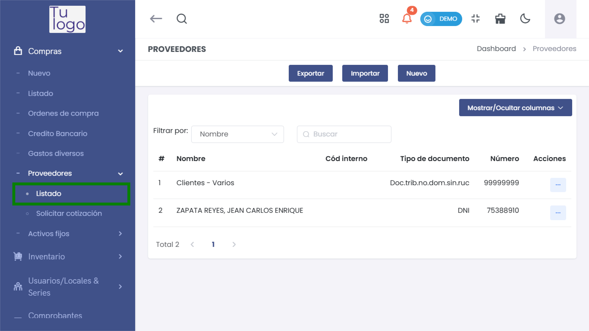
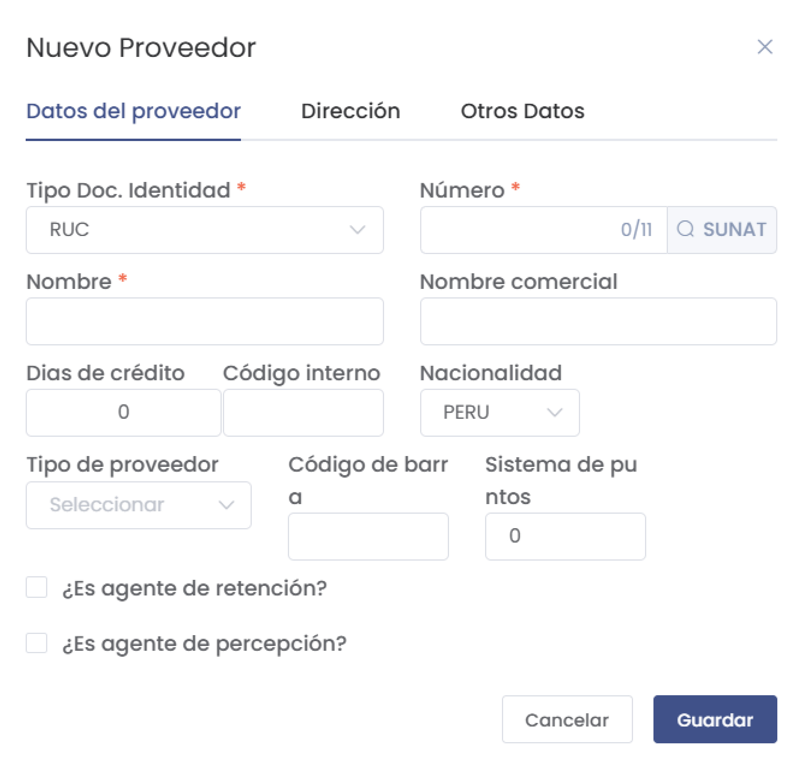
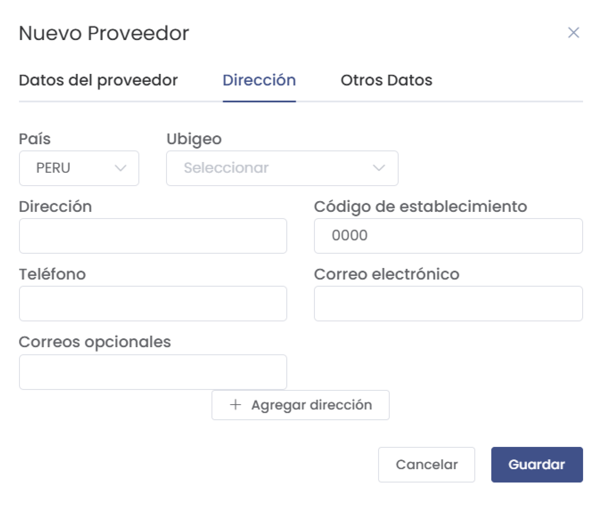
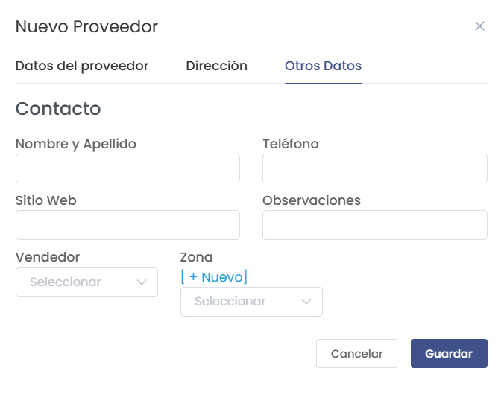
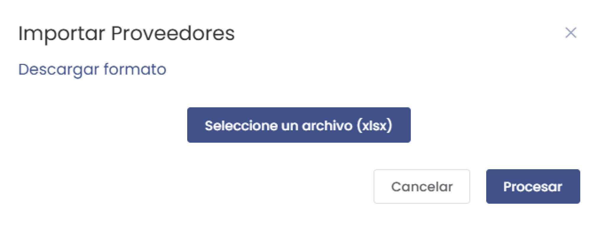
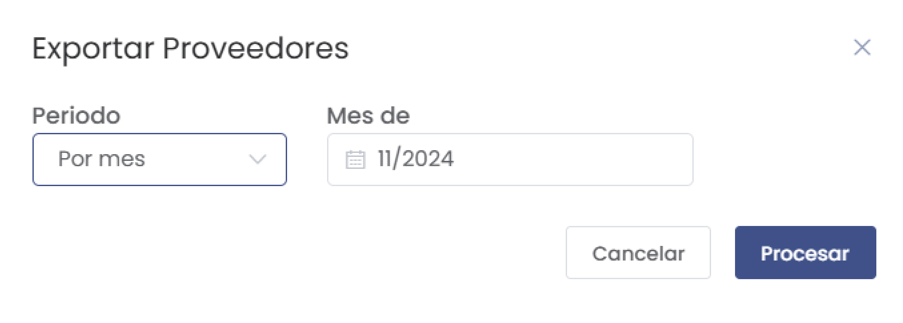
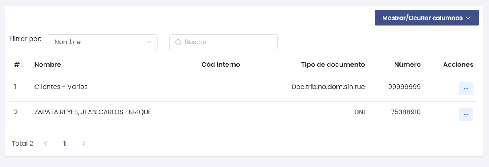
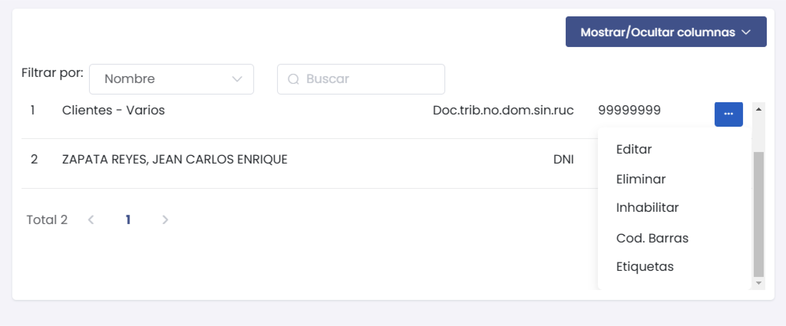

# Proveedores - Listado

Este módulo permite registrar y gestionar proveedores en el sistema, proporcionando detalles sobre sus datos de contacto, dirección y otros aspectos adicionales.

## Acceso al Módulo
Ingresa al módulo de **Compras** y selecciona la subcategoría **Proveedores**. Dentro de esta, elige la opción **Listado** para ver todos los proveedores registrados o añadir uno nuevo.

## 1. Nuevo Proveedor

Al agregar un nuevo proveedor, verás un formulario dividido en tres secciones: **Datos del proveedor**, **Dirección** y **Otros Datos**.

### Datos del Proveedor

1. **Tipo Doc. Identidad**: Selecciona el tipo de documento del proveedor (e.g., RUC).
2. **Número**: Ingresa el número de identificación del proveedor. Haz clic en **SUNAT** para validar el número.
3. **Nombre**: Nombre completo del proveedor.
4. **Nombre comercial**: Nombre comercial del proveedor, si aplica.
5. **Días de crédito**: Días permitidos para el crédito.
6. **Código interno**: Código de identificación interna del proveedor.
7. **Nacionalidad**: Selecciona la nacionalidad del proveedor.
8. **Tipo de proveedor**: Clasifica al proveedor en la categoría correspondiente.
9. **Código de barra**: Agrega un código de barras si es necesario.
10. **Sistema de puntos**: Define el sistema de puntos si el proveedor lo maneja.
11. **¿Es agente de retención?**: Marca si el proveedor actúa como agente de retención.
12. **¿Es agente de percepción?**: Marca si el proveedor actúa como agente de percepción.

:::danger importante
Los campos con * son obligatorios.
:::

### Dirección

1. **País**: Selecciona el país del proveedor.
2. **Ubigeo**: Selecciona el ubigeo correspondiente.
3. **Dirección**: Dirección completa del proveedor.
4. **Código de establecimiento**: Código asignado al establecimiento del proveedor.
5. **Teléfono**: Número de contacto del proveedor.
6. **Correo electrónico**: Correo principal del proveedor.
7. **Correos opcionales**: Otros correos electrónicos de contacto.
8. **Agregar dirección**: Agrega direcciones adicionales si es necesario.

### Otros Datos

1. **Nombre y Apellido**: Nombre y apellido del contacto del proveedor.
2. **Teléfono**: Teléfono de contacto directo.
3. **Sitio Web**: Sitio web del proveedor, si tiene.
4. **Observaciones**: Cualquier observación adicional sobre el proveedor.
5. **Vendedor**: Selecciona el vendedor asociado al proveedor.
6. **Zona**: Zona geográfica del proveedor. Haz clic en **[+ Nuevo]** para añadir una nueva zona.

### Acciones Disponibles

1. **Cancelar**: Cancela el registro del proveedor.
2. **Guardar**: Guarda y finaliza el registro del proveedor en el sistema.

## 2. Importar y Exportar Proveedores

### Importar Proveedores

1. **Descargar formato**: Descarga el formato de archivo para importar proveedores.
2. **Seleccionar un archivo (.xlsx)**: Selecciona el archivo con los datos de los proveedores.
3. **Procesar**: Carga los datos en el sistema.

### Exportar Proveedores

1. **Periodo**: Selecciona el periodo para exportar.
2. **Mes de**: Selecciona el mes correspondiente.
3. **Procesar**: Exporta la lista de proveedores en el formato seleccionado.

## 3. Listado de Proveedores

En esta sección, puedes ver todos los proveedores registrados en el sistema. Usa los filtros para buscar proveedores por **Nombre** u otros criterios.

### Campos Principales

* **Nombre**: Nombre del proveedor.
* **Código Interno**: Código asignado al proveedor.
* **Tipo de documento**: Tipo de documento de identificación del proveedor.
* **Número**: Número de identificación del proveedor.
* **Acciones**: Opciones para gestionar el proveedor.

### Opciones del Menú (tres puntos)

1. **Editar**: Modifica los detalles del proveedor.
2. **Eliminar**: Elimina el proveedor del sistema.
3. **Inhabilitar**: Desactiva el proveedor sin eliminarlo.
4. **Cod. Barras**: Genera el código de barras del proveedor.
5. **Etiquetas**: Administra etiquetas asociadas al proveedor.

---

