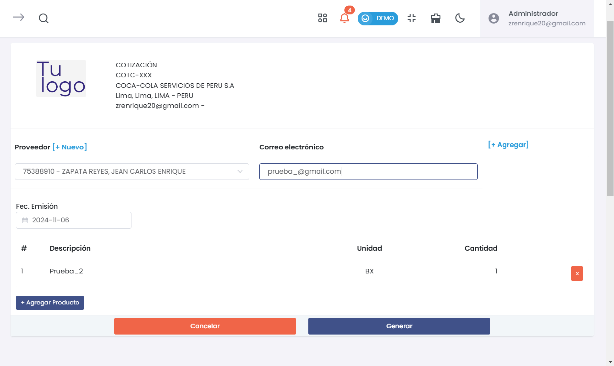

# Solicitar Cotización

La sección de **Solicitar Cotización** permite a los usuarios gestionar y enviar solicitudes de cotización a los proveedores, especificando productos, cantidades y otros detalles relevantes para obtener presupuestos.

---

## Acceso al Módulo

Para acceder a la función de Solicitar Cotización:
1. Ingresa al módulo de **Compras**.
2. Selecciona la subcategoría **Proveedores**.
3. Haz clic en la opción **Solicitar cotización**.

---

## Funcionalidades Principales

### Crear una Nueva Cotización

1. **Proveedor**: Selecciona un proveedor existente o agrega uno nuevo haciendo clic en **[+ Nuevo]**.
2. **Correo Electrónico**: Ingresa el correo electrónico del proveedor donde se enviará la cotización.
3. **Fecha de Emisión**: Selecciona la fecha en que se emite la cotización.
4. **Agregar Productos**:
   - Haz clic en **+ Agregar Producto**.
   - Ingresa los detalles del producto, incluyendo la descripción, unidad y cantidad.
5. **Opciones de Acción**:
   - **Cancelar**: Cancela el proceso de creación de la cotización.
   - **Generar**: Genera y guarda la cotización en el sistema.

### Confirmación de Cotización

Una vez generada la cotización, aparecerá un mensaje de confirmación indicando que el documento ha sido enviado al proveedor, junto con opciones adicionales:

- **Imprimir A4**: Permite imprimir la cotización en formato A4.
- **Ir al Listado**: Redirige al listado de todas las cotizaciones registradas.
- **Nuevo documento**: Inicia el proceso para crear una nueva cotización.

---

## Listado de Cotizaciones

El listado muestra todas las cotizaciones registradas y permite aplicar filtros, descargar el PDF de la cotización o realizar acciones adicionales en cada registro.

### Campos del Listado

- **Fecha de Emisión**: Muestra la fecha de emisión de la cotización.
- **Estado**: Indica el estado de la cotización (e.g., Registrado).
- **Documento**: Número del documento de la cotización.
- **Descarga**: Permite descargar la cotización en formato PDF.

- **Acciones**:

  - **Generar OC**: Genera una Orden de Compra basada en la cotización.
  - **Editar**: Permite modificar los detalles de la cotización.
  - **Opciones**: Acceso a más acciones disponibles para el documento.

---

:::danger Importante
Los campos a llenar son obligatorios
:::

---
