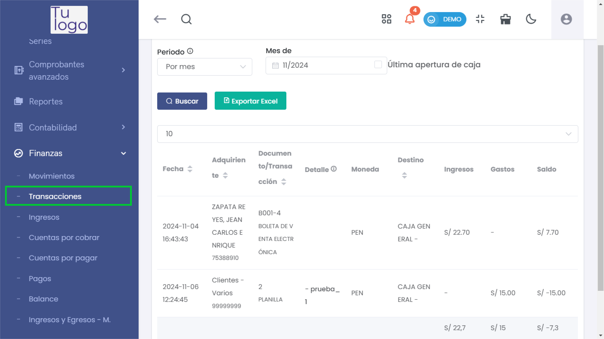
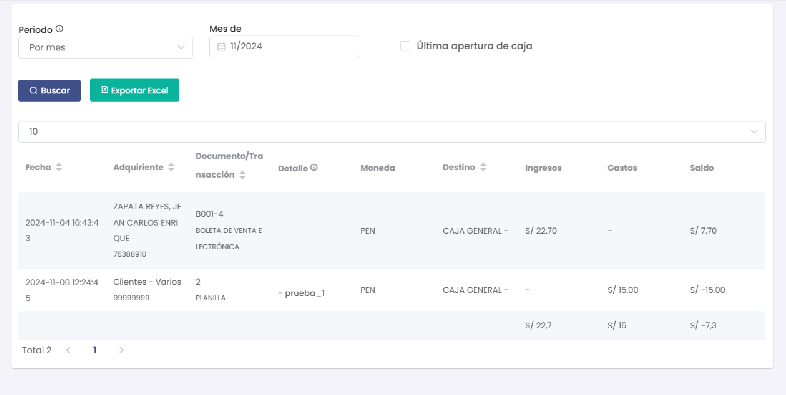
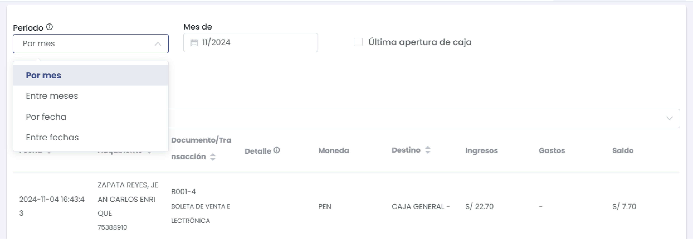
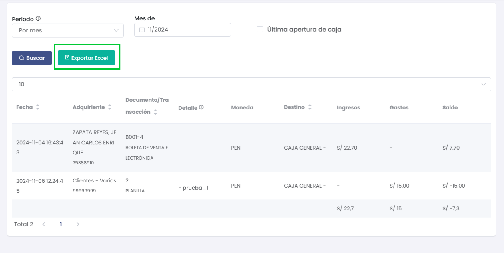

# Transacciones

Esta sección permite gestionar las transacciones financieras dentro de la plataforma, tales como pagos, cobros, y transferencias, entre otros. Aquí se registran y gestionan todas las transacciones financieras que realiza la empresa.

---

### 1. Acceso al Módulo de Transacciones
- Desde el menú lateral, navega a **Finanzas** y selecciona **Transacciones** para acceder a la lista de transacciones registradas.

  

---

### 2. Lista de Transacciones
La interfaz muestra la lista de transacciones con las siguientes columnas:
- **Fecha**: Fecha en la que se realizó la transacción.
- **Adquiriente**: Persona o entidad que realizó la transacción.
- **Documento/Transacción**: Número de documento o referencia de la transacción.
- **Detalle**: Descripción detallada de la transacción realizada.
- **Moneda**: Moneda utilizada en la transacción.
- **Destino**: Destino de los fondos de la transacción.
- **Ingresos**: Monto de ingresos asociados con la transacción.
- **Gastos**: Monto de gastos asociados con la transacción.
- **Saldo**: Saldo restante después de la transacción.

  

#### Filtrar Transacciones
- Utiliza **Filtrar por** para buscar transacciones por **Fecha**, **Tipo de Transacción**, o **Estado**.
- Ingresa un término de búsqueda en el campo **Buscar** para filtrar los resultados en tiempo real.

  

---

### 3. Opciones de Exportación
- El botón **Exportar** permite exportar las transacciones financieras en los siguientes formatos:
  - **Excel**: Descarga la lista completa de transacciones en formato Excel.

  
