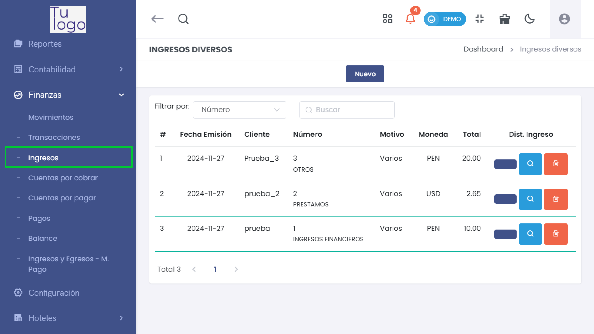
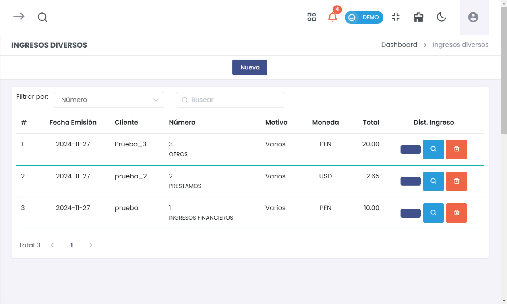
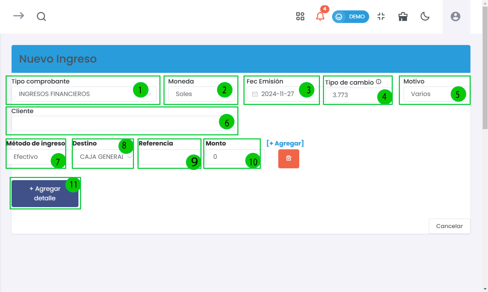
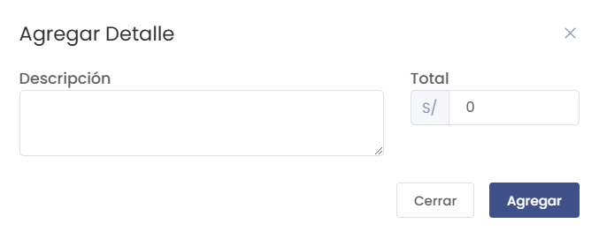
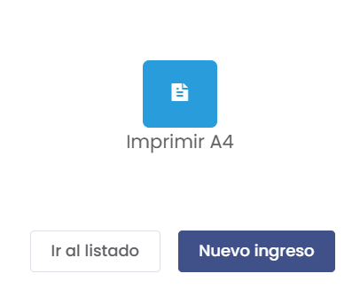

# Ingresos  

Esta sección permite gestionar y registrar todos los ingresos financieros dentro de la plataforma, tales como cobros, pagos recibidos y cualquier otra transacción que incremente los fondos de la empresa. Aquí se detallan los pasos para crear y gestionar ingresos de manera efectiva.  

---  

### 1. Acceso al Módulo de Ingresos  
- Desde el menú lateral, navega a **Finanzas** y selecciona **Ingresos** para acceder a la lista de ingresos registrados.  

    

---  

### 2. Lista de Ingresos  
La interfaz principal de ingresos mostrará la lista de todos los ingresos registrados. Esta sección incluye varias columnas importantes:  

  

#### Columnas:  
- **Fecha**: Fecha en la que se registró el ingreso.  
- **Cliente**: Nombre del cliente al que se le atribuye el ingreso.  
- **Número**: Identificación única del ingreso, que facilita su seguimiento.  
- **Motivo**: Descripción breve sobre la razón del ingreso.  
- **Moneda**: Moneda en la que se registró el ingreso.  
- **Total**: Monto total del ingreso.  
- **Acciones**: Opciones para ver más detalles o eliminar el ingreso.  

#### Filtrar Ingresos  
- Utiliza filtros para buscar ingresos específicos por **Fecha**, o  **Numero**.  
- Ingresa un término de búsqueda en el campo **Buscar** para filtrar los resultados en tiempo real.  

---  

### 3. Nuevo Ingreso  
Cuando elijas crear un nuevo ingreso, se abrirá una interfaz que permite registrar todos los detalles relevantes de la transacción.  

  

#### Elementos Clave:  
- **Tipo Comprobante (1)**:  
  - Selecciona el tipo de ingreso de un menú desplegable, con opciones como **INGRESOS FINANCIEROS**, **PRESTAMOS**, o **OTROS**.  

- **Moneda (2)**:  
  - Define la moneda en la que se llevará a cabo el ingreso; por defecto, se establece en **Soles**.  

- **Fecha Emisión (3)**:  
  - Elige la fecha en la que se está registrando el ingreso. Generalmente, se muestra la fecha actual como predeterminada.  

- **Tipo de Cambio (4)**:  
  - Indica el tipo de cambio aplicable si se está registrando un ingreso en moneda extranjera.  

- **Motivo (5)**:  
  - Un campo para ingresar el motivo del ingreso, proporcionando contexto adicional respecto a la transacción.  

- **Cliente (6)**:  
  - Espacio para ingresar el nombre del cliente que realiza el pago. Este campo ayuda a relacionar el ingreso con la fuente correspondiente.  

- **Método de Ingreso (7)**:  
  - Selecciona el método mediante el cual se recibió el ingreso. Las opciones pueden incluir **efectivo**, **tarjeta de crédito**, **cheque**, entre otros.  

   

- **Destino (8)**:  
  - Selecciona el destino donde se registrará el ingreso, como **CAJA GENERAL**.  

- **Referencia (9)**:  
  - Un campo opcional para agregar cualquier referencia o nota relacionada con el ingreso.  

- **Monto (10)**:  
  - Indica el monto total del ingreso. Este debe ser un número positivo que refleje la cantidad recibida.  

- **Botón de Agregar Detalle (11)**:  
  - Habilita la opción para añadir más información o detalles específicos de la transacción. Al hacer clic, se puede expandir la funcionalidad para incluir descripciones adicionales o sub-registros relevantes.  

---  

### 4. Detalle del Ingreso  
Al hacer clic en **Botón de Agregar Detalle**, se abrirá el siguiente formulario.  

  

##### Elementos del Formulario:  
- **Descripción**: Campo para detallar la naturaleza del ingreso adicional, proporcionando más contexto.  
- **Total**: Espacio para ingresar el monto correspondiente a este detalle específico, asegurándose de que sea un valor positivo.  
  
#### Botones Disponibles:  
- **Agregar**: Este botón guarda el detalle ingresado y lo incorpora al registro principal del ingreso.  
- **Cerrar**: Permite salir del formulario sin guardar cambios realizados.  

---

### 5. Funciones Adicionales en la Interfaz de Ingresos  
Después de llenar el formulario para un nuevo ingreso y presionar el botón **Generar**, se abrirá un formulario de confirmación que muestra todos los detalles del ingreso registrado.  

  

#### Opciones Disponibles:  
- **Imprimir A4**:   
  - Este botón permite generar una impresión del ingreso en formato A4. Es útil para mantener un registro físico de la transacción o para presentar la información en reuniones o auditorías.  

- **Ir al Listado**:  
  - Al hacer clic en este botón, serás dirigido a la lista de todos los ingresos registrados. Esta opción facilita la navegación y el acceso a la información de otras transacciones sin necesidad de regresar al menú principal.  

- **Nuevo Ingreso**:  
  - Este botón te lleva directamente a la interfaz para registrar un nuevo ingreso. Facilita el proceso de entrada de datos y agiliza la gestión de transacciones.  

---

