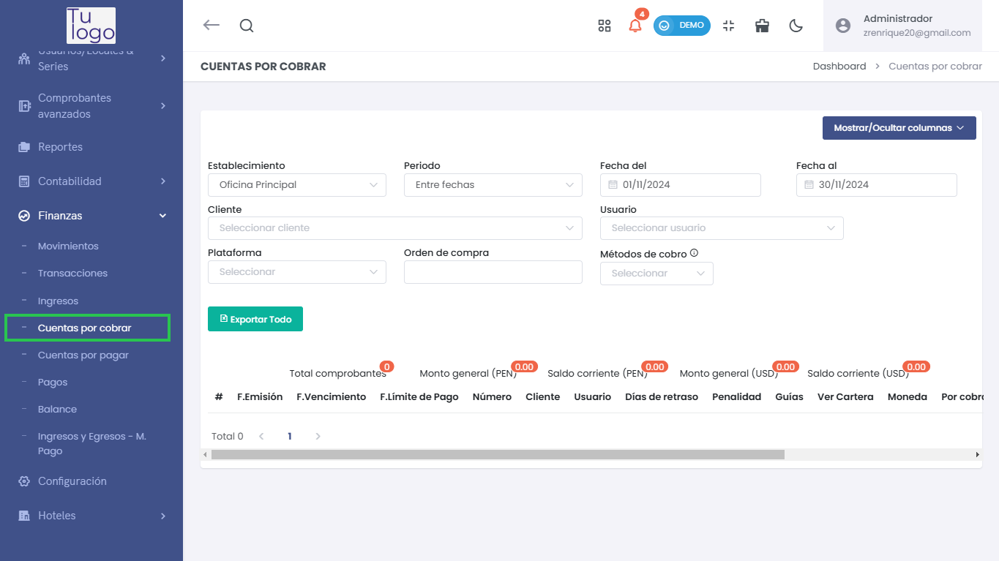
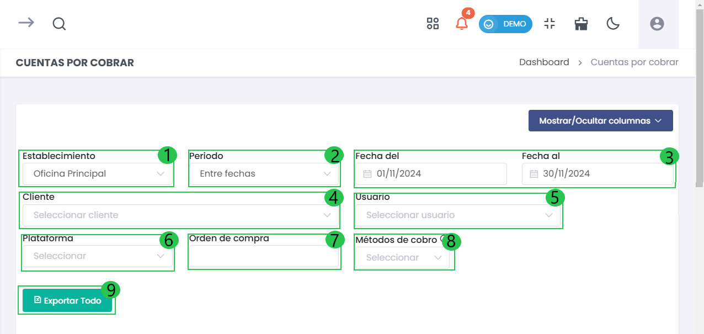
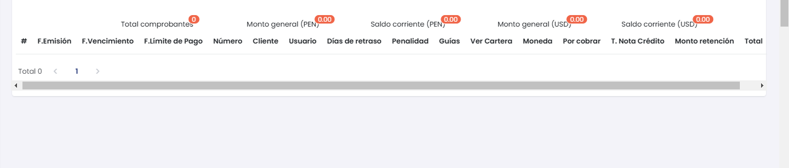

# Cuentas por Cobrar  

Esta sección permite gestionar y visualizar las cuentas por cobrar de la empresa. Aquí podrás monitorear los pagos pendientes, gestionar clientes y llevar un registro eficiente de las transacciones que requieren cobro. A continuación, se detallan los elementos y funcionalidades de este módulo.  

---  

### 1. Acceso al Módulo de Cuentas por Cobrar  
Para acceder a la sección de cuentas por cobrar, navega desde el menú lateral a **Finanzas** y selecciona **Cuentas por cobrar**. Una vez dentro, podrás observar la interfaz principal.  

  

---  

### 2. Filtros de Búsqueda  
En la parte superior de la pantalla, encontrarás diversos filtros que te ayudarán a personalizar la búsqueda de cuentas por cobrar:  

 

- **Establecimiento  (1)**:   
  - Selecciona la sucursal correspondiente donde se gestionan las cuentas por cobrar.  

- **Periodo (2)**:   
  - Establece un rango de fechas para filtrar las cuentas.  

- **Fecha del** y **Fecha al  (3)**:   
  - Define las fechas específicas entre las cuales deseas buscar las cuentas por cobrar.  

- **Cliente  (4)**:   
  - Selecciona el cliente para ver solo sus cuentas pendientes. 

- **Usuario  (5)**:   
  - Selecciona el usuario. 

- **Plataforma  (6)**:   
  - Elige la plataforma relacionada con las transacciones.  

- **Orden de compra (7)**:   
  - Puedes ingresar un número específico de orden de compra si es necesario.  

- **Métodos de cobro (8)**:   
  - Filtra las cuentas según los métodos de cobro utilizados.  

- **Botón Exportar (9)**:   
  - Utiliza el botón **Exportar Todo** para descargar la información de las cuentas en un formato accesible.  

 

---  

### 3. Descripción de los Campos:

- **F. Emisión**: Fecha en la que se emitió la factura o el comprobante.
- **F. Vencimiento**: Fecha en la que el pago debía ser realizado.
- **F. Límite de Pago**: Fecha límite para realizar el pago antes de aplicar penalidades.
- **Número**: Número único del comprobante o factura.
- **Cliente**: Nombre del cliente relacionado con la cuenta.
- **Usuario**: Usuario que registró o está gestionando la cuenta por cobrar.
- **Días de Retraso**: Número de días que la cuenta está retrasada en relación con la fecha de vencimiento.
- **Penalidad**: Porcentaje de penalidad que se aplica sobre el monto pendiente debido al retraso en el pago.
- **Guías**: Número de guías relacionadas con la cuenta por cobrar, si aplica.
- **Orden de Compra**: Número de la orden de compra asociada con la transacción, si corresponde.
- **Ver Cartera**: Opción para ver más detalles sobre la cuenta específica.
- **Moneda**: La moneda en la que está registrado el monto pendiente (por ejemplo, **PEN** para soles o **USD** para dólares).
- **Por Cobrar**: Monto pendiente por cobrar.
- **T. Nota Crédito**: Total de la nota de crédito asociada, si aplica.
- **Monto Retención**: Monto retenido de la cuenta debido a políticas fiscales o contractuales.
- **Total**: Monto total a cobrar, que incluye el **Por Cobrar**, las **Penalidades**, las **Notas de Crédito** y cualquier **Monto Retención**.

Los totales se reflejan al final de la tabla, indicando el número total de comprobantes y los montos generales, tanto en PEN como en USD.  

  

---  

### 4. Resumen de Totales  
En la parte inferior de la tabla, encontrarás un resumen que muestra:  
- **Total comprobantes**: Número total de comprobantes listados.  
- **Monto general (PEN)**: Total del monto en soles.  
- **Saldo corriente (PEN)**: Monto vigente a cobrar en soles.  
- **Monto general (USD)**: Total del monto en dólares.  
- **Saldo corriente (USD)**: Monto a cobrar vigente en dólares.  

---