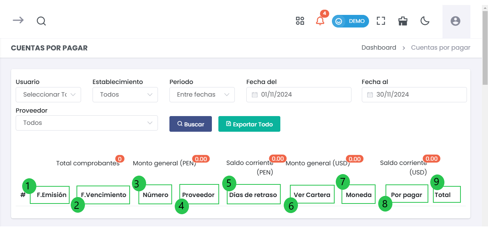

# Cuentas por Pagar

Esta sección permite gestionar las cuentas por pagar de la empresa, proporcionando una visión clara de las facturas pendientes, los proveedores asociados y los saldos a pagar, tanto en moneda nacional como extranjera.

---

### 1. Acceso al Módulo de Cuentas por Pagar
- Para acceder al módulo de **Cuentas por Pagar**, ve al menú lateral, selecciona **Finanzas** y luego haz clic en **Cuentas por Pagar**. Aquí se muestra un tablero con la lista de las cuentas por pagar registradas.

  

---

### 2. Filtros de Búsqueda
En la parte superior de la interfaz, los usuarios pueden aplicar filtros para personalizar los resultados de las cuentas por pagar. Los filtros disponibles incluyen:

- **Usuario (1)**: Permite seleccionar el usuario responsable de la gestión de la cuenta por pagar.
- **Establecimiento (2)**: Filtra las cuentas por sede o ubicación de la empresa. El valor predeterminado es **Todos**.
- **Periodo (3)**: Permite seleccionar un rango de fechas para las cuentas por pagar:
  - **Fecha del**: Fecha de inicio del periodo.
  - **Fecha al**: Fecha final del periodo.
- **Proveedor (4)**: Filtra por el proveedor asociado a la cuenta. El valor predeterminado es **Todos**.

  

---

### 3. Resumen General
La parte superior de la pantalla muestra un resumen de los valores generales de las cuentas por pagar, como sigue:

- **1. Total comprobantes**: Número total de comprobantes de pago registrados.
- **2. Monto general (PEN)**: Total de las cuentas por pagar en soles (PEN).
- **3. Saldo corriente (PEN)**: Monto pendiente de pago en soles (PEN).
- **4. Monto general (USD)**: Total de las cuentas por pagar en dólares (USD).
- **5. Saldo corriente (USD)**: Monto pendiente de pago en dólares (USD).

  

---

### 4. Lista de Cuentas por Pagar
La interfaz muestra una tabla con las cuentas por pagar, que incluye las siguientes columnas:

  

- **1. F. Emisión**: Fecha en que se emitió el comprobante de pago.
- **2. F. Vencimiento**: Fecha en que debía haberse realizado el pago.
- **3. Número**: Número de la factura o comprobante de pago.
- **4. Proveedor**: Nombre del proveedor al que se le debe realizar el pago.
- **5. Días de retraso**: Número de días que la cuenta está retrasada (si corresponde).
- **6. Ver Cartera**: Enlace para ver los detalles completos de la cuenta por pagar.
- **7. Moneda**: Moneda en la que está registrada la cuenta (PEN, USD, etc.).
- **8. Por Pagar**: Monto pendiente de pago.
- **9. Total**: Monto total de la cuenta, incluyendo cualquier ajuste, penalidad o retención.

#### Filtrar Cuentas por Pagar
- Los usuarios pueden filtrar las cuentas por **Fecha**, **Proveedor**, y **Estado** de pago.
- Ingresa un término de búsqueda en el campo **Buscar** para filtrar los resultados en tiempo real.

---

### 5. Opciones de Exportación
- Los usuarios pueden exportar la lista de cuentas por pagar a un archivo **Excel** para su posterior análisis o para mantener un registro fuera del sistema.

  

---
