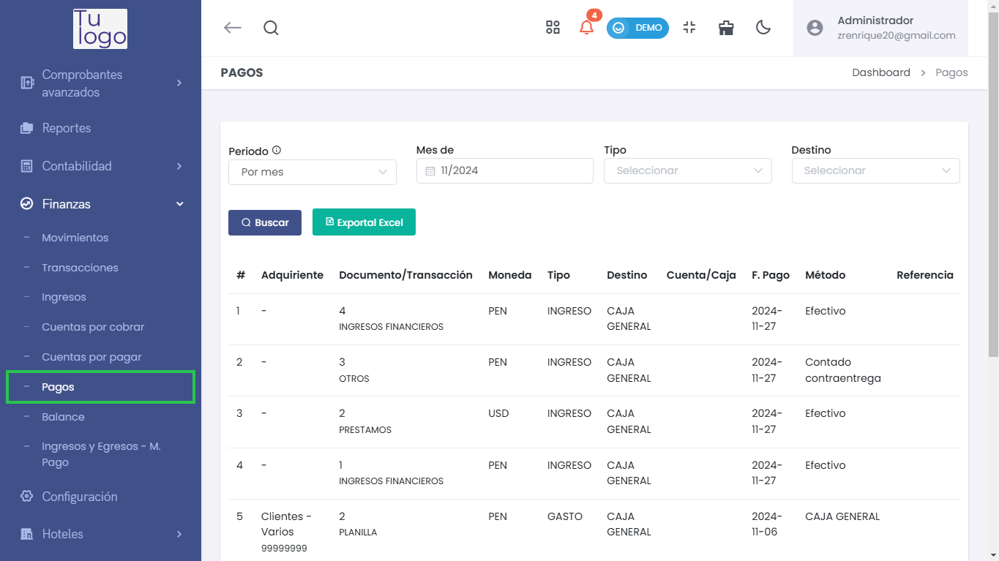

# Pagos  

La sección de Pagos permite gestionar y visualizar todos los pagos registrados en la plataforma, facilitando el seguimiento de las transacciones financieras realizadas a clientes y proveedores. Esta funcionalidad es esencial para mantener un control efectivo de las obligaciones financieras de la empresa.  

---  

### 1. Acceso al Módulo de Pagos  
Para acceder a la sección de pagos, navega desde el menú lateral a **Finanzas** y selecciona **Pagos**. Desde allí, podrás visualizar la lista de todos los pagos registrados.  

  

---  

### 2. Filtros de Búsqueda  
En la parte superior de la pantalla, encontrarás opciones de filtrado que te ayudarán a personalizar la búsqueda de pagos:  

 

- **Periodo**:   
  - Selecciona el periodo que deseas consultar (por mes, entre meses, etc.).    

- **Tipo**:   
  - Selecciona el tipo de pago que deseas visualizar (por ejemplo, ingresos, gastos, etc.).  

- **Destino**:   
  - Filtra los pagos por el destino específico, si es necesario.  

- **Botón Exportar**:   
  - Utiliza el botón **Exportar Excel** para descargar la información de los pagos en un archivo accesible.  

 

---  

### 3. Tabla de Resultados  
Debajo de los filtros, se mostrará una tabla con los resultados de los pagos:  

#### Columnas de la Tabla:  
- **#**: Número de registro.  
- **Adquiriente**: Nombre del adquiriente asociado al pago.  
- **Documento/Transacción**: Identificación o número del documento relacionado con la transacción.  
- **Moneda**: Moneda utilizada en la transacción (PEN, USD, etc.).  
- **Tipo**: Tipo de transacción (por ejemplo, ingreso o gasto).  
- **Destino**: Información sobre a dónde se destinó el pago.  
- **Cuenta/Caja**: Cuenta o caja desde la cual se realizó el pago.  
- **F. Pago**: Fecha en que se realizó el pago.  
- **Método**: Método utilizado para el pago (efectivo, cheque, transferencia, etc.).  
- **Referencia**: Cualquier referencia adicional relacionada con el pago.  
- **Pago**: Monto total del pago realizado.  

  

---  

### 4. Resumen de Totales  
En la parte inferior de la tabla, encontrarás un resumen que muestra los totales generales (si están disponibles), permitiéndote ver el monto total de pagos realizados en el periodo consultado.  

---  
