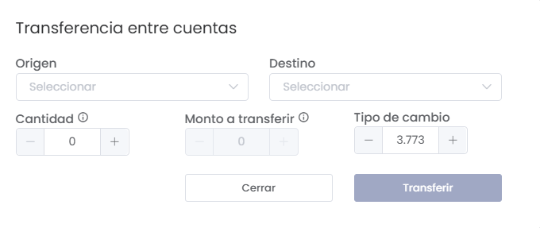

# Balance  

La sección de Balance permite gestionar y visualizar el estado financiero de la empresa, proporcionando una visión clara de los movimientos, cuentas y transferencias. Esta funcionalidad es crucial para el control financiero y la toma de decisiones.  

---  

### 1. Acceso al Módulo de Balance  
Para acceder a la sección de balance, dirígete desde el menú lateral a **Finanzas** y selecciona **Balance**. Desde allí, podrás visualizar la información financiera relativa a las cuentas y sus saldos.  

  

---  

### 2. Filtros de Búsqueda  
En la parte superior de la pantalla, verás los siguientes filtros que te ayudarán a personalizar la búsqueda de balances:  

  

- **Periodo**:   
  - Selecciona el periodo que deseas consultar (por mes, entre meses, etc.).    

- **Moneda**:   
  - Selecciona la moneda en la que deseas visualizar los saldos (Soles, Dólares, etc.).  

- **Botones de Exportación**:   
  - **Exportar PDF**: Genera un informe en formato PDF del balance.  
  - **Exportar Excel**: Descarga el balance en un archivo Excel para un análisis más detallado.  

---  

### 3. Tabla de Resultados  
Debajo de los filtros, se mostrará una tabla con los detalles del balance:  

  

#### Columnas de la Tabla:  
- **#**: Número de registro.  
- **Descripción**: Nombre de la cuenta o institución relacionada.  
- **S.Inicial**: Saldo inicial de la cuenta.  
- **CPE**: Monto de comprobantes emitidos.  
- **N. Venta**: Número total de ventas realizadas.  
- **Cotización**: Cotizaciones relacionadas con la cuenta.  
- **Contrato**: Detalles de contratos en vigor.  
- **S. Técnico**: Servicios técnicos asociados.  
- **Ingresos**: Monto total de ingresos registrados.  
- **Compras**: Monto total de compras realizadas.  
- **Gastos**: Monto total de gastos.  
- **P. Bancarios**: Penalidades o comisiones bancarias.  
- **Pago P. Bancarios**: Pagos a proveedores bancarios.  
- **Saldo**: Saldo actual de la cuenta.  

---  

### 4. Transferencia entre Cuentas  
Desde la sección de saldo, puedes realizar transferencias entre cuentas de manera sencilla:  

#### Elementos del Formulario de Transferencia:  
- **Origen**:   
  - Selecciona la cuenta de origen de la cual se realizará la transferencia.  
  
- **Destino**:   
  - Selecciona la cuenta de destino a la que se transferirán los fondos.  

- **Cantidad**:   
  - Selecciona la cantidad a transferir.  

- **Monto a transferir**:   
  - Indica el monto específico que deseas transferir entre cuentas.  

- **Tipo de cambio**:   
  - Especifica el tipo de cambio aplicable si estás transfiriendo entre cuentas en diferentes monedas.  

- **Botones de Acción**:   
  - **Cerrar**: Cierra el formulario sin realizar ninguna acción.  
  - **Transferir**: Ejecuta la transferencia entre cuentas.  

  

