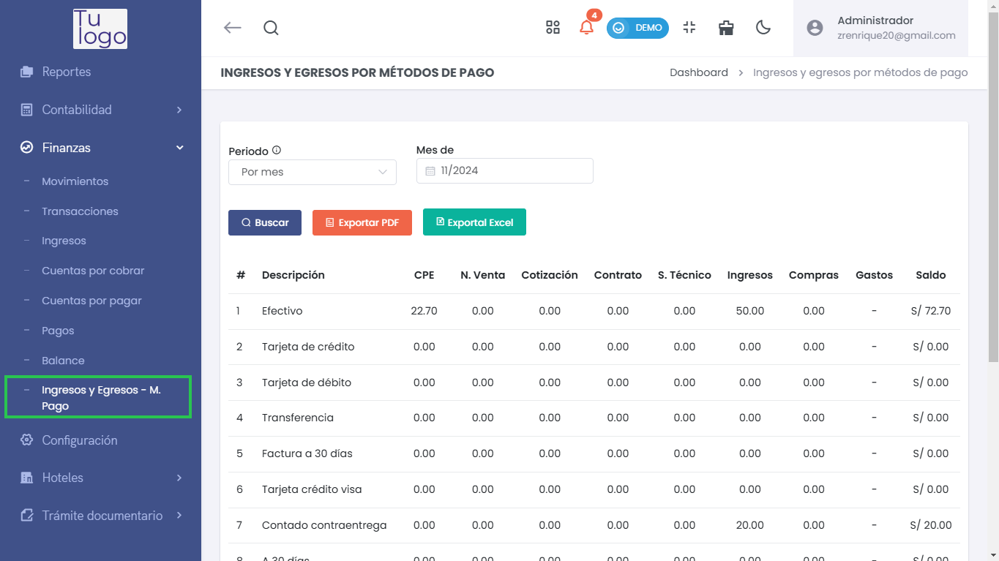
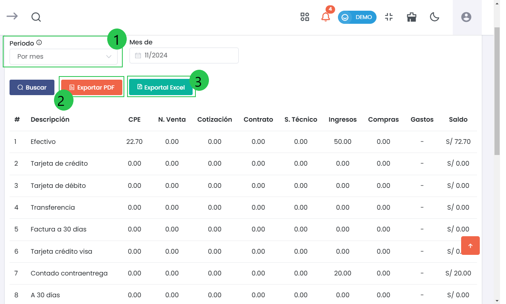
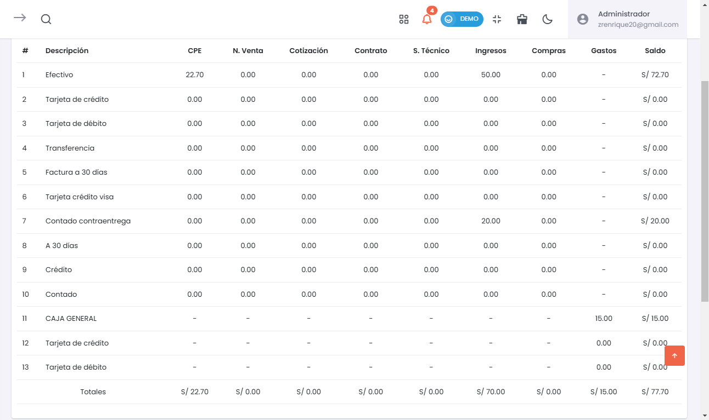

# Ingresos y Egresos 

La sección de Ingresos y Egresos permite gestionar y visualizar los ingresos y gastos realizados a través de diferentes métodos de pago. Esta herramienta es esencial para un análisis financiero detallado y la gestión efectiva de las finanzas de la empresa.  

---  

### 1. Acceso al Módulo de Ingresos y Egresos  
Para acceder a esta sección, dirígete al menú lateral y selecciona **Finanzas > Ingresos y Egresos por Métodos de Pago**. Desde allí, podrás visualizar la información relacionada con todos los ingresos y gastos registrados.  

  

---  

### 2. Filtros de Búsqueda  
En la parte superior de la pantalla, verás los siguientes filtros que facilitan la búsqueda:  

- **Periodo (1)**:   
  - Selecciona el periodo que deseas consultar (por mes, entre meses, etc.).   

- **Botones de Exportación**:  
  - **Exportar PDF (2)**: Genera un informe en formato PDF de los ingresos y egresos.  
  - **Exportar Excel (3)**: Descarga la información en un archivo Excel para su análisis.  

---  

### 3. Tabla de Resultados  
Debajo de los filtros, se mostrará una tabla que lista todos los ingresos y egresos:  

 

#### Columnas de la Tabla:  
- **#**: Número de registro.  
- **Descripción**: Método de pago utilizado (efectivo, tarjeta de crédito, transferencia, etc.).  
- **CPE**: Comprobantes de pago emitidos.  
- **N. Venta**: Número de ventas asociadas.  
- **Cotización**: Información sobre las cotizaciones relacionadas.  
- **Contrato**: Detalles de contratos asociados, si los hay.  
- **S. Técnico**: Servicios técnicos relacionados con transacciones.  
- **Ingresos**: Monto total de ingresos generados a través del método de pago.  
- **Compras**: Total de compras realizadas con ese método.  
- **Gastos**: Monto total de gastos por el método de pago.  
- **Saldo**: Saldo restante después de considerar ingresos y gastos.  

---  

### 4. Resumen de Totales  
Al final de la tabla, podrás ver un resumen de los totales, mostrando:  

- **Total de Ingresos**: Suma de todos los ingresos generados.  
- **Total de Egresos**: Suma de los gastos realizados.  
- **Saldo Total**: Diferencia entre ingresos y egresos, proporcionando una visión clara de la situación financiera.  
