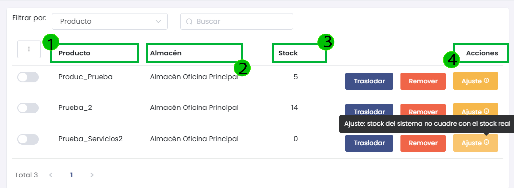

# Movimientos

La subcategoría de **Movimientos** dentro del módulo de **Inventario** permite una gestión completa y detallada del inventario, facilitando la importación, el ajuste de stock, y la creación de reportes. A continuación, se detallan cada una de las secciones y funcionalidades disponibles en esta subcategoría para optimizar el control de los productos y su movimiento entre almacenes.

---

## 1. Importar Ajuste de Stock

Esta funcionalidad permite realizar ajustes masivos en el inventario importando datos desde un archivo Excel. Es ideal para actualizar el inventario de manera rápida.

- **Almacén**: Elige el almacén donde se aplicarán los ajustes.
- **Archivo (.xlsx)**: Carga el archivo Excel con los datos de ajuste.
- **Formato de ejemplo**: Descarga un archivo de referencia para estructurar correctamente los datos.
- **Procesar**: Inicia el proceso de ajuste de stock.

> **Importante**: Asegúrate de que los datos en el archivo coincidan con el formato del ejemplo, para evitar errores de importación.

---

## 2. Reporte de Ajuste de Stock

Genera un reporte detallado de todos los ajustes realizados en el stock de productos. Permite ordenar y filtrar los datos según las necesidades del usuario.

- **Filtrar por**: Permite seleccionar el criterio de filtro (Producto, Lote, Serie).
- **Valor de búsqueda**: Introduce el valor específico que deseas buscar dentro del filtro seleccionado.
- **Almacén**: Selecciona el almacén a consultar.
- **Fecha de Inicio y Fecha Término**: Define el periodo de tiempo para el ajuste.
- **Ordenar por producto**: Organiza los resultados por producto.
- **Ordenar por fecha - hora**: Ordena los ajustes de stock según la fecha y hora de modificación.

> **Nota**: Este reporte es útil para auditar y verificar las actualizaciones en el inventario, asegurando coherencia en el sistema.

---

## 3. Reporte de Movimientos

Esta herramienta permite generar un reporte detallado de todos los movimientos de productos en el inventario, segmentados por almacén, tipo de movimiento, motivo de traslado, y un rango de fechas específico.

- **Producto**: Selecciona el producto específico del cual deseas obtener el reporte (opcional).
- **Almacén**: Indica el almacén a consultar.
- **Tipo de movimiento**: Filtra los resultados por tipo de movimiento (por ejemplo, ingreso, salida, traslado).
- **Motivo de Traslado**: Especifica el motivo del movimiento para mayor precisión en el reporte.
- **Fecha de Inicio y Fecha Término**: Define el periodo de consulta del reporte.
- **Ordenar por motivo de traslado**: Organiza los resultados según el motivo de traslado para facilitar la visualización.

> **Consejo**: Utiliza filtros específicos para obtener reportes más precisos y simplificar la búsqueda de datos.

---

## 4. Importar Lotes

Esta opción es ideal para productos que se gestionan en lotes en lugar de números de serie únicos. Permite cargar productos desde un archivo Excel para un almacén específico.

- **Almacén**: Define el almacén donde se almacenarán los productos importados.
- **Archivo (.xlsx)**: Selecciona el archivo con los datos de los productos y sus lotes correspondientes.
- **Formato de ejemplo**: Descarga un formato de referencia para la correcta estructura del archivo.
- **Procesar**: Ejecuta la importación de los lotes en el almacén seleccionado.

> **Recomendación**: Verifica que los lotes tengan un formato uniforme y coincidan con los requerimientos del sistema para evitar errores durante la importación.

---

## 5. Importar Series

Permite la importación masiva de productos que se gestionan con números de serie únicos. Los usuarios pueden cargar un archivo en formato Excel para registrar múltiples productos y sus series asociadas, agilizando la gestión de inventario.

- **Almacén**: Selecciona el almacén de destino para los productos importados.
- **Archivo (.xlsx)**: Carga el archivo Excel que contiene los productos y sus series.
- **Formato de ejemplo**: Descarga un archivo de ejemplo para garantizar que los datos están en el formato correcto.
- **Procesar**: Inicia el proceso de importación.

> **Nota**: Asegúrate de que el archivo contiene los datos de las series en las columnas y formato especificado en el archivo de ejemplo.

---

## 6. Ingreso de Producto al Almacén

Permite registrar la entrada de productos a un almacén, útil para nuevas adquisiciones, devoluciones de clientes, o cualquier ingreso al inventario.

- **Producto**: Elige el producto que se ingresará.
- **Almacén**: Selecciona el almacén de destino.
- **Motivo traslado**: Describe el motivo del ingreso.
- **Cantidad**: Define la cantidad que ingresará al inventario.
- **Comentarios**: Añade información adicional para completar el registro.

> **Consejo**: Registrar siempre el motivo y comentarios para una mejor trazabilidad del movimiento en el inventario.

---

## 7. Salida de Producto del Almacén

Registra la salida de productos del inventario, ideal para ventas, devoluciones, o cualquier otra actividad que requiera la reducción del stock.

- **Producto**: Selecciona el producto a retirar.
- **Almacén**: Define el almacén de salida.
- **Motivo traslado**: Explica la razón de la salida.
- **Cantidad**: Define la cantidad de unidades que salen del almacén.
- **Comentarios**: Agrega información adicional relevante para el registro.

---

## 8. Gestión de Inventario y Ajuste de Stock

En la vista principal del inventario, puedes ver los productos disponibles, su ubicación y el stock actual. Además, puedes realizar ajustes rápidos para mantener la coherencia con el inventario real.

- **Trasladar**: Permite mover productos a otro almacén.
- **Remover**: Elimina unidades del stock.
- **Ajuste**: Corrige discrepancias entre el stock registrado y el stock real.

### Ajuste de Stock Detallado
Cuando el stock del sistema no coincide con el inventario real, puedes ajustar los valores.

- **Producto**: Producto al que se aplica el ajuste.
- **Almacén**: Almacén en el que se encuentra.
- **Stock en el sistema**: Cantidad registrada en el sistema.
- **Stock real**: Cantidad física real.

> **Nota**: La opción **Ajuste** es ideal para corregir discrepancias en tiempo real y también permite especificar la **cantidad a retirar** en casos donde se requiera ajustar el inventario de forma inmediata.

---

## 9. Traslado entre Almacenes

Permite trasladar productos de un almacén a otro. Define el almacén de origen y destino, la cantidad a trasladar y el motivo.

- **Producto**: Selecciona el producto que deseas trasladar.
- **Almacén Inicial**: Define el almacén de origen del traslado.
- **Almacén Final**: Especifica el almacén de destino.
- **Cantidad a trasladar**: Ingresa la cantidad que deseas trasladar.
- **Motivo de Traslado**: Explica el motivo para el registro.

> **Consejo**: Registra siempre un motivo claro para facilitar el seguimiento de los traslados en los reportes.

---

