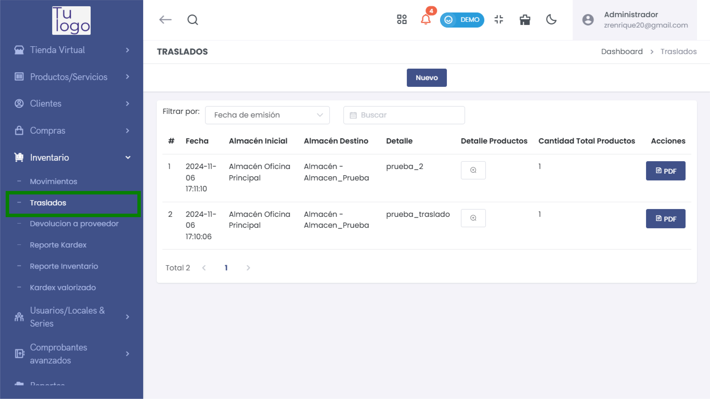
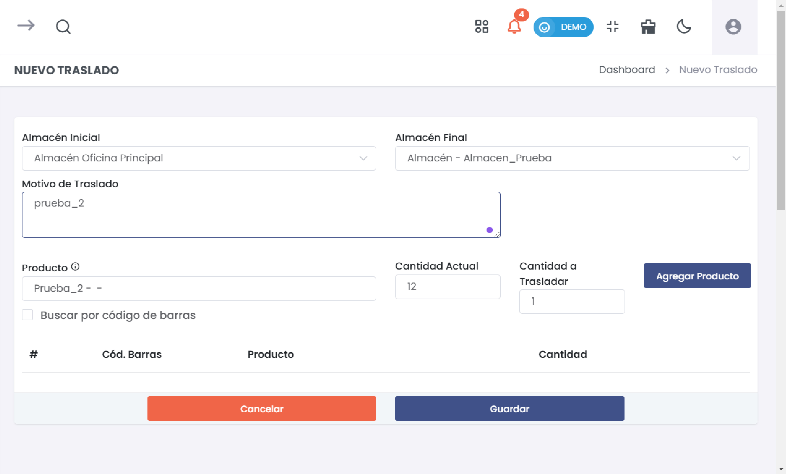
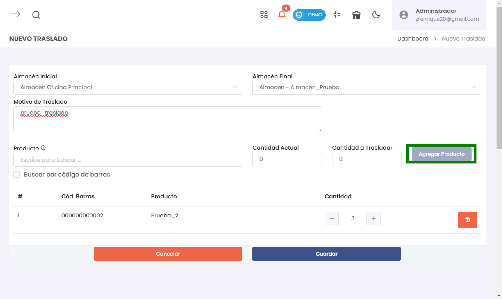
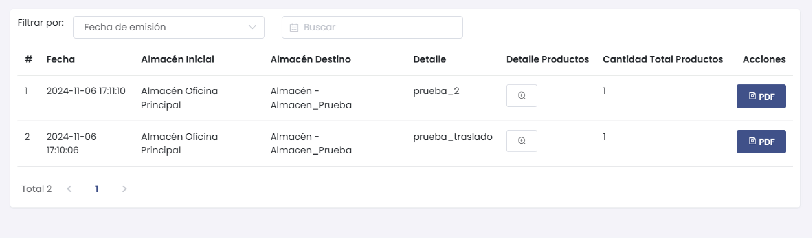

# Traslados

El submódulo de **Traslados** en el módulo de **Inventario** permite gestionar y registrar el movimiento de productos entre distintos almacenes. A continuación, se detalla el flujo y opciones disponibles para realizar un traslado de productos.

---

## 1. Iniciar un Nuevo Traslado

Para realizar un traslado, selecciona el botón **Nuevo** en la pantalla principal de Traslados. Esto abrirá un formulario para ingresar los detalles del traslado.

- **Almacén Inicial**: Selecciona el almacén de donde provienen los productos.
- **Almacén Final**: Elige el almacén de destino para los productos.
- **Motivo de Traslado**: Especifica el motivo del traslado para registrar adecuadamente el movimiento.
- **Producto**: Busca y selecciona el producto a trasladar.
  - Puedes optar por **Buscar por código de barras** para localizar el producto de forma más precisa.
- **Cantidad Actual**: Muestra la cantidad actual disponible del producto en el almacén inicial.
- **Cantidad a Trasladar**: Indica la cantidad de producto que deseas trasladar.

> **Nota**: Asegúrate de que la cantidad a trasladar no exceda la cantidad actual disponible en el almacén inicial.

---

## 2. Añadir Productos al Traslado

Una vez seleccionado el producto y especificada la cantidad a trasladar, haz clic en **Agregar Producto** para añadirlo a la lista del traslado. Puedes repetir este proceso para múltiples productos.

Cada producto agregado aparecerá en una tabla con los siguientes detalles:
- **Cód. Barras**: Código de barras del producto (si aplica).
- **Producto**: Nombre del producto.
- **Cantidad**: Cantidad especificada para el traslado.

> **Tip**: Puedes ajustar la cantidad o eliminar productos de la lista antes de guardar el traslado.

---

## 3. Guardar o Cancelar el Traslado

Después de agregar todos los productos, puedes:
- **Guardar**: Confirmar y registrar el traslado.
- **Cancelar**: Descartar los datos ingresados y salir de la pantalla de traslado.

> **Advertencia**: Una vez guardado, el traslado se registrará en el sistema y afectará los niveles de inventario de ambos almacenes.

---

## 4. Ver y Filtrar Traslados

En la pantalla principal de **Traslados**, puedes visualizar el historial de traslados realizados. Usa los filtros para buscar traslados específicos por:
- **Fecha de Emisión**: Ordena por la fecha en que se realizó el traslado.
- **Almacén Inicial y Destino**: Filtra traslados entre almacenes específicos.

Cada registro muestra:
- **Fecha**: Fecha y hora del traslado.
- **Almacén Inicial y Destino**: Ubicaciones de origen y destino.
- **Detalle Productos**: Resumen de los productos trasladados.
- **Cantidad Total de Productos**: Total de unidades trasladadas.
- **Acciones**: Opción para generar un PDF con el detalle del traslado.

> **Consejo**: Genera un PDF para respaldar y documentar cada traslado, especialmente si necesitas compartir la información o realizar auditorías.

---

