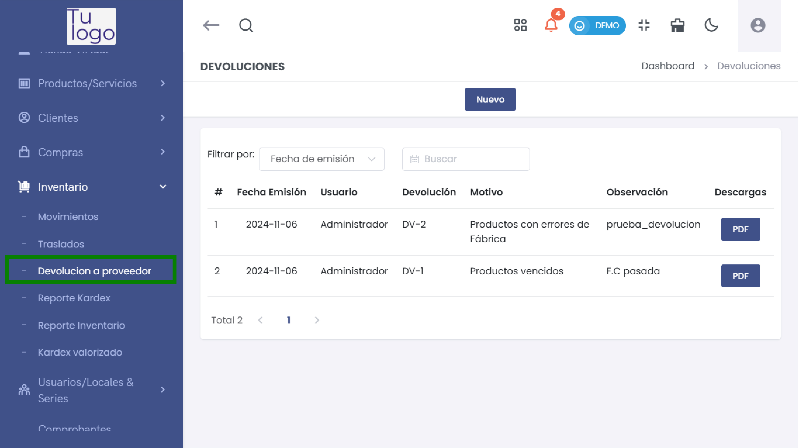
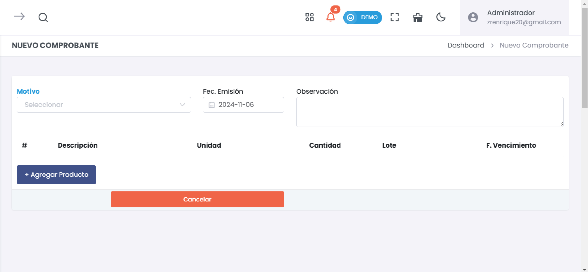
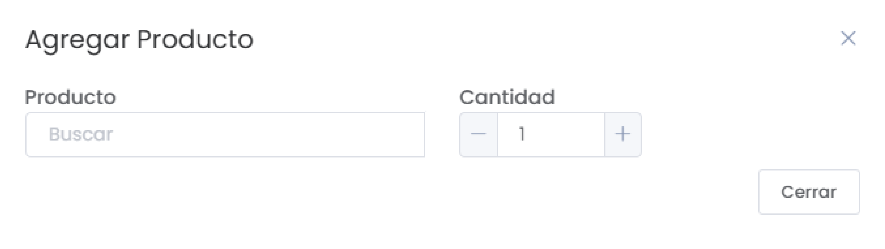
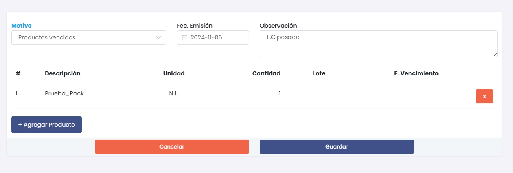
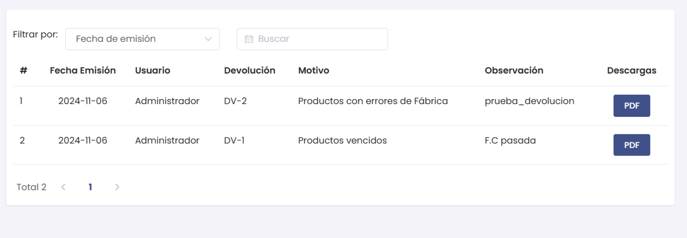

# Devolución a Proveedor

El módulo **Devolución a Proveedor** permite gestionar las devoluciones de productos a los proveedores, documentando el motivo, la cantidad y otros detalles relevantes para mantener un control eficiente de los inventarios y las transacciones de devolución. A continuación se describe cada una de las secciones y funcionalidades de este módulo.

---

## 1. Nueva Devolución

La opción de **Nueva Devolución** permite registrar una devolución indicando el motivo y otros detalles importantes del producto que será devuelto.

### Campos del formulario
- **Motivo**: Selecciona el motivo de la devolución. Los motivos disponibles son:
  - Productos vencidos
  - Productos dañados
  - Productos con errores de fábrica
- **Fecha de Emisión**: Indica la fecha en la que se realiza la devolución.
- **Observación**: Campo de texto para agregar comentarios adicionales sobre la devolución.

> **Nota**: El motivo de la devolución es esencial para categorizar correctamente el tipo de problema con el producto.

---

## 2. Agregar Producto

Para añadir productos a la devolución, utiliza el botón **+ Agregar Producto**. Esto permite seleccionar el producto a devolver, la cantidad y otros datos específicos.

- **Producto**: Busca el producto en el inventario para añadirlo a la devolución.
- **Cantidad**: Especifica la cantidad a devolver. Puedes ajustarla utilizando los botones de incremento o escribiendo la cantidad directamente.

> **Sugerencia**: Asegúrate de seleccionar correctamente el producto y verificar la cantidad antes de continuar.

---

## 3. Visualización de Productos Agregados

Una vez añadido el producto, se muestra una tabla con la información del producto a devolver, incluyendo detalles como descripción, unidad de medida, cantidad, lote y fecha de vencimiento.

- **Descripción**: Nombre del producto a devolver.
- **Unidad**: Unidad de medida del producto (e.g., NIU - Unidad).
- **Cantidad**: Número de unidades a devolver.
- **Lote** y **F. Vencimiento**: Información adicional del producto para mejorar la trazabilidad.

> **Importante**: Verifica que todos los datos sean correctos antes de guardar la devolución.

---

## 4. Guardar y Cancelar Devolución

Una vez completado el formulario y añadido el producto, puedes:
- **Guardar**: Registra la devolución en el sistema.
- **Cancelar**: Descarta la devolución y elimina todos los datos ingresados.

> **Consejo**: Utiliza la opción de **Guardar** solo cuando estés seguro de que toda la información es correcta.

---

## 5. Listado de Devoluciones

En la vista principal de **Devolución a Proveedor**, se muestra un listado de todas las devoluciones registradas. 

- **Fecha de Emisión**: Fecha en la que se registró la devolución.
- **Usuario**: Nombre del usuario que registró la devolución.
- **Devolución**: Código único de identificación de la devolución.
- **Motivo**: Motivo seleccionado al momento de realizar la devolución.
- **Observación**: Comentarios adicionales sobre la devolución.
- **Descargas**: Permite descargar el comprobante de devolución en formato PDF.

> **Nota**: Puedes filtrar las devoluciones por fecha de emisión y buscar devoluciones específicas para un mejor control.

---
