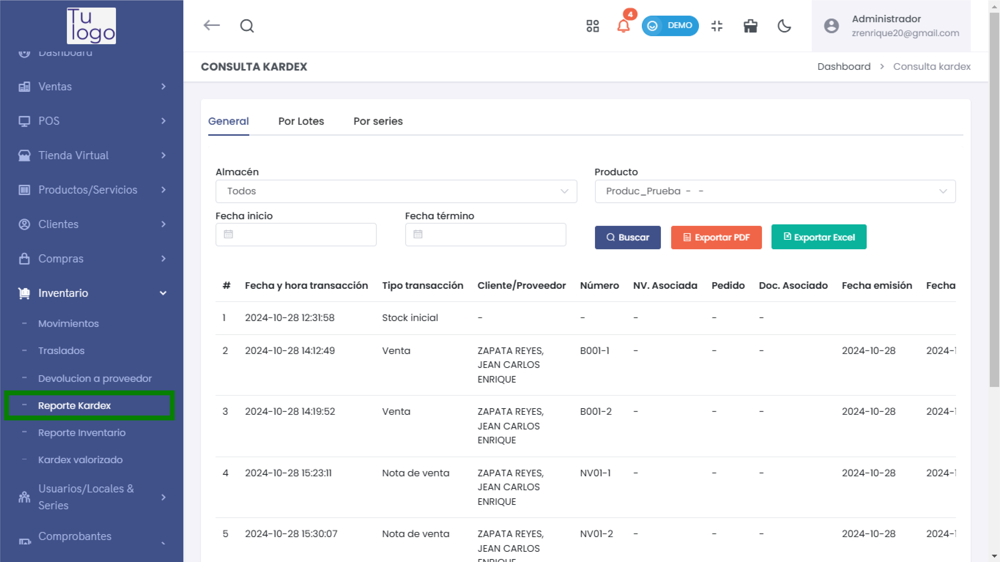
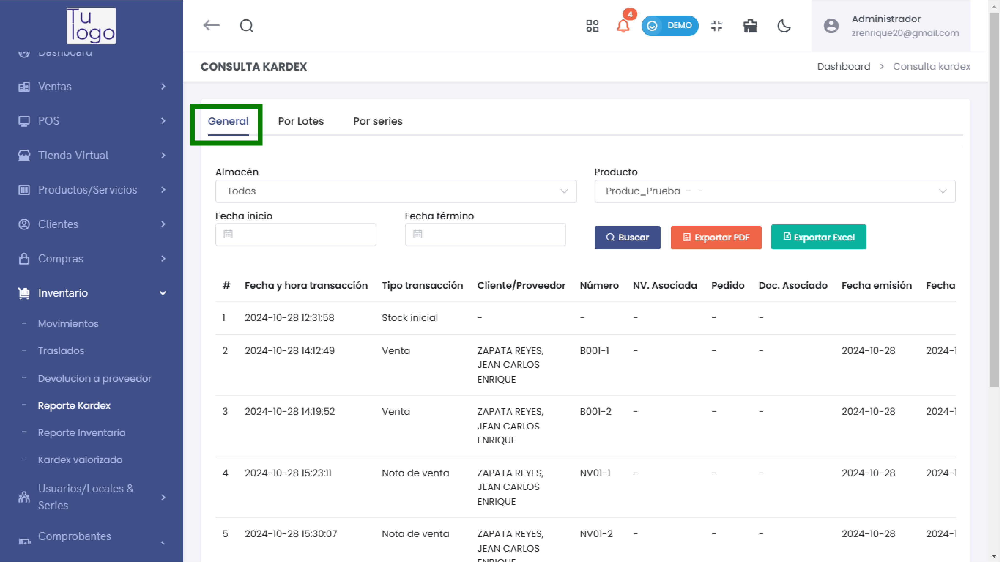
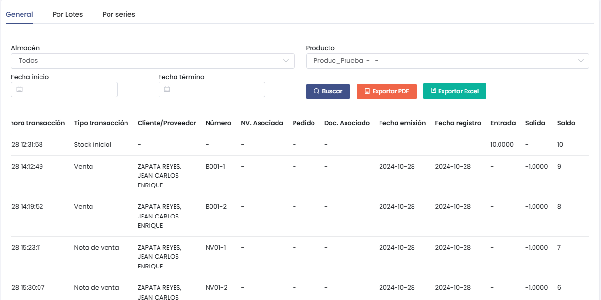
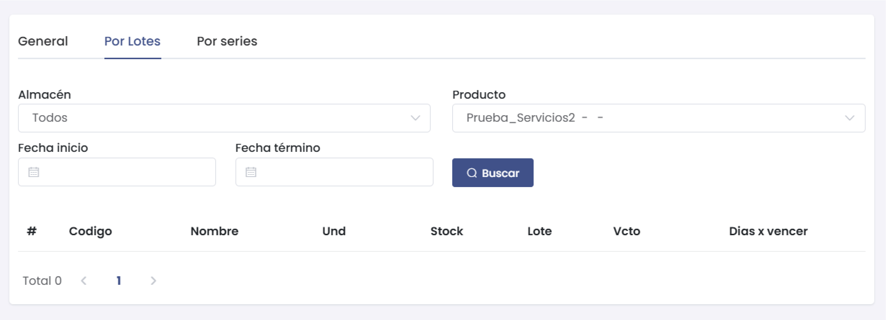
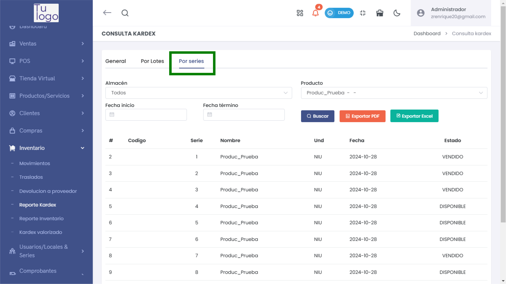
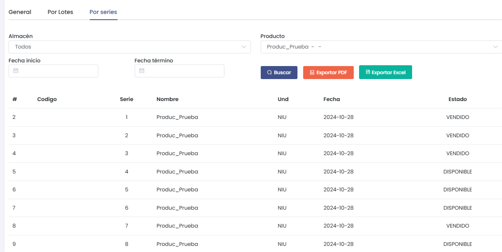

# Reporte Kardex

El módulo **Reporte Kardex** permite realizar una consulta detallada de los movimientos de inventario de productos. Está organizado en tres secciones: **General**, **Por Lotes** y **Por Series**, proporcionando opciones para filtrar, visualizar y exportar los registros. Esta herramienta es fundamental para el control y la trazabilidad de los movimientos de productos en el almacén.

## Sección: General

La pestaña **General** permite visualizar un resumen detallado de los movimientos de cada producto en el inventario. Los filtros y opciones de visualización incluyen:

- **Almacén**: Selecciona uno o todos los almacenes para especificar la ubicación de los productos a consultar.
- **Fecha de inicio** y **Fecha término**: Define un rango de fechas para delimitar los movimientos registrados en el sistema.
- **Producto**: Es necesario seleccionar un producto específico para ejecutar la búsqueda.

### Listado de Resultados

Los resultados de la búsqueda en esta sección incluyen las siguientes columnas:

1. **#**: Número de registro.
2. **Producto**: Nombre del producto.
3. **Fecha y hora transacción**: Momento exacto en el que ocurrió el movimiento.
4. **Tipo transacción**: Tipo de movimiento (Ej. Venta, Compra, Devolución).
5. **Cliente/Proveedor**: Persona o empresa involucrada en la transacción.
6. **Número**: Número de referencia de la transacción.
7. **NV. Asociada**: Nota de venta asociada a la transacción, si aplica.
8. **Pedido**: Número de pedido asociado, en caso de que aplique.
9. **Doc. Asociado**: Documento relacionado con la transacción.
10. **Fecha emisión**: Fecha en la que se emitió el documento o pedido.
11. **Fecha registro**: Fecha en la que se registró la transacción en el sistema.
12. **Entrada**: Cantidad de unidades ingresadas al inventario.
13. **Salida**: Cantidad de unidades retiradas del inventario.
14. **Saldo**: Cantidad total disponible en el inventario después del movimiento.

### Funcionalidades

- **Buscar**: Ejecuta la búsqueda según los filtros seleccionados.
- **Exportar PDF** y **Exportar Excel**: Opciones para descargar el reporte en formato PDF o Excel.

---

## Sección: Por Lotes

La pestaña **Por Lotes** permite consultar los movimientos de inventario agrupados por lotes, ideal para productos gestionados por unidades de lote.

- **Almacén**: Selecciona uno o todos los almacenes.
- **Fecha de inicio** y **Fecha término**: Define el periodo de tiempo para los movimientos.
- **Producto**: Especifica el producto a consultar.

### Columnas de Resultados

1. **#**: Número de registro.
2. **Código**: Código identificador del lote.
3. **Nombre**: Nombre del producto.
4. **Und**: Unidad de medida.
5. **Stock**: Cantidad disponible en stock.
6. **Lote**: Número de lote del producto.
7. **Vcto**: Fecha de vencimiento del lote.
8. **Días x vencer**: Días restantes antes del vencimiento.

### Funcionalidades

- **Buscar**: Filtra los resultados con los criterios especificados.
- **Exportar PDF** y **Exportar Excel**: Exporta el reporte de lotes en los formatos seleccionados.

---

## Sección: Por Series

La pestaña **Por Series** está diseñada para productos gestionados por número de serie único, proporcionando trazabilidad específica para cada unidad.

- **Almacén**: Filtra los resultados por almacén específico o consulta en todos.
- **Fecha de inicio** y **Fecha término**: Limita la búsqueda a un periodo de tiempo.
- **Producto**: Selecciona el producto a consultar en esta sección.

### Columnas de Resultados

1. **#**: Número de registro.
2. **Código**: Código del producto.
3. **Serie**: Número de serie específico de la unidad.
4. **Nombre**: Nombre del producto.
5. **Und**: Unidad de medida.
6. **Fecha**: Fecha de la última transacción asociada al producto con esa serie.
7. **Estado**: Estado actual del producto (Ej. Disponible, Vendido).

### Funcionalidades

- **Buscar**: Realiza la búsqueda según los criterios de filtros establecidos.
- **Exportar PDF** y **Exportar Excel**: Permite descargar los resultados en formato PDF o Excel.

---

