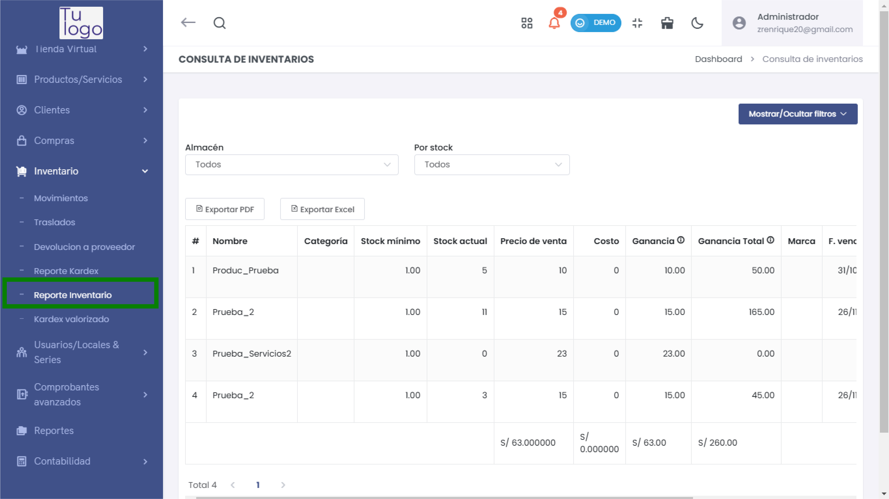
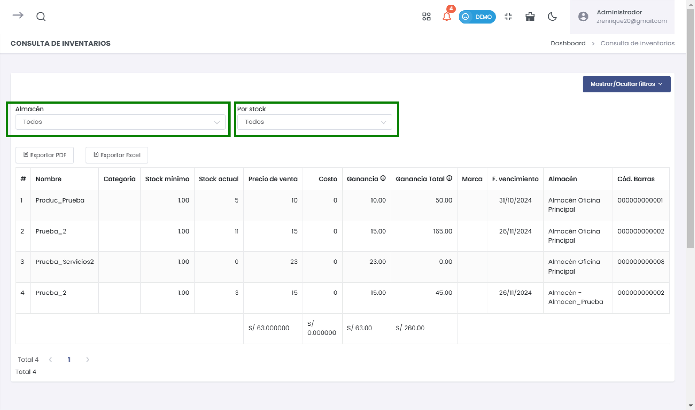
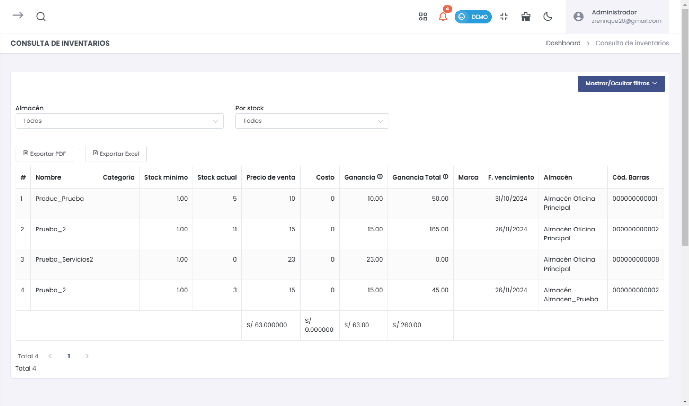
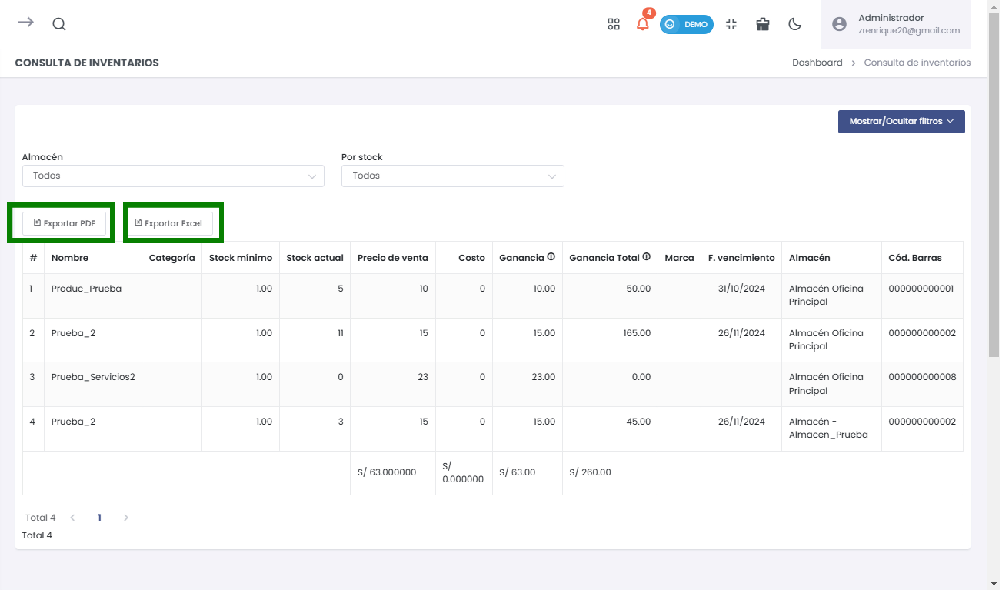

# Reporte de Inventario

En esta sección se puede consultar el inventario de productos en el sistema, visualizando información detallada de cada artículo como el nombre, categoría, stock mínimo y actual, precios de venta, costos, entre otros. También se puede filtrar la información y exportarla en formato PDF o Excel.

## Acceso al Reporte de Inventario

Para acceder a esta sección, navega en el menú lateral a **Inventario > Reporte Inventario**. Verás la pantalla principal de consulta del inventario, donde puedes aplicar filtros y ver la información de los productos registrados en el sistema.

## Filtros de Búsqueda

La consulta permite filtrar los resultados por:
- **Almacén**: Puedes seleccionar el almacén específico o visualizar el inventario de todos.
- **Por stock**: Filtra los productos según su estado de stock:
  - `Stock < 0`
  - `Stock = 0`
  - `0 < Stock <= Stock mínimo`
  - `Stock > Stock mínimo`

También hay un botón **Mostrar/Ocultar filtros** que despliega opciones adicionales para filtrar por descripción, categorías, modelo, marcas, estado y rango de fechas.

## Listado de Productos

En el listado de productos se muestra la siguiente información:
- **#**: Número secuencial del producto en la lista.
- **Nombre**: Nombre del producto.
- **Categoría**: Categoría a la que pertenece el producto.
- **Stock mínimo**: Cantidad mínima en inventario que se debe mantener.
- **Stock actual**: Cantidad actual en inventario.
- **Precio de venta**: Precio al que se vende el producto.
- **Costo**: Costo del producto.
- **Ganancia**: Diferencia entre el precio de venta y el costo.
- **Ganancia Total**: Total de ganancia calculado sobre la cantidad en stock.
- **Marca**: Marca del producto.
- **F. vencimiento**: Fecha de vencimiento del producto, si aplica.
- **Almacén**: Ubicación en la cual se encuentra almacenado el producto.
- **Cód. Barras**: Código de barras del producto para facilitar su identificación.

## Exportar Resultados

Una vez aplicada la búsqueda y los filtros, puedes exportar los resultados en dos formatos:
- **Exportar PDF**: Genera un archivo PDF con el listado de productos.
- **Exportar Excel**: Genera un archivo Excel con el listado de productos.

Esta funcionalidad permite compartir o analizar el inventario fuera del sistema.

---

**Nota:** La consulta de inventario permite monitorear y gestionar los productos disponibles, ayudando a la toma de decisiones respecto a compras, ventas y control de inventario.
