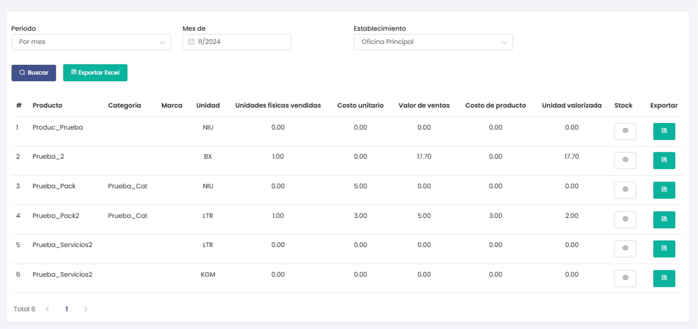

# Kardex Valorizado

La sección de **Kardex Valorizado** permite realizar consultas sobre el valor y movimientos de los productos en inventario durante un período específico. Esta funcionalidad es útil para obtener una visión detallada de la valoración de los productos en función de las ventas y el stock.

## Acceso a Kardex Valorizado

Para acceder a esta sección, sigue estos pasos:
1. En el menú lateral izquierdo, selecciona **Inventario**.
2. Dentro del menú de Inventario, elige la opción **Kardex Valorizado**.

## Filtros de Búsqueda

La interfaz de **Kardex Valorizado** ofrece varios filtros para facilitar la búsqueda y personalización de la información:

- **Periodo**: Permite seleccionar el rango de tiempo de consulta. Las opciones incluyen:
  - Por mes
  - Entre meses
  - Por fecha
  - Entre fechas

  

- **Mes de**: Selecciona el mes específico para filtrar los datos.
- **Establecimiento**: Selecciona el establecimiento donde se realizará la consulta del kardex.

## Resultados de la Búsqueda

Después de aplicar los filtros, la tabla mostrará los siguientes datos:

- **Producto**: Nombre del producto.
- **Categoría**: Categoría a la que pertenece el producto.
- **Marca**: Marca del producto.
- **Unidad**: Unidad de medida del producto (por ejemplo, NIU, LTR, KGM).
- **Unidades físicas vendidas**: Cantidad de unidades vendidas en el período seleccionado.
- **Costo unitario**: Costo de cada unidad del producto.
- **Valor de ventas**: Valor total de las ventas realizadas para el producto.
- **Costo de producto**: Costo total de los productos en stock.
- **Unidad valorizada**: Valor unitario valorizado del producto.
- **Stock**: Cantidad de unidades en inventario.

## Detalle de Stock

Cada producto cuenta con un botón en la columna **Stock** que permite visualizar el detalle del stock disponible en diferentes almacenes, incluyendo:
- **Almacén**: Nombre del almacén donde se encuentra el stock.
- **Stock**: Cantidad de unidades en ese almacén.
- **Precio**: Precio unitario del producto en ese almacén.

## Exportar Resultados

La herramienta permite exportar los resultados de la consulta en dos formatos:
- **Exportar PDF**: Genera un archivo PDF con la información actual de la consulta.
- **Exportar Excel**: Genera un archivo Excel con los datos mostrados.

---

