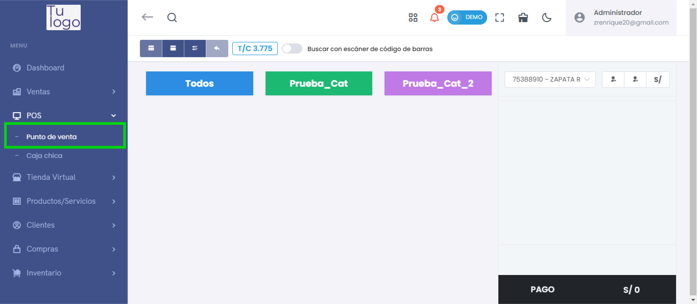
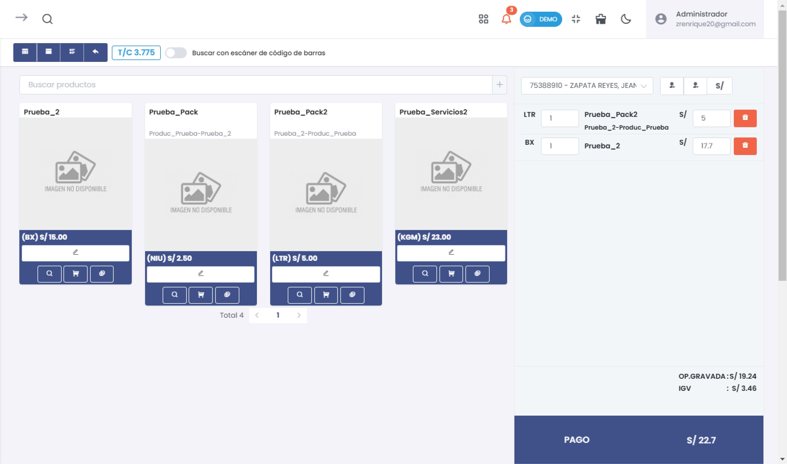
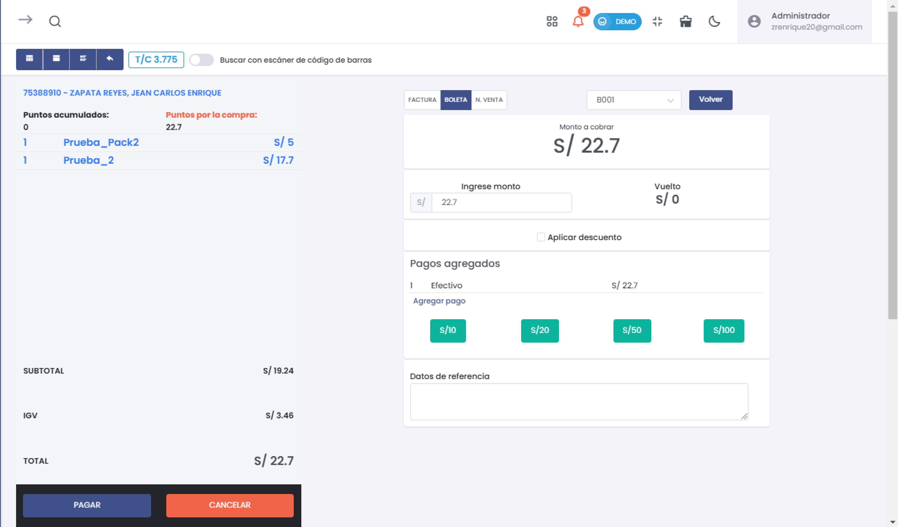
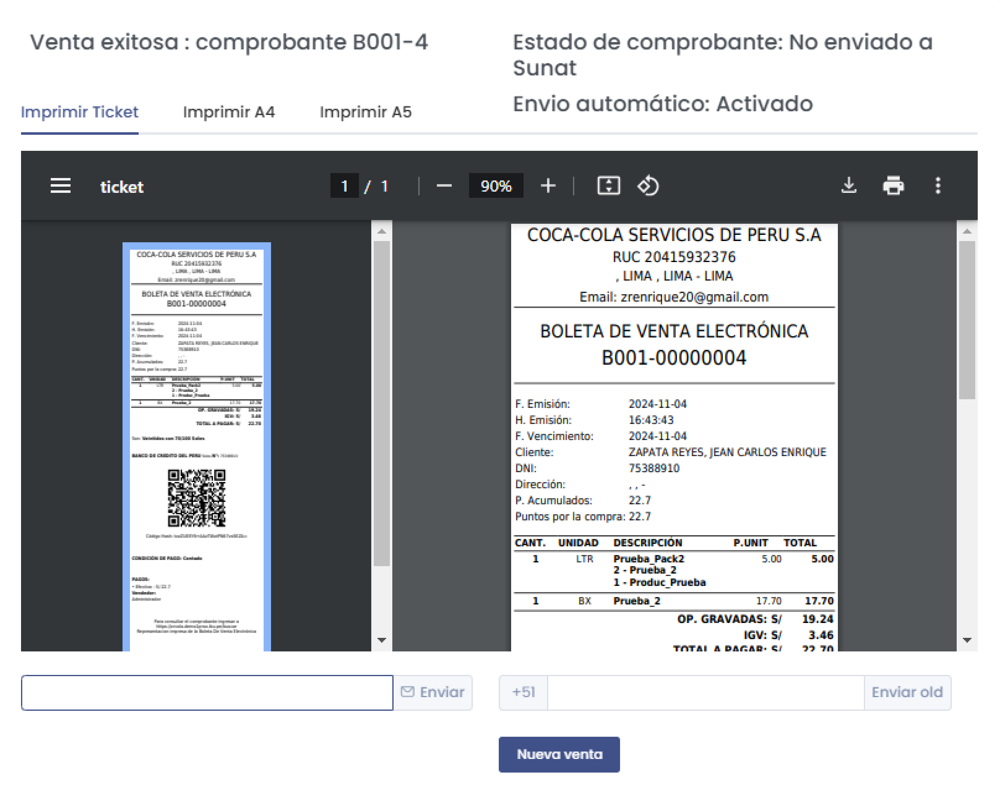
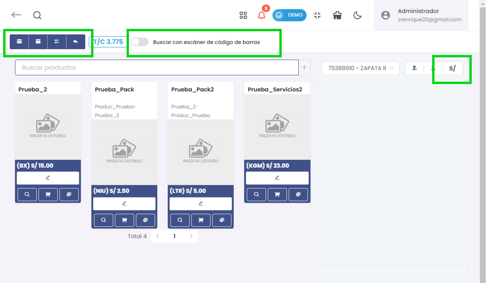

# Punto de Venta (POS)

## Descripción General
El módulo de **Punto de Venta (POS)** permite gestionar la venta de productos y servicios en tiempo real. Los usuarios pueden realizar búsquedas de productos, aplicar descuentos, calcular el cambio y emitir comprobantes de venta. Este módulo es adecuado para entornos de venta rápida, como tiendas y comercios que necesitan generar recibos electrónicos.

## Funcionalidades

### Selección de Productos
- **Buscar productos**: Permite al usuario buscar productos por nombre o código de barras.
- **Tarjetas de productos**: Cada producto disponible se muestra en una tarjeta con:
  - Imagen de producto (si está disponible).
  - Nombre del producto.
  - Precio unitario.
  - Botones de acción para ver detalles, agregar al carrito, o editar la cantidad.

### Carrito de Compras
- **Lista de productos seleccionados**: En el panel derecho, el usuario puede ver los productos añadidos al carrito.
- **Cantidad y precio total**: Para cada producto seleccionado, se muestra la cantidad y el precio total.
- **Puntos acumulados**: Muestra los puntos por la compra si el cliente acumula puntos.
- **Opciones de eliminación**: El usuario puede eliminar productos del carrito si es necesario.

### Pagos
- **Monto a cobrar**: Muestra el total de la venta actual, incluyendo impuestos y otros cargos.
- **Aplicar descuento**: Opción para aplicar un descuento al total.
- **Agregar pago**: El sistema permite pagos en efectivo o por otros métodos, con botones rápidos para agregar montos predeterminados (S/10, S/20, S/50, S/100).
- **Calculador de cambio**: Calcula automáticamente el cambio basado en el monto ingresado.

### Comprobantes de Venta
- **Opciones de comprobantes**: El sistema permite seleccionar entre boletas y facturas.
- **Visualización de comprobantes**: Una vez confirmada la venta, se genera un comprobante que puede imprimirse en formatos de ticket, A4 o A5.
- **Estado del comprobante**: Indica si el comprobante ha sido enviado a SUNAT y si el envío automático está activado.

## Opciones de Visualización
- **Modos de vista**: Cambiar entre vistas de lista y mosaico para ver productos.
- **Escáner de código de barras**: Activar la opción de buscar productos mediante escaneo para agilizar el proceso de venta.
- **Tipo de cambio**: Muestra el tipo de cambio aplicado a los precios en caso de ventas en moneda extranjera.

## Procesos Comunes

### Realizar una Venta
1. **Buscar y seleccionar productos**: Utiliza la barra de búsqueda o el escáner de código de barras para añadir productos al carrito.
2. **Revisar el carrito**: Verifica los productos seleccionados y las cantidades.
3. **Proceder al pago**: Ingrese el monto a pagar y seleccione el método de pago. El sistema calculará el cambio automáticamente.
4. **Generar el comprobante**: Seleccione el tipo de comprobante y confirme la venta. El comprobante puede imprimirse o descargarse.

### Imprimir y Descargar Comprobantes
El sistema permite la generación de comprobantes de venta en formato de ticket, A4 y A5. Estos pueden imprimirse directamente desde el sistema o descargarse en PDF para el registro del cliente.

### Notas Adicionales
- Los productos pueden filtrarse por nombre, categoría o código interno.
- El sistema soporta acumulación de puntos para clientes recurrentes.

---

