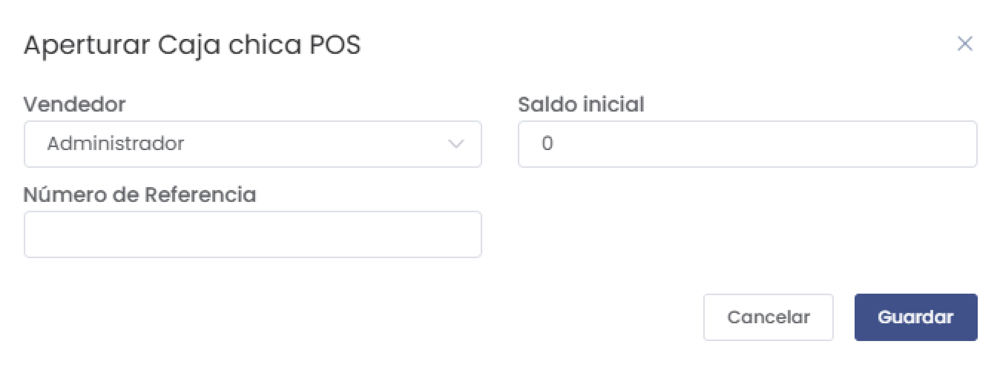
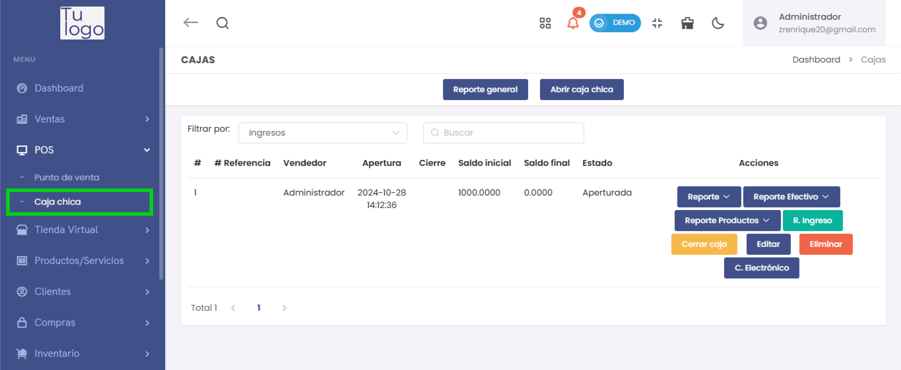
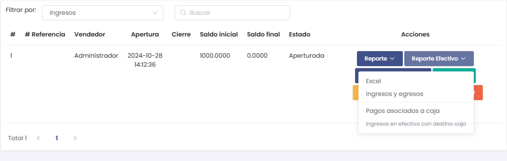
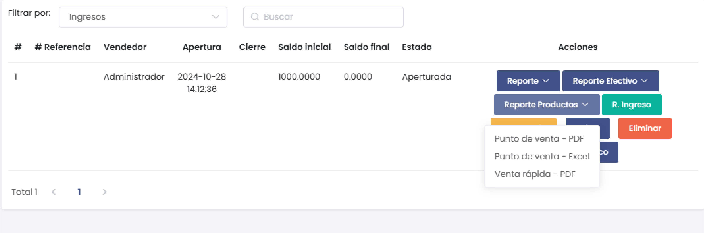
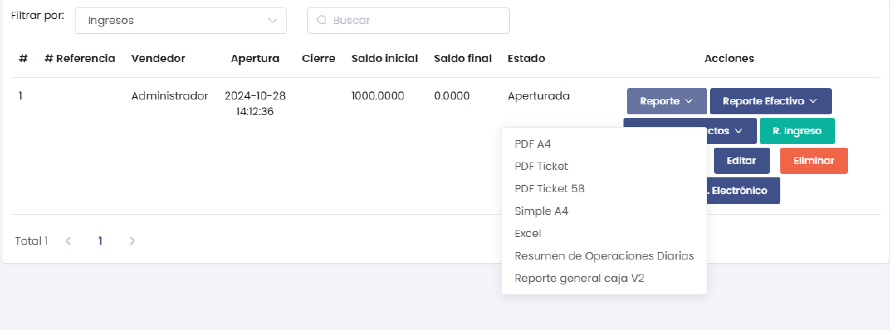

# Caja Chica

La sección de Caja Chica permite gestionar las operaciones de apertura, cierre y registro de ingresos en las cajas asignadas a los vendedores. A continuación se detallan las funciones y opciones disponibles.

---

## Apertura de Caja Chica

Al iniciar el turno, es posible aperturar la caja chica para un vendedor específico. En esta ventana se debe ingresar:
- **Vendedor**: Seleccionar el usuario responsable de la caja.
- **Saldo Inicial**: Monto de apertura de la caja.
- **Número de Referencia**: Código o identificación de la caja.

---

## Visualización de Cajas

La tabla muestra un resumen del estado de las cajas con la siguiente información:
- **# Referencia**: Número de identificación de la caja.
- **Vendedor**: Usuario asignado a la caja.
- **Apertura**: Fecha y hora de apertura.
- **Cierre**: Fecha y hora de cierre (si aplica).
- **Saldo Inicial**: Monto inicial registrado.
- **Saldo Final**: Monto al cierre de caja.
- **Estado**: Indica si la caja está "Aperturada" o "Cerrada".

---

## Opciones de Reporte

Existen varias opciones de reporte disponibles:
1. **Reporte General**: Descarga un PDF con un resumen completo de todas las operaciones.
2. **Reporte Efectivo**: Opciones para exportar a Excel o visualizar ingresos y egresos de la caja.

3. **Reporte Productos**: Permite descargar un PDF o Excel con el detalle de productos vendidos.

4. **R. Ingreso**: Genera un reporte específico de los ingresos de la caja.
5. **C. Electrónico**: Reporte detallado de las operaciones diarias en un formato electrónico.

### Ejemplos de opciones de descarga:
- **PDF A4**: Formato detallado de reporte en tamaño A4.
- **PDF Ticket**: Versión de recibo en formato de ticket.
- **Resumen de Operaciones Diarias**: Reporte compacto de todas las transacciones diarias.

---

## Cerrar Caja

Al finalizar el turno, es posible cerrar la caja, registrando el saldo final y generando los reportes necesarios. Esta acción deja la caja en estado "Cerrada" hasta la próxima apertura.

---

**Nota**: La opción de "Reporte General" descarga un PDF con un resumen exhaustivo de todas las transacciones realizadas durante el periodo de apertura de la caja.
