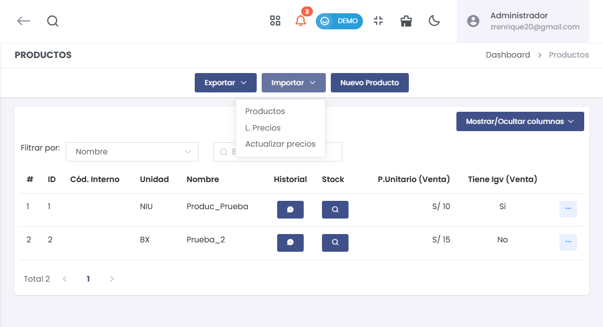

# Lista de Productos

## Gestión de Productos

1. **Acceso al Módulo**  
   Ingresa al módulo de **Productos/Servicios** y selecciona la subcategoría **Productos**.

   

2. **Listado de Productos**  
   Se mostrarán diferentes funcionalidades de las secciones enumeradas a continuación.

   

### Funcionalidades Principales

**1. Filtrar por:**  
   Esta sección permite obtener información sobre los productos de manera más eficiente, aplicando diferentes filtros a la búsqueda.

**2. Historial:**  
   Muestra los detalles del stock, últimas ventas y últimas compras.

**3. Stock:**  
   Visualiza el inventario disponible de los productos.

**4. Precio Unitario:**  
   Indica el valor del producto por unidad.

**5. IGV (Venta):**  
   Muestra si el producto está sujeto a IGV.

**6. Acciones Rápidas (Botón de 3 puntos):**  
   Al seleccionar el botón desplegable, encontrarás opciones para:  
   - **Editar:** Modificar el producto.  
   - **Eliminar:** Eliminar el producto (no se puede eliminar si ha sido utilizado en otras gestiones).  
   - **Duplicar:** Crear una copia del producto.  
   - **Inhabilitar:** Desactivar el producto sin eliminarlo.  
   - **Códigos de Barras:** Identificación de productos mediante códigos.

   

   - **Etiquetas:** Imprimir códigos de barras en diferentes formatos.

   

**7. Exportar:**  
   Seleccionando el botón desplegable, encontrarás opciones para:

   - **Listado:** Descargar la lista completa en formato Excel.  
   - **Woocommerce:** Exportar lista para importación posterior a Woocommerce.  
   - **Etiquetas:** Imprimir etiquetas masivamente.

   

> **Recomendación:** Para la exportación masiva, consulta nuestro [artículo](https://fastura.github.io/documentacion/productos-servicios/Productos-Exportar-masivamente).

**8. Importar:**  
   Opciones disponibles al seleccionar el botón desplegable:  
   - **Productos:** Importar la lista completa de los productos.  
   - **L.Precios:** Importar la lista de precios.  
   - **Actualizar Precios:** Actualizar la lista de precios unitarios.

   

> **Recomendación:** Para la importación masiva, visita nuestro [artículo](https://fastura.github.io/documentacion/productos-servicios/Productos-Importar-masivamente).

**9. Nuevo Producto:**  

   

En esta sección le enseñará a crear un producto en la plataforma. 

## **1. General**  
> ### Información General del Producto  
En esta sección se configuran los datos básicos del producto, incluyendo precio, stock, unidades, y códigos de identificación. 

- **Incluir IGV**:  
  Marcar si el producto incluye IGV.
- **Calcular cantidad por precio**:  
  Activar esta opción para calcular la cantidad basada en el precio.
- **Impuesto a la Bolsa Plástica**:  
  Marcar si el producto está sujeto a este impuesto.
- **Nombre (Obligatorio)**:  
  Nombre principal del producto.
- **Nombre secundario**:  
  Nombre alternativo o secundario del producto.
- **Descripción**:  
  Breve descripción del producto.
- **Modelo y Unidad**:  
  Modelo y unidad de medida del producto.
- **Moneda y Precio Unitario (Obligatorio)**:  
  Seleccionar la moneda y asignar un precio por unidad.
- **Tipo de afectación**:  
  Seleccionar el tipo de afectación fiscal (Ej.: Gravado - Operación Onerosa).
- **Almacén, Stock Inicial y Stock Mínimo**:  
  Configurar el almacén y las cantidades de stock inicial y mínimo.
- **Fecha de Vencimiento**:  
  Fecha en que el producto expira.
- **Códigos de Identificación**:  
  Incluir código de barra, código interno, código de fábrica, código SUNAT, y línea de producto.
- **Opciones adicionales**:  
  Activar opciones como percepción, manejo de lotes, series, si requiere insumos, ISC, detracción, y si es canjeable por puntos.

:::danger IMPORTANTE
Si el producto requiere insumos, se habilitará la pestaña **Producción** durante la creación del producto. En esta sección, podrás buscar y agregar los insumos necesarios para la fabricación o ensamblaje del producto.

  
:::

---

## **2. Almacenes**  
> ### Precios por Almacén  
Permite especificar precios únicos para cada almacén donde el producto esté disponible.

  

- **Almacén Oficina Principal**:  
  Configura el precio específico para el almacén principal o añade otros almacenes según sea necesario.

---

## **3. Presentaciones**  
> ### Configurar Diferentes Presentaciones del Producto  
Define distintas unidades o niveles de precios para el mismo producto, útil para productos con variaciones en tamaño o empaque.

  

- **Código de barra**:  
  Código de barras específico de cada presentación.
- **Unidad**:  
  Unidad de medida para esta presentación.
- **Descripción, Factor y Precios**:  
  Especifica la descripción, el factor de conversión y hasta tres precios distintos.  
- **Precio Predeterminado**:  
  Selecciona el precio que será el predeterminado para esta presentación.

:::danger IMPORTANTE:

Es **obligatorio** ingresar la **descripción** y el **factor** para cada presentación.  
Estos campos son fundamentales para el correcto funcionamiento del sistema y los cálculos relacionados.

  

:::

---

## **4. Atributos**  
> ### Asignación de Atributos y Categorías  
Añade atributos, categorías y marcas al producto para facilitar su identificación y clasificación.

  

- **Imagen del Producto**:  
  Subir una imagen (resolución recomendada entre 700px y 900px, tamaño máximo de 5MB).
- **Categoría y Marca**:  
  Seleccionar la categoría y marca del producto. Es posible crear nuevas categorías y marcas desde esta sección.
- **Listado**:  
  Añadir listados adicionales para especificar el tipo de producto.

---

## **5. Compra**  
> ### Configuración de Parámetros de Compra  
Configura los detalles relacionados con la compra del producto, como precio de compra y porcentaje de ganancia.

  

- **Tipo de afectación**:  
  Seleccionar el tipo de afectación fiscal aplicable en la compra.
- **Precio Unitario y Porcentaje de Ganancia**:  
  Define el precio unitario y el porcentaje de ganancia esperado.
- **Opciones adicionales**:  
  Activar opciones como IGV, ganancia e ISC para este producto en las compras.

---

## **6. Guardar o Cancelar**  
> ### Finalización de la Configuración  
Una vez completados todos los campos necesarios, selecciona **Guardar** para registrar el producto o **Cancelar** para descartar los cambios.

---

