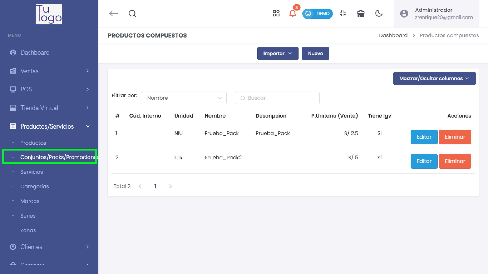
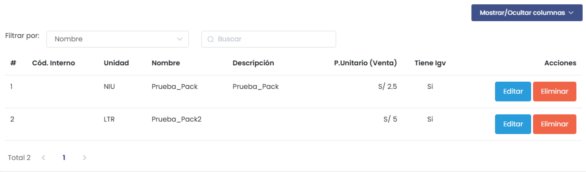
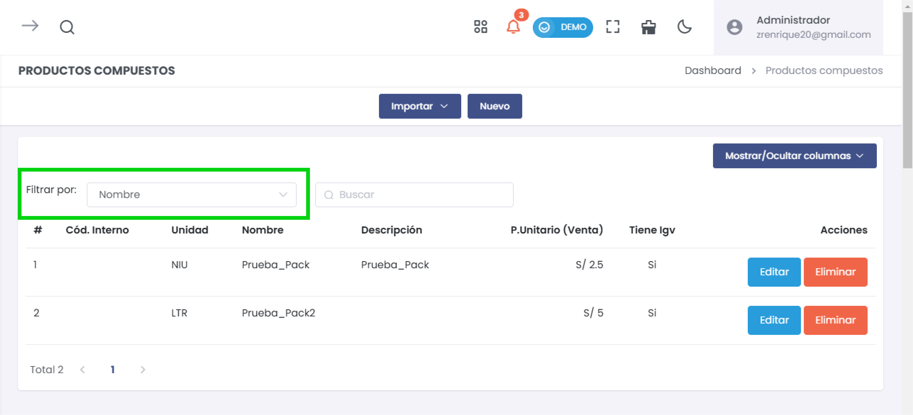
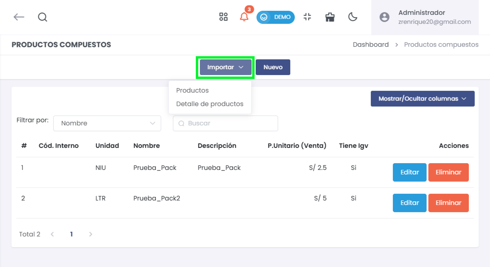
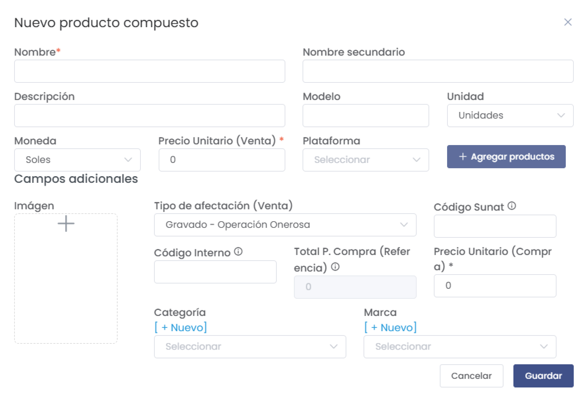
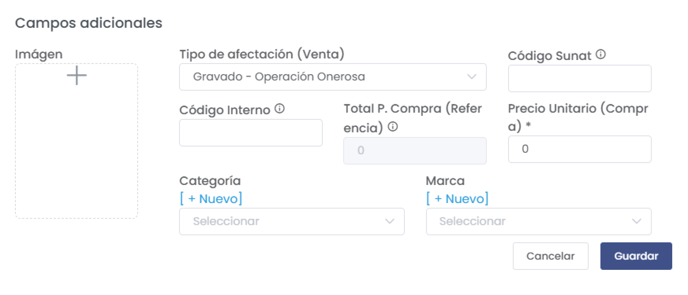
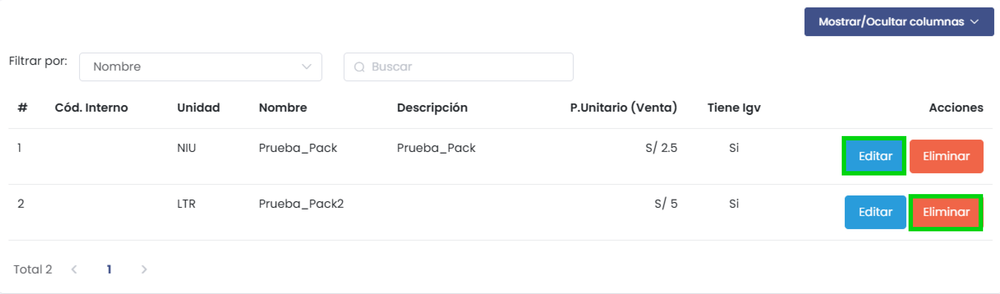

# Productos Compuestos

Esta sección permite gestionar productos compuestos, también conocidos como "packs" o conjuntos de productos. Aquí puedes crear, editar, eliminar y configurar productos compuestos, combinando varios productos individuales en uno solo para su venta.

---

## **1. Acceso al Módulo**  
- Dirígete a **Productos/Servicios** en el menú lateral y selecciona la opción **Conjuntos/Packs/Promociones** para acceder a la lista de productos compuestos.

   

---

## **2. Lista de Productos Compuestos**  
- La interfaz muestra una lista de los productos compuestos existentes con columnas como:
  - **Código Interno**: Identificación única del producto compuesto.
  - **Unidad**: Unidad de medida.
  - **Nombre** y **Descripción**: Detalles del producto compuesto.
  - **Precio Unitario (Venta)**: Precio de venta por unidad.
  - **Tiene IGV**: Indica si el producto está sujeto a IGV.
  - **Acciones**: Opciones para editar o eliminar el producto.

   

### Filtrar Productos
- Utiliza la opción **Filtrar por** para buscar productos compuestos por **Nombre** o **Código interno**.
- Ingresa un término de búsqueda en el campo **Buscar** para filtrar los resultados en tiempo real.

   

---

## **3. Opciones de Importación**  
- En el botón **Importar**, tienes la opción de cargar productos compuestos en masa a través de:
  - **Productos**: Importa una lista general de productos compuestos.
  - **Detalle de productos**: Importa detalles específicos de cada producto compuesto.

   

---

## **4. Creación de Nuevo Producto Compuesto**  
- Haz clic en el botón **Nuevo** para crear un producto compuesto.
- En el formulario de creación, completa los siguientes campos:

   

   - **Nombre y Nombre Secundario**: Nombre principal y alternativo del producto.
   - **Descripción**: Breve descripción del producto compuesto.
   - **Modelo y Unidad**: Especifica el modelo y la unidad de medida.
   - **Moneda y Precio Unitario (Venta)**: Define la moneda y el precio de venta.
   - **Plataforma**: Selecciona la plataforma donde se venderá el producto.
   - **Agregar productos**: Permite agregar los productos individuales que componen el conjunto, especificando la cantidad de cada uno y su precio unitario.

### Campos Adicionales  
- En la sección **Campos adicionales**, puedes configurar:
  - **Imagen**: Subir una imagen representativa del producto compuesto.
  - **Tipo de afectación (Venta)**: Selecciona el tipo de afectación fiscal.
  - **Código Interno y Código Sunat**: Configura los códigos necesarios para identificación fiscal y logística.
  - **Total P. Compra (Referencia)** y **Precio Unitario (Compra)**: Define los precios de compra para referencia.
  - **Categoría y Marca**: Selecciona la categoría y marca asociada al producto compuesto o crea nuevas opciones.

   

### Guardar el Producto Compuesto  
- Una vez que completes todos los campos, haz clic en **Guardar** para registrar el nuevo producto compuesto en el sistema.

---

## **5. Acciones de Gestión**  
- **Editar**: Permite modificar los detalles de un producto compuesto existente.
- **Eliminar**: Borra un producto compuesto de la lista (esta acción es irreversible).

   

