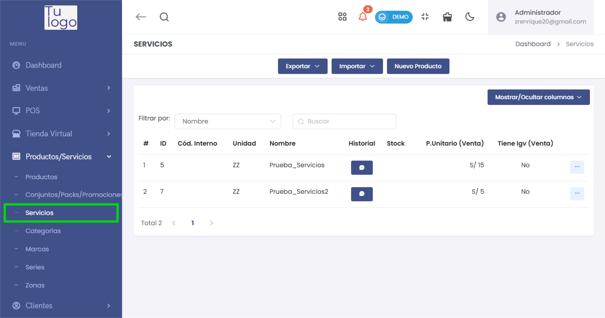
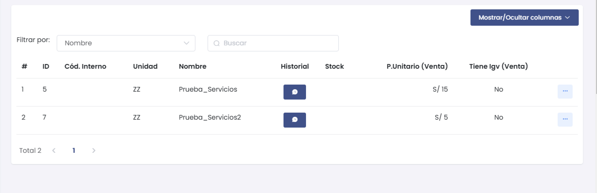
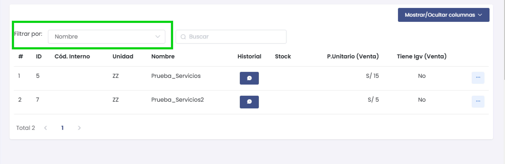
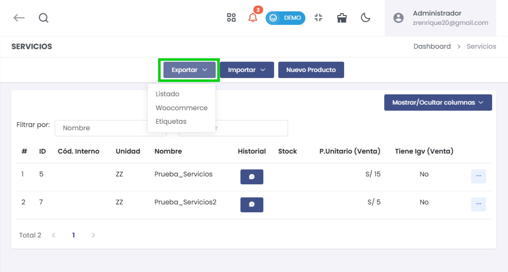
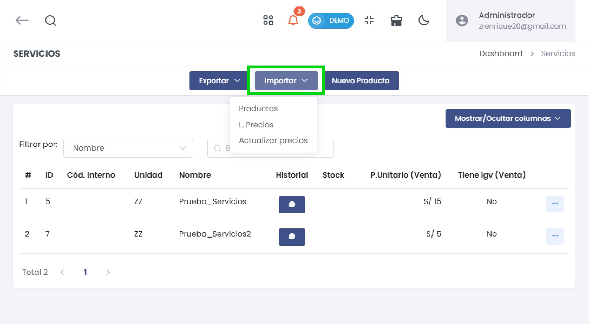
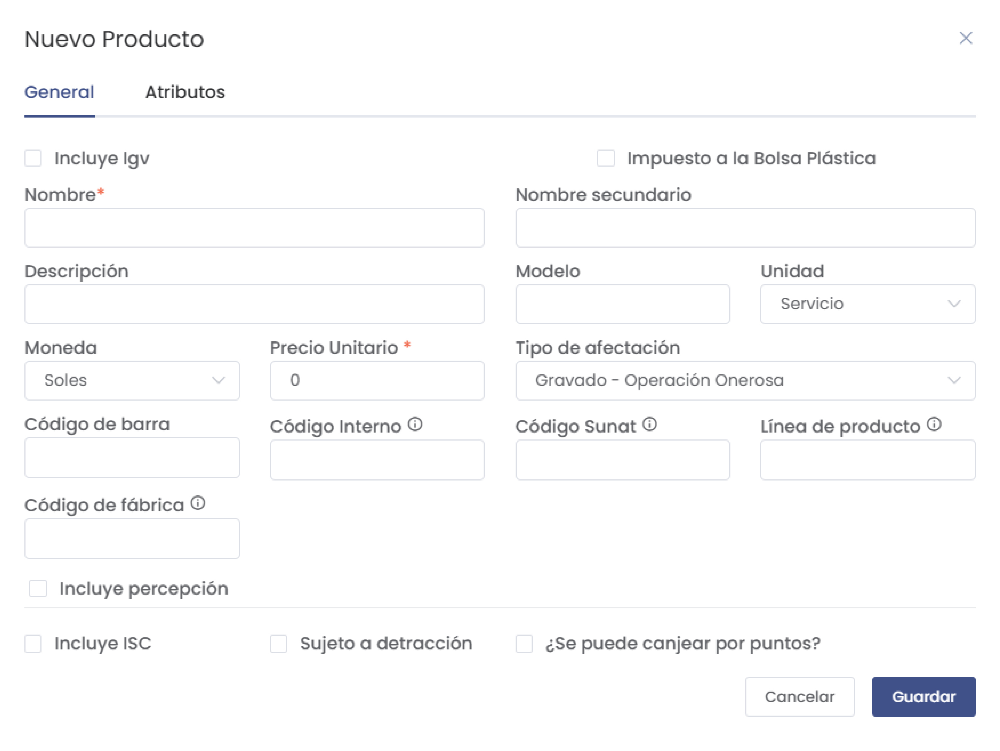
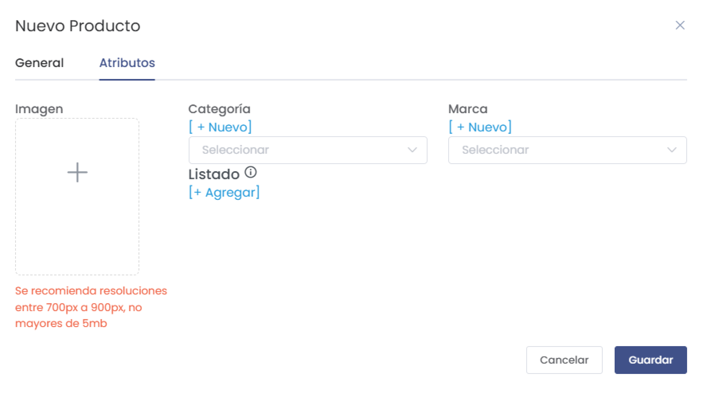
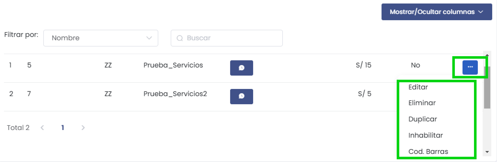

# Servicios

La sección **Servicios** permite gestionar servicios ofrecidos por la empresa, como aquellos que no requieren stock de productos físicos. Esta guía detalla las funcionalidades y opciones disponibles para administrar servicios.

---

## **1. Acceso al Módulo**
- Desde el menú lateral, navega a **Productos/Servicios** y selecciona **Servicios** para acceder a la lista de servicios registrados.

   

---

## **2. Lista de Servicios**
- La interfaz muestra la lista de servicios con columnas como:
  - **ID**: Identificación única del servicio.
  - **Código Interno**: Código personalizado asignado al servicio.
  - **Unidad**: Unidad de medida para el servicio (Ej.: ZZ).
  - **Nombre** y **Descripción**: Detalles básicos del servicio.
  - **Historial**: Registra el historial de cambios y uso del servicio.
  - **Stock**: Aunque los servicios no requieren stock, esta columna puede mostrar disponibilidad si aplica.
  - **P. Unitario (Venta)**: Precio unitario de venta.
  - **Tiene IGV (Venta)**: Indica si el servicio está sujeto a IGV.

   

### Filtrar Servicios
- Utiliza **Filtrar por** para buscar servicios por **Nombre** o **Código interno**.
- Ingresa un término de búsqueda en el campo **Buscar** para filtrar los resultados en tiempo real.

   

---

## **3. Opciones de Exportación**
- El botón **Exportar** permite exportar datos de los servicios en los siguientes formatos:
  - **Listado**: Descarga la lista completa de servicios en formato Excel.
  - **Woocommerce**: Exporta la lista para importar en una tienda de Woocommerce.
  - **Etiquetas**: Imprime etiquetas personalizadas.

   

## **4. Opciones de Importación**
- El botón **Importar** permite cargar servicios de forma masiva:
  - **Productos**: Importa la lista general de servicios.
  - **L. Precios**: Importa una lista de precios para los servicios.
  - **Actualizar precios**: Actualiza los precios unitarios de los servicios.

   

---

## **5. Crear un Nuevo Servicio**
- Haz clic en **Nuevo Producto** para agregar un nuevo servicio.
- Completa el formulario con los datos básicos del servicio:

   

   - **Nombre**: Nombre del servicio (campo obligatorio).
   - **Descripción**: Breve descripción del servicio.
   - **Moneda y Precio Unitario**: Define la moneda y el precio unitario de venta.
   - **Unidad**: Selecciona la unidad de medida (Ej.: Servicio).
   - **Tipo de afectación**: Define la afectación fiscal, como **Gravado - Operación Onerosa**.
   - **Códigos**: Incluye el código de barra, código interno y código SUNAT si aplica.
   - **Otras Opciones**: Marca opciones adicionales, como **Incluye IGV**, **Incluye percepción**, **Sujeto a detracción**, y **Canjeable por puntos**.

### Pestaña Atributos
- En la pestaña **Atributos**, puedes configurar los siguientes detalles adicionales:
  - **Imagen**: Sube una imagen representativa del servicio (recomendación de resolución entre 700px y 900px, tamaño máximo de 5MB).
  - **Categoría y Marca**: Selecciona la categoría y marca del servicio o crea nuevas opciones desde esta sección.
  - **Listado**: Añade listados adicionales para especificar el tipo de servicio.

   

### Guardar el Servicio
- Al finalizar la configuración, haz clic en **Guardar** para registrar el nuevo servicio en el sistema.

---

## **6. Acciones de Gestión**
- **Editar**: Permite modificar los detalles de un servicio.
- **Eliminar**: Borra un servicio de la lista (acción irreversible).
- **Duplicar**: Crea una copia exacta del servicio para agilizar la creación de servicios similares.
- **Inhabilitar**: Desactiva temporalmente un servicio sin eliminarlo.
- **Cod. Barras**: Genera e imprime etiquetas de código de barras para el servicio.

   

