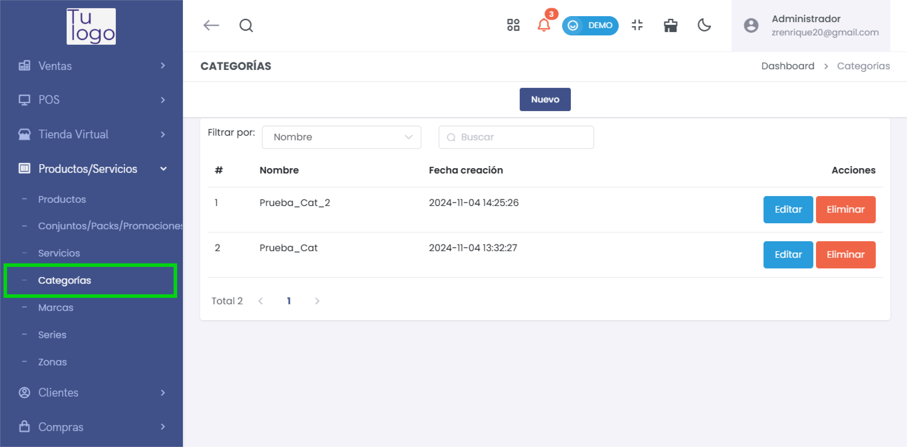
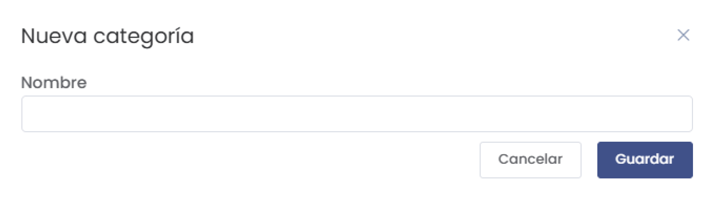

# Categorías

La sección **Categorías** permite gestionar las diferentes categorías de productos y servicios que ofrece la empresa. Esta funcionalidad es útil para organizar y clasificar los elementos del catálogo de manera ordenada.

---

## **1. Acceso al Módulo**
- Desde el menú lateral, navega a **Productos/Servicios** y selecciona **Categorías** para acceder a la lista de categorías registradas.

   

---

## **2. Lista de Categorías**
- La interfaz muestra una lista de las categorías existentes con las siguientes columnas:
  - **#**: Número de orden de la categoría.
  - **Nombre**: Nombre de la categoría.
  - **Fecha creación**: Fecha y hora en la que se creó la categoría.
  - **Acciones**: Opciones para editar o eliminar la categoría.

---

## **3. Crear una Nueva Categoría**
- Haz clic en el botón **Nuevo** para agregar una nueva categoría.
- Aparecerá un formulario donde podrás ingresar el **Nombre** de la categoría.
  
   

- Haz clic en **Guardar** para registrar la nueva categoría en el sistema o en **Cancelar** para descartar la creación.

---

## **4. Acciones de Gestión**
- **Editar**: Permite modificar el nombre de una categoría existente.
- **Eliminar**: Borra la categoría de la lista (esta acción es irreversible).

