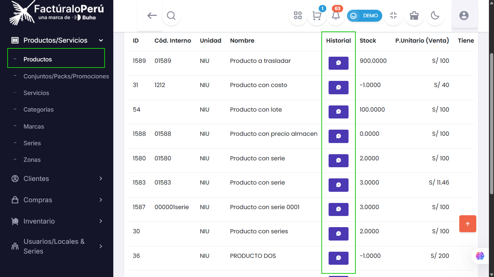
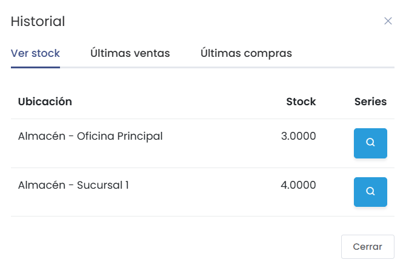
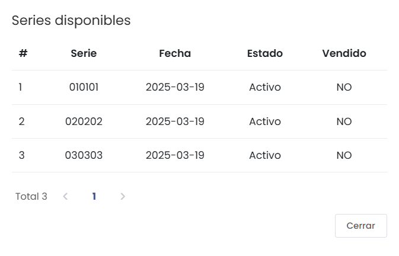
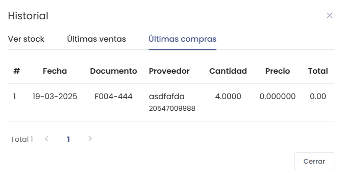

# Inventarios por Almacenes

En esta guía aprenderás a consultar y gestionar los inventarios de tus productos por cada almacén, así como a visualizar información clave como series, historial de ventas y compras.

---

## Acceso a Inventarios por Almacén

1. Ingresa al módulo **Productos/Servicios** desde el menú lateral.
2. Busca el producto que deseas consultar.
3. Haz clic en el producto para acceder a su historial y detalles.

---

## Consulta de Stock por Almacén

En la sección de historial del producto podrás visualizar:

- **Stock disponible** en cada almacén.

- **Series** asociadas a cada almacén (útil para productos con número de serie como celulares o electrodomésticos).

- **Historial de ventas** y la fecha de la última venta.
- **Historial de compras**.

:::tip Nota
Esta funcionalidad es especialmente útil si trabajas con productos que requieren control por número de serie o manejas múltiples almacenes.
:::

---

## Acciones Disponibles

- **Ver series por almacén:** Consulta el detalle de cada serie registrada en los diferentes almacenes.
- **Consultar últimas ventas y compras:** Accede rápidamente a la información de movimientos recientes del producto.
- **Gestión eficiente:** Toda la información clave de inventarios está centralizada para una mejor toma de decisiones.

---

:::danger Importante
Si no visualizas la información de series o movimientos, verifica que el producto tenga correctamente configurados los almacenes y la gestión de series activada.
:::

---

¿Tienes dudas o quieres sacarle más provecho a esta funcionalidad?  
No dudes en escribirnos para recibir soporte personalizado.

---

