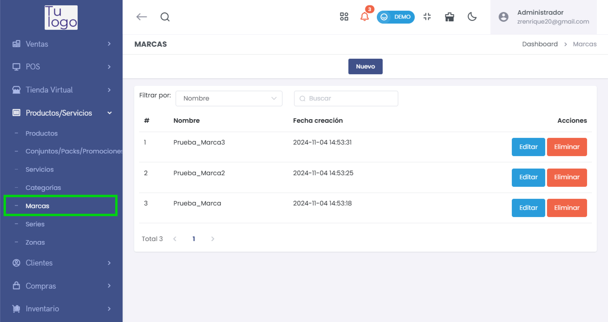
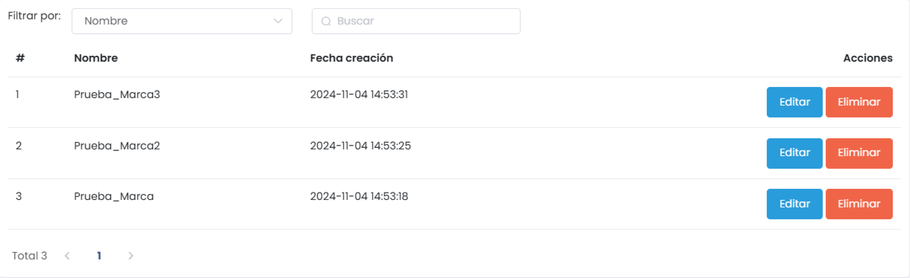
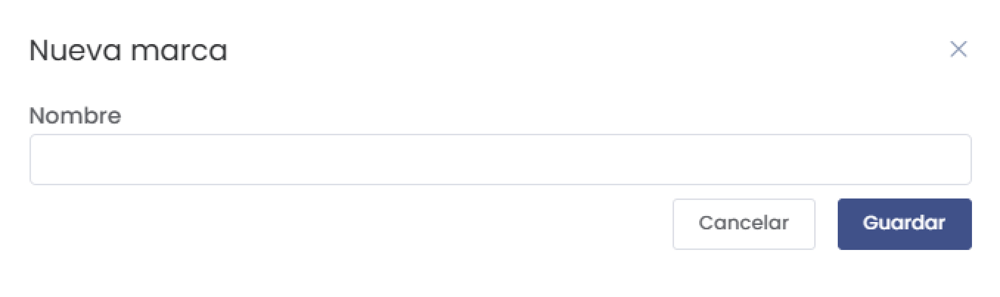

# Marcas

La sección **Marcas** permite gestionar las marcas asociadas a los productos y servicios ofrecidos por la empresa. Organizar los productos por marca facilita su identificación y categorización dentro del sistema.

---

## **1. Acceso al Módulo**
- Desde el menú lateral, dirígete a **Productos/Servicios** y selecciona **Marcas** para acceder a la lista de marcas registradas.

   

---

## **2. Lista de Marcas**
- La interfaz muestra una lista de las marcas existentes con las siguientes columnas:
  - **#**: Número de orden de la marca.
  - **Nombre**: Nombre de la marca.
  - **Fecha creación**: Fecha y hora en que se creó la marca.
  - **Acciones**: Opciones para editar o eliminar la marca.

   

### Filtrar Marcas
- Utiliza el campo **Filtrar por** para buscar marcas por **Nombre**.
- Ingresa un término en el campo **Buscar** para encontrar rápidamente una marca específica.

---

## **3. Crear una Nueva Marca**
- Haz clic en el botón **Nuevo** para agregar una nueva marca.
- Aparecerá un formulario donde podrás ingresar el **Nombre** de la marca.

   

- Haz clic en **Guardar** para registrar la nueva marca en el sistema o en **Cancelar** para descartar la creación.

---

## **4. Acciones de Gestión**
- **Editar**: Permite modificar el nombre de una marca existente.
- **Eliminar**: Borra la marca de la lista (esta acción es irreversible).

