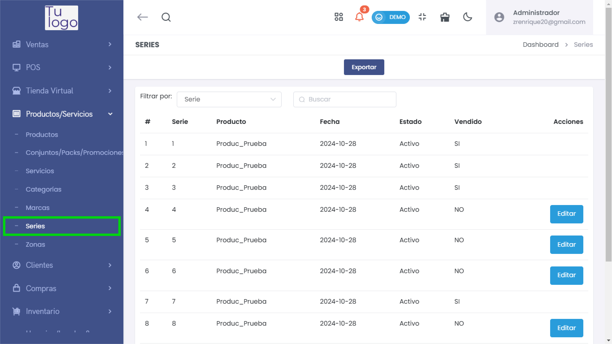
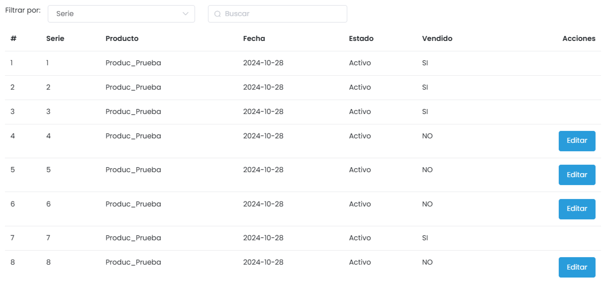
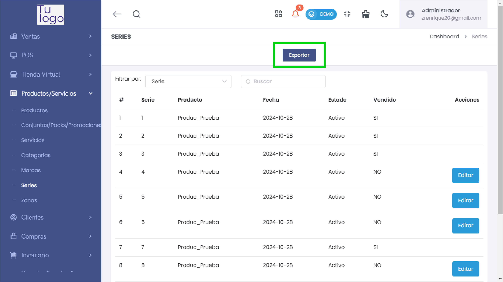
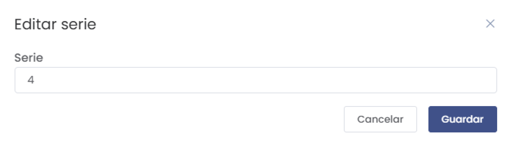

# Series

La sección **Series** permite gestionar los números de serie asociados a productos específicos. Esto es útil para el seguimiento detallado de productos individuales, especialmente en casos donde se requiere un control exhaustivo de inventario o de productos vendidos y activos.

---

## **1. Acceso al Módulo**
- Desde el menú lateral, navega a **Productos/Servicios** y selecciona **Series** para acceder a la lista de series registradas.

   

---

## **2. Lista de Series**
- La interfaz muestra una lista de las series de productos con las siguientes columnas:
  - **#**: Número de orden de la serie.
  - **Serie**: Número de serie asignado al producto.
  - **Producto**: Nombre del producto al que pertenece la serie.
  - **Fecha**: Fecha de creación o registro de la serie.
  - **Estado**: Indica si la serie está **Activa** o **Inactiva**.
  - **Vendido**: Indica si el producto con esta serie ha sido vendido (**Sí** o **No**).
  - **Acciones**: Opción para editar la serie.

   

---

## **3. Exportar Series**
- El botón **Exportar** permite descargar la lista de series en formato Excel, facilitando la gestión y análisis de series de productos fuera del sistema.

   

---

## **4. Editar una Serie**
- Para modificar el número de serie o detalles específicos, haz clic en el botón **Editar** en la columna de **Acciones** correspondiente a la serie que deseas actualizar.
- Aparecerá un formulario donde podrás modificar el número de serie.

   

- Haz clic en **Guardar** para actualizar la serie o en **Cancelar** para descartar los cambios.

---

