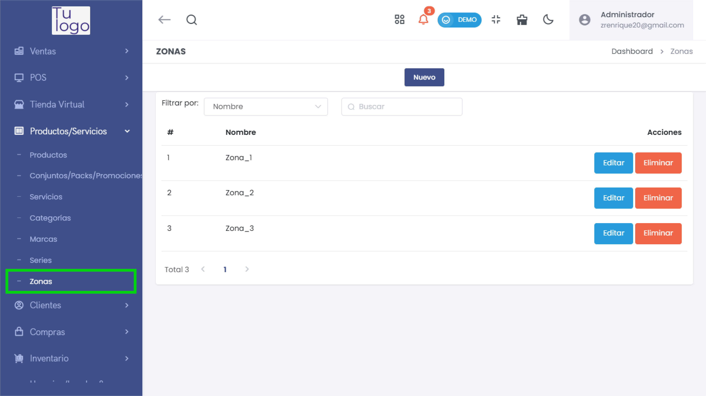
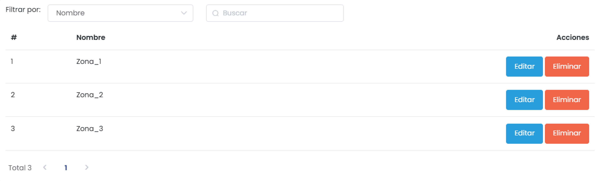
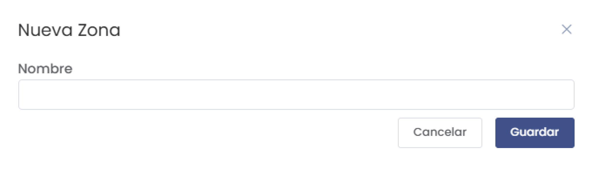
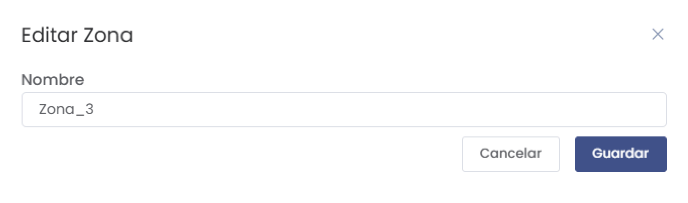

# Zonas

La sección **Zonas** permite gestionar las diferentes zonas geográficas o áreas en las que opera la empresa. Estas zonas pueden ser utilizadas para organizar y categorizar productos, servicios, o clientes según la ubicación.

---

## **1. Acceso al Módulo**
- Desde el menú lateral, dirígete a **Productos/Servicios** y selecciona **Zonas** para acceder a la lista de zonas registradas.

   

---

## **2. Lista de Zonas**
- La interfaz muestra una lista de las zonas existentes con las siguientes columnas:
  - **#**: Número de orden de la zona.
  - **Nombre**: Nombre de la zona.
  - **Acciones**: Opciones para editar o eliminar la zona.

   

---

## **3. Crear una Nueva Zona**
- Haz clic en el botón **Nuevo** para agregar una nueva zona.
- Aparecerá un formulario donde podrás ingresar el **Nombre** de la zona.

   

- Haz clic en **Guardar** para registrar la nueva zona en el sistema o en **Cancelar** para descartar la creación.

---

## **4. Editar una Zona**
- Para modificar el nombre de una zona existente, haz clic en el botón **Editar** en la columna de **Acciones** correspondiente a la zona que deseas actualizar.
- Aparecerá un formulario donde podrás cambiar el nombre de la zona.

   

- Haz clic en **Guardar** para actualizar la zona o en **Cancelar** para descartar los cambios.

---

## **5. Eliminar una Zona**
- Para eliminar una zona, haz clic en el botón **Eliminar** en la columna de **Acciones**. Ten en cuenta que esta acción es irreversible.

