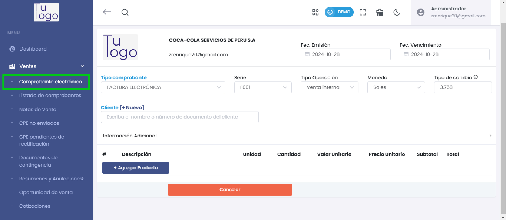
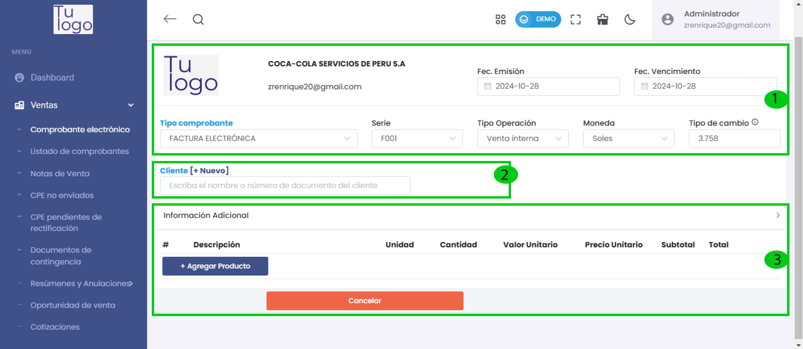
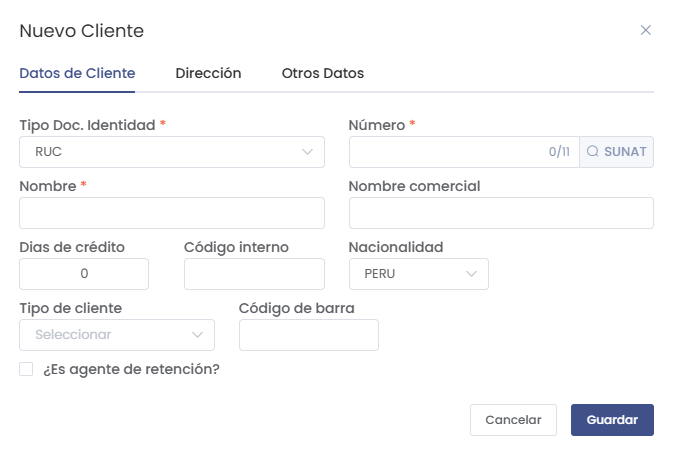
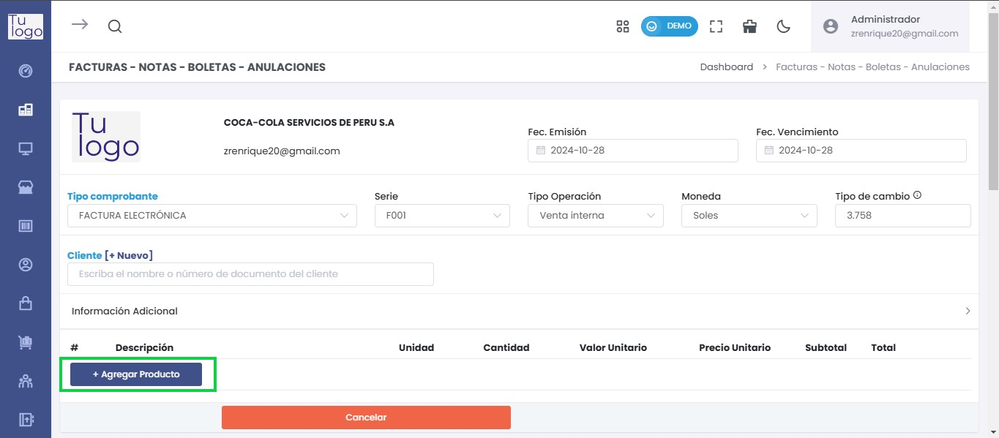
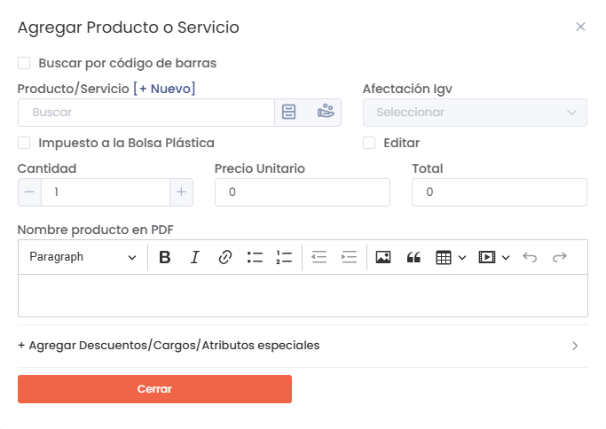
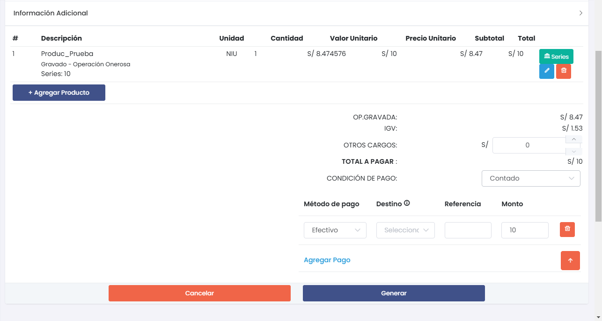
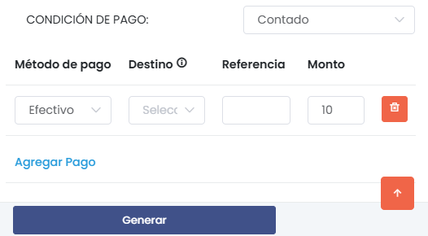
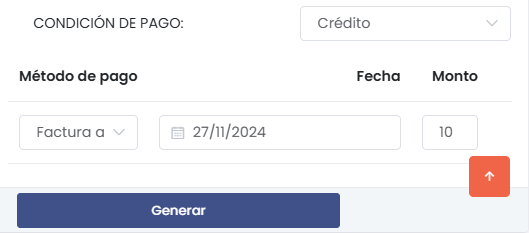
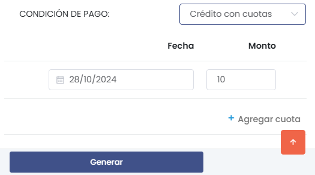
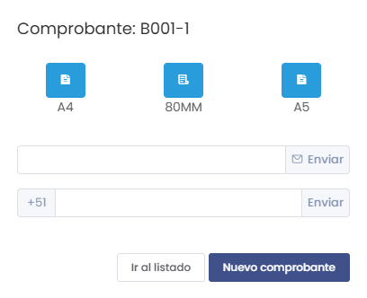

# Emitir Facturas y Boletas

Esta guía te ayudará a generar comprobantes electrónicos y gestionar los clientes de forma eficiente.

---

## 1. Crear Comprobante

Entra al **módulo de ventas** y selecciona la opción **Comprobante electrónico** en el menú lateral.

### Sección de Configuración del Comprobante

En esta sección puedes seleccionar el tipo de comprobante y realizar las configuraciones necesarias.

1. **Tipo de Comprobante:** Selecciona el tipo (Factura o Boleta electrónica).
2. **Serie:** Selecciona la serie del comprobante (por defecto aparece **F001** para facturas).
3. **Tipo de Operación:** Escoge el tipo de operación, como **Venta interna**.
4. **Moneda:** Selecciona entre **Soles** o **Dólares Americanos**.
5. **Tipo de Cambio:** El valor del tipo de cambio es cargado automáticamente desde SUNAT.
6. **Fecha de Emisión:** Selecciona la fecha en que se emite el comprobante.
7. **Fecha de Vencimiento:** Define la fecha límite de pago del comprobante.

:::info IMPORTANTE
Puedes emitir un comprobante con un día de retraso.
:::

---

## 2. Seleccionar o Crear un Nuevo Cliente

Si el cliente ya existe, selecciónalo en el campo correspondiente. Si no, selecciona **[+Nuevo]** para agregar uno.

Al crear un cliente nuevo, se abrirá el siguiente formulario:

Completa los siguientes datos:

- **Tipo de Documento:** Selecciona entre RUC, DNI, CE, entre otros.
- **Número de Documento:** Ingresa el número del documento.
- **Nombre:** Se autocompleta una vez ingresado el número de documento.

Luego, agrega la dirección y otros datos según las necesidades de tu empresa. Para guardar el cliente, selecciona **Guardar**.

:::danger IMPORTANTE
Todos los campos marcados con **(*)** son obligatorios.
:::

---

## 3. Agregar Productos al Comprobante

Selecciona el botón **Agregar Producto** para añadir productos o servicios al comprobante.

Se abrirá el siguiente formulario:

Completa los datos del producto o servicio:

- **Producto/Servicio:** Si ya está creado, selecciona de la lista. Si no, usa **[+Nuevo]** para crear uno.
- **Cantidad:** Ingresa la cantidad de productos.
- **Precio Unitario:** Precio por unidad del producto.
- **Nombre del Producto en PDF:** Ingresa la descripción que aparecerá en el comprobante.
- **Descuentos o Atributos Especiales:** Agrega descuentos o características adicionales, si corresponde.

Una vez completados los datos, selecciona **Guardar**.

---

## 4. Revisar el Comprobante y Métodos de Pago

Después de agregar los productos, revisa que todos los datos estén correctos.

### Seleccionar Condiciones de Pago

Elige la condición de pago que se ajuste a la operación:

#### **Contado**
Selecciona el método de pago y especifica el destino, la referencia, y el monto.

#### **Crédito**
Configura la fecha de pago y el método. Esta opción puede ajustarse en **Configuración > Métodos de Pago**.

#### **Crédito a Cuotas**
Ingresa las fechas de pago, el monto de cada cuota y el número de cuotas.

:::info IMPORTANTE
Si seleccionas crédito o crédito a cuotas, puedes hacer seguimiento del estado de pago desde **Finanzas > Cuentas por Cobrar**.
:::

---

## 5. Generar y Enviar el Comprobante

Una vez que todos los datos estén completos, selecciona el botón **Generar**.

### Opciones Adicionales

- **Formato del Comprobante:** Elige entre **A4 (vertical)**, **80MM (ticket)** o **A5 (horizontal)**.
- **Enviar por Correo o WhatsApp:** Ingresa los datos del destinatario y selecciona **Enviar**.
- **Ir al Listado:** Visualiza todos los comprobantes generados o selecciona **Crear Nuevo Comprobante** para iniciar otro.

