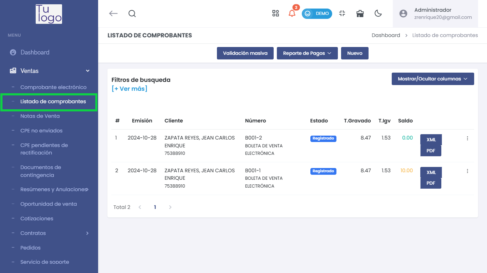
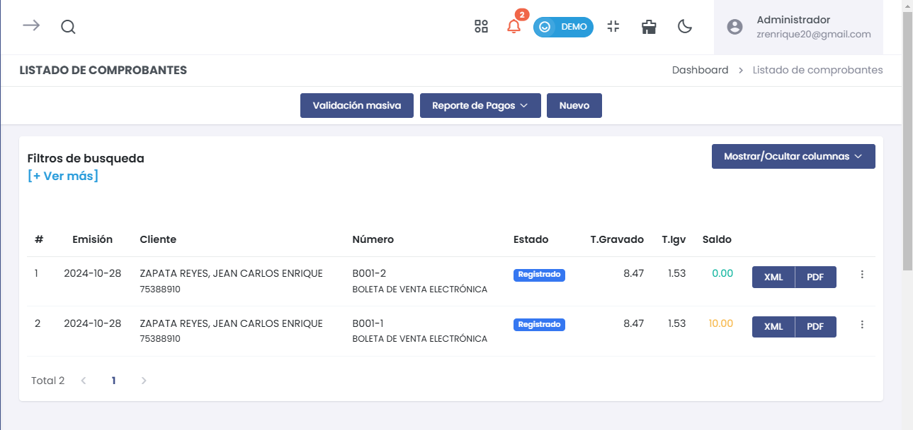
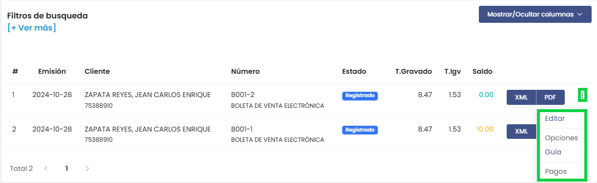
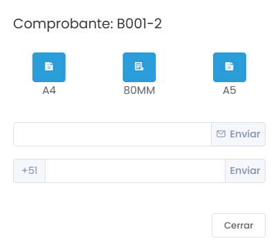
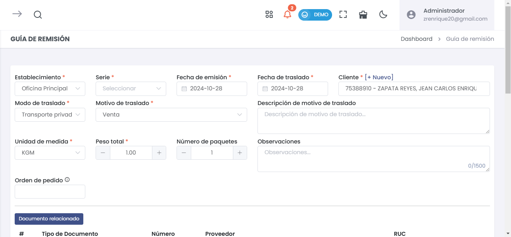
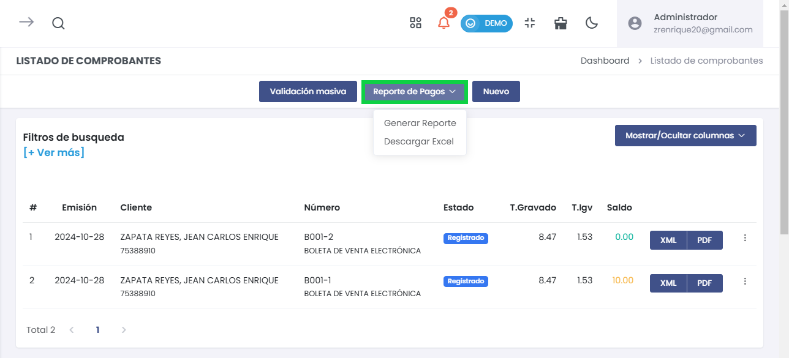
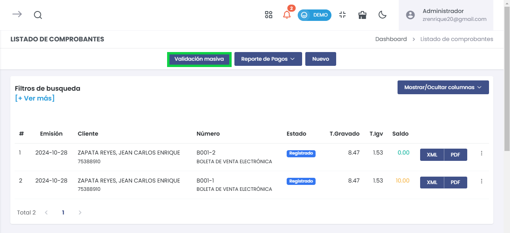
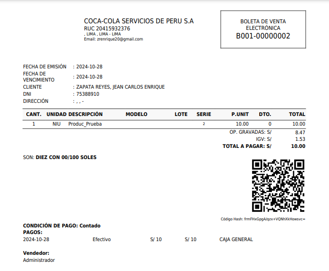

# Listado de Comprobantes

Gestiona todos los comprobantes electrónicos generados en la plataforma de forma rápida y sencilla.

---

## Acceso al Listado de Comprobantes

1. **Navega al módulo de Ventas** y selecciona **Listado de comprobantes** en el menú lateral.

---

## Opciones Principales

En esta vista podrás filtrar, validar y gestionar los comprobantes generados.

### 1. Filtros de Búsqueda

- **[+ Ver más]**: Amplía las opciones para filtrar por cliente, estado, fecha, entre otros.

---

### 2. Comprobantes Listados

Cada fila muestra la información esencial del comprobante:

- **Fecha de Emisión**: Día en que se emitió.
- **Cliente**: Nombre del cliente y su documento.
- **Número**: Identificador del comprobante, como **B001-1**.
- **Estado**: Ejemplo: **Registrado**.
- **T.Gravado / T.IGV**: Subtotal e impuestos.
- **Saldo**: Monto pendiente, si lo hay.

---

## Acciones con los Comprobantes

Cada comprobante ofrece varias opciones desde el menú desplegable.

1. **Editar**: Modifica los detalles del comprobante.
2. **Opciones**: Selecciona formato e imprime o envía el comprobante.
3. **Guía**: Genera una **Guía de Remisión** con datos del comprobante.
4. **Pagos**: Gestiona los pagos registrados.

---

### Opciones de Formato y Envío

Selecciona **Opciones** para elegir el formato e imprimir o enviar el comprobante.

- **Formatos Disponibles**:
  - **A4**: Formato vertical estándar.
  - **80MM**: Ticket pequeño.
  - **A5**: Formato horizontal.

- **Envío por Correo o WhatsApp**:
  - **Correo**: Ingresa el email del destinatario y selecciona **Enviar**.
  - **WhatsApp**: Ingresa el número con prefijo internacional (+51 para Perú) y selecciona **Enviar**.

---

## Generación de Guía de Remisión

Si seleccionas **Guía** en las opciones, serás redirigido al formulario para completar la **Guía de Remisión**.

### Datos a Completar

- **Establecimiento**: Lugar de origen del traslado.
- **Serie y Fechas**: Serie del comprobante y fechas de emisión y traslado.
- **Modo y Motivo de Traslado**: Tipo de transporte y razón del traslado.
- **Peso y Paquetes**: Peso total y número de paquetes.
- **Observaciones**: Notas adicionales, si es necesario.

---

## Reporte de Pagos

Genera informes de los pagos desde la opción **Reporte de Pagos**.

- **Generar Reporte**: Muestra un informe de los pagos realizados.
- **Descargar Excel**: Exporta los datos a Excel para análisis externo.

---

## Validación Masiva de Comprobantes

Realiza la validación masiva de comprobantes con la opción **Validación masiva**.

1. **Periodo**: Selecciona el rango de fechas (por mes, entre meses, entre fechas).
2. **Comprobante**: Escoge el tipo de comprobante que quieres validar.
3. **Buscar y Validar**: Ejecuta la validación de los comprobantes seleccionados.

---

## Exportar Comprobantes

Cada comprobante se puede descargar en formato **XML** o **PDF** para su archivo o envío.

---

## Conclusión

El **Listado de Comprobantes** es una herramienta completa para gestionar los documentos emitidos. Permite:
- Filtrar y buscar comprobantes rápidamente.
- Editar y gestionar pagos de manera sencilla.
- Generar guías de remisión con datos pre-cargados.
- Imprimir y enviar comprobantes en formatos adecuados.
- Realizar validaciones masivas para optimizar el proceso.

Esta sección garantiza el control total sobre tus comprobantes electrónicos, facilitando una gestión ágil y eficiente.
