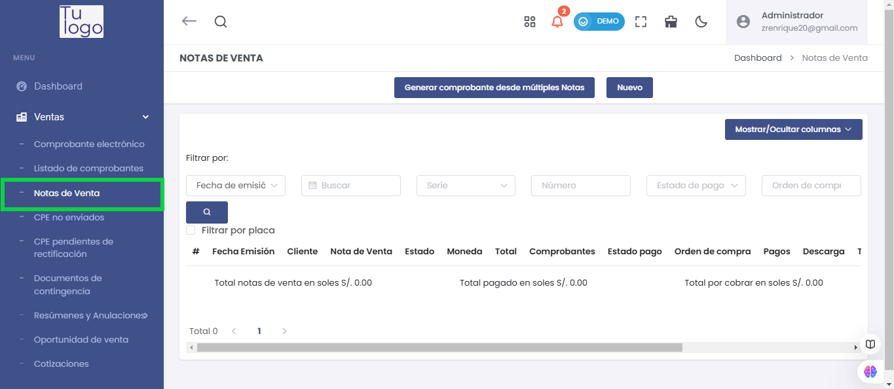
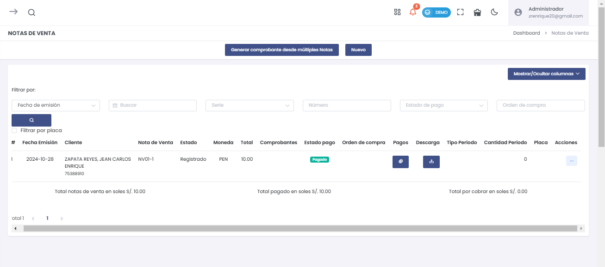
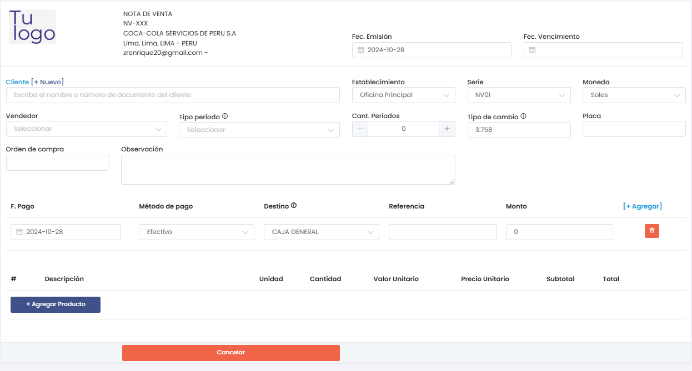
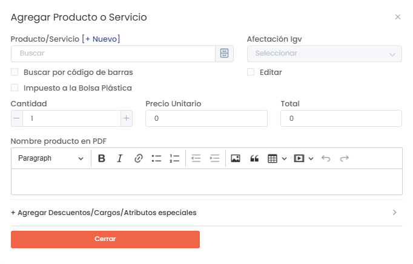
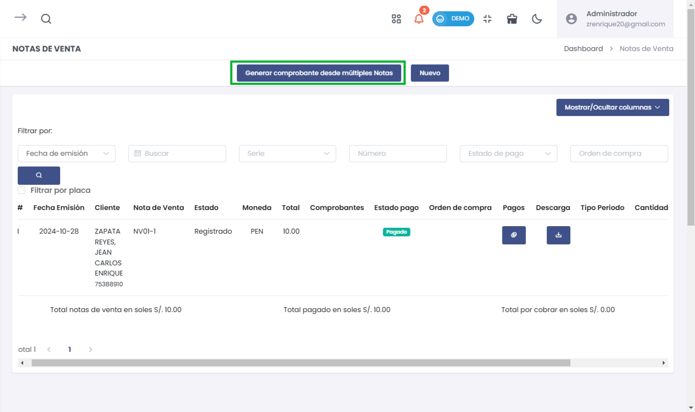
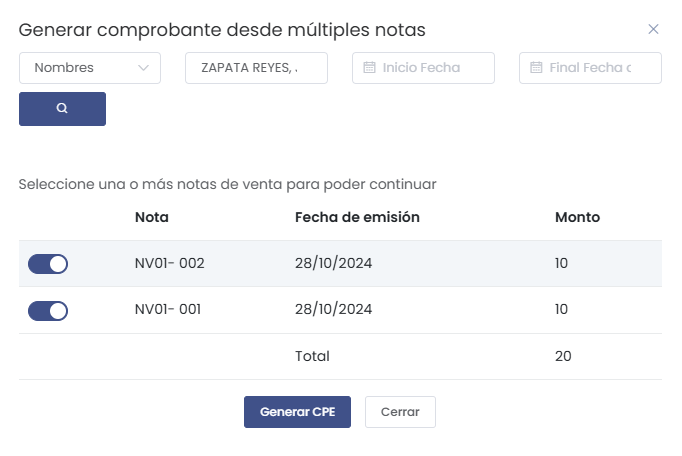
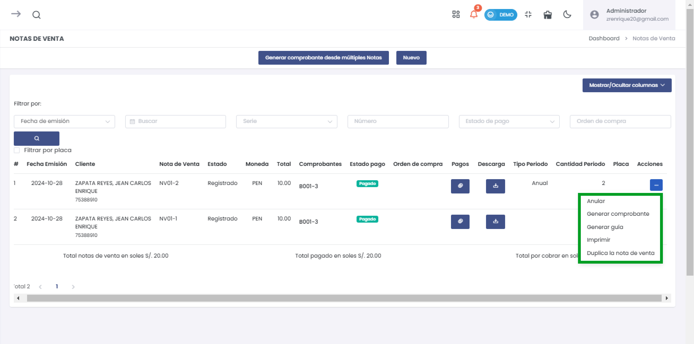
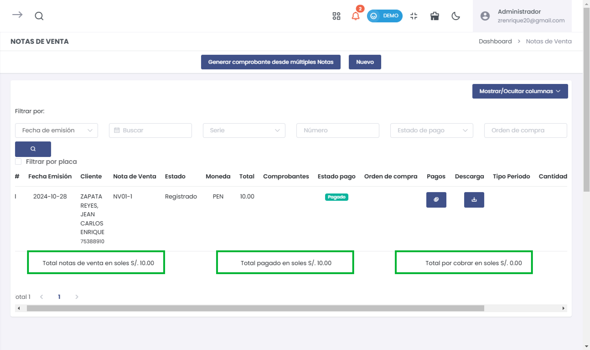
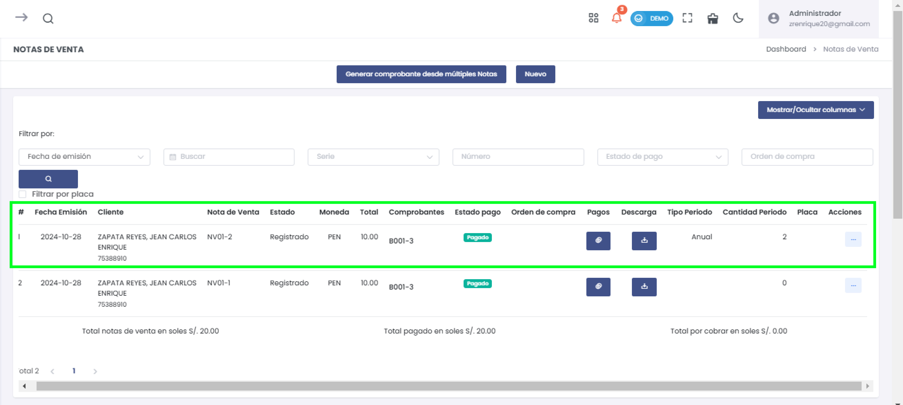

# Notas de Venta

La sección de **Notas de Venta** permite registrar ventas preliminares, gestionarlas y convertirlas en comprobantes electrónicos oficiales. Además, facilita la agrupación de múltiples notas para optimizar los procesos de facturación.

---

## Acceso a Notas de Venta

1. **Navega al módulo de Ventas** en el menú lateral.
2. Selecciona la opción **Notas de Venta**.

---

## Filtrado de Notas de Venta

En esta vista principal, podrás buscar y gestionar notas de venta utilizando varios filtros:

### Opciones de Filtro:
- **Fecha de emisión**: Filtra notas según la fecha en que se registraron.
- **Serie y Número**: Encuentra notas específicas ingresando su serie o número.
- **Estado de pago**: Identifica notas pagadas o pendientes.
- **Moneda**: Filtra por ventas realizadas en **soles (PEN)** o **dólares (USD)**.
- **Orden de compra**: Filtra notas vinculadas a órdenes de compra específicas.

También puedes **Filtrar por placa** si los productos o servicios están asociados a vehículos.

---

## Crear Nueva Nota de Venta

1. Haz clic en el botón **Nuevo** para registrar una nueva nota de venta.

2. **Completa los siguientes campos obligatorios**:

   - **Cliente**: Ingresa el nombre o documento del cliente. Si es nuevo, haz clic en **[+ Nuevo]** para registrarlo.
   - **Establecimiento**: Selecciona la sucursal que emite la nota.
   - **Serie**: Escoge la serie correspondiente para la nota.
   - **Fecha de emisión y vencimiento**: Define las fechas respectivas.
   - **Moneda**: Selecciona entre **Soles (PEN)** o **Dólares (USD)**.
   - **Vendedor**: Elige al vendedor encargado.
   - **Método de pago y destino**: Define la forma de pago y la cuenta o caja donde se registrará.

3. **Agregar Productos o Servicios**:
   - Presiona **+ Agregar Producto**.
   - Completa los datos del producto: nombre, cantidad, precio unitario y subtotal.

4. **Guardar la Nota**: Haz clic en **Guardar** para registrar la nota o **Cancelar** si deseas descartar los cambios.

---

## Generar Comprobante desde Múltiples Notas

Si tienes varias notas registradas, puedes agruparlas para generar un comprobante único:

1. **Haz clic en "Generar comprobante desde múltiples notas"**.

2. **Filtra las notas** según tus criterios (cliente, fecha de emisión, etc.).
3. **Selecciona las notas** que deseas agrupar.
4. Presiona **Buscar** y luego **Generar** para completar la acción.

---

## Opciones y Gestión de Notas

Cada nota de venta tiene un **menú de opciones** para facilitar su gestión:

1. **Anular**: Cancela la nota y la desactiva para uso posterior.
2. **Generar Comprobante**: Convierte la nota en un comprobante oficial.
3. **Generar Guía**: Crea una guía de remisión basada en la nota.
4. **Imprimir**: Genera una copia física para archivo.
5. **Duplicar la Nota de Venta**: Crea una copia exacta para agilizar procesos repetitivos.

---

## Control de Pagos y Totales

Desde esta sección, puedes gestionar el estado de pago de las notas y visualizar los totales.

- **Estado de Pago**: Identifica si la nota está **pagada** o si **queda saldo pendiente**.
- **Total por Cobrar**: Muestra el monto acumulado aún pendiente de pago.
- **Total Pagado**: Refleja el total recibido.

---

## Ejemplo de Vista de Notas

En la siguiente imagen, se muestra cómo se despliegan las notas de venta registradas:

- **Fecha de emisión**: 2024-10-28.
- **Cliente**: ZAPATA REYES, JEAN CARLOS ENRIQUE.
- **Estado**: Registrado.
- **Moneda**: PEN.
- **Total**: S/. 10.00.
- **Estado de pago**: Pagado.
- **Comprobante asociado**: B001-3.
- **Período**: Anual.
- **Cantidad de períodos**: 2.

---

## Conclusión

La sección **Notas de Venta** permite gestionar ventas preliminares de manera eficiente, manteniendo un control claro del estado de cada nota y sus pagos. Con esta herramienta, podrás:

- **Filtrar y encontrar notas rápidamente**.
- **Agrupar notas en un solo comprobante**, optimizando la facturación.
- **Controlar pagos y estados** desde una interfaz intuitiva.
- **Generar documentos oficiales fácilmente** desde cada nota.

Con estas funcionalidades, podrás gestionar tus ventas de forma precisa y eficaz.
