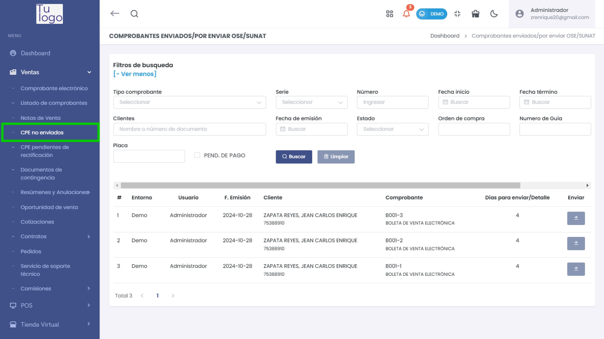
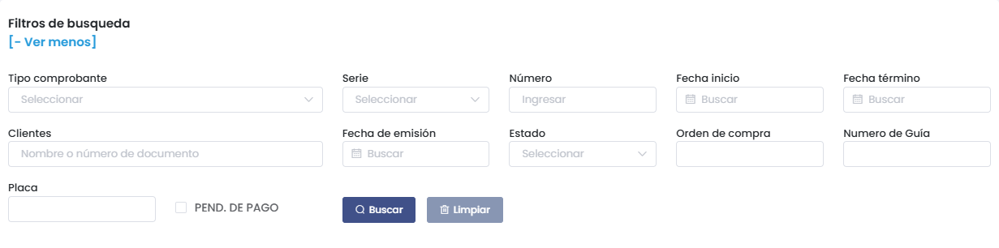
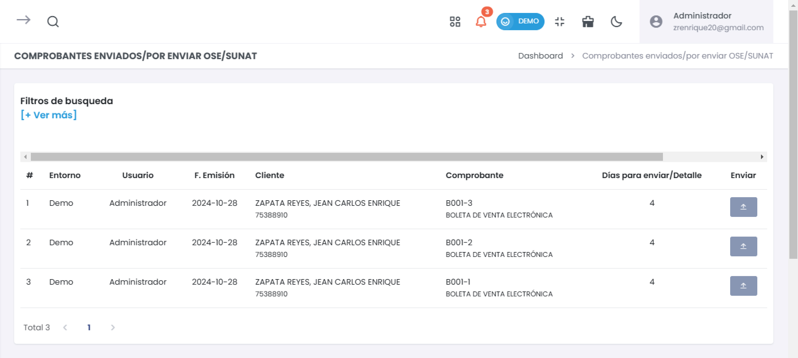
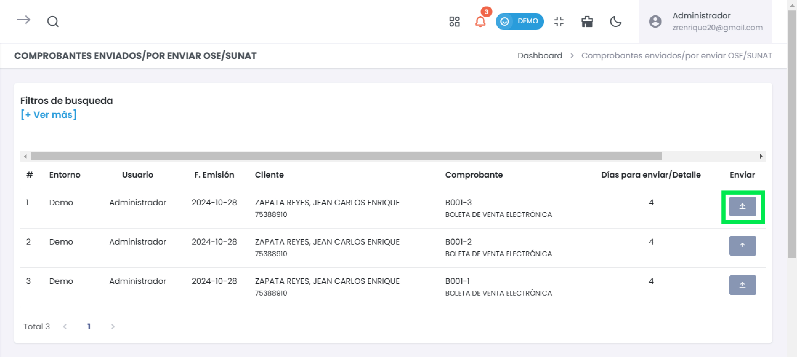

# CPE No Enviados

La sección **CPE No Enviados** permite gestionar aquellos comprobantes electrónicos que aún no han sido enviados al OSE o SUNAT. Desde aquí, puedes verificar el estado de cada comprobante y proceder con su envío manual para cumplir con los plazos exigidos por la normativa.

---

## Acceso a CPE No Enviados

1. En el menú lateral, navega al módulo de **Ventas**.
2. Selecciona la opción **CPE No Enviados**.

---

## Filtros de Búsqueda

Utiliza los **filtros de búsqueda** para encontrar de manera rápida y eficiente los comprobantes que aún no han sido enviados.

### Opciones de Filtro:
- **Tipo de Comprobante**: Selecciona el tipo de comprobante (Factura, Boleta, Nota de Crédito, etc.).
- **Serie y Número**: Permite buscar un comprobante específico por su serie y número.
- **Fecha de Emisión**: Filtra los comprobantes por la fecha en que fueron emitidos.
- **Fecha de Inicio y Fecha de Término**: Rango de fechas para filtrar documentos emitidos entre dos fechas específicas.
- **Estado**: Filtra comprobantes según su estado (registrado, anulado, pendiente de pago, etc.).
- **Cliente**: Busca comprobantes ingresando el nombre o número de documento del cliente.
- **Orden de Compra**: Filtra documentos vinculados a órdenes de compra específicas.
- **Número de Guía**: Permite encontrar comprobantes asociados a una guía de remisión.
- **Pendiente de Pago**: Marca esta casilla para mostrar solo los documentos que aún tienen saldo por pagar.
- **Placa**: Útil para filtrar comprobantes relacionados con el transporte o vehículos.

---

## Vista de Comprobantes No Enviados

En la **tabla principal**, se listan todos los comprobantes electrónicos pendientes de envío al OSE o SUNAT.

Cada fila del listado contiene los siguientes campos:

- **#**: Número secuencial del comprobante en la lista.
- **Entorno**: Indica si el comprobante fue emitido en modo **demo** o **producción**.
- **Usuario**: Nombre del usuario que registró el comprobante.
- **Fecha de Emisión**: Fecha en la que se emitió el comprobante.
- **Cliente**: Nombre del cliente y su número de documento asociado.
- **Comprobante**: Tipo, serie y número del comprobante (Ejemplo: B001-1).
- **Días para Enviar / Detalle**: Muestra los días restantes para enviar el comprobante al OSE/SUNAT.
- **Enviar**: Botón que permite realizar el envío manual del comprobante.

---

## Envío Manual de Comprobantes

Si algún comprobante no ha sido enviado automáticamente, puedes realizar el **envío manual** siguiendo estos pasos:

1. **Verifica los datos del comprobante** para asegurarte de que la información esté completa y correcta.
2. Localiza el comprobante en la lista y presiona el botón de **Enviar** correspondiente.

---

## Recomendaciones Importantes

- **Verifica el estado del comprobante** antes de enviarlo para evitar errores en la validación.
- **Realiza el envío dentro del plazo** indicado en la columna "Días para Enviar" para evitar sanciones por retraso.
- **Monitorea el estado del comprobante** en el OSE/SUNAT después del envío para confirmar su aceptación.

---

## Conclusión

La sección **CPE No Enviados** es fundamental para garantizar que todos los comprobantes electrónicos cumplan con los requisitos legales y lleguen a SUNAT a tiempo. Con esta herramienta podrás:

- **Filtrar y buscar documentos fácilmente** según diversos criterios.
- **Gestionar los envíos manualmente** en caso de fallas automáticas.
- **Evitar sanciones** al enviar los comprobantes dentro del plazo establecido.

Asegúrate de **mantener al día los envíos** y utilizar esta herramienta como un recurso clave para cumplir con la normativa tributaria vigente.
