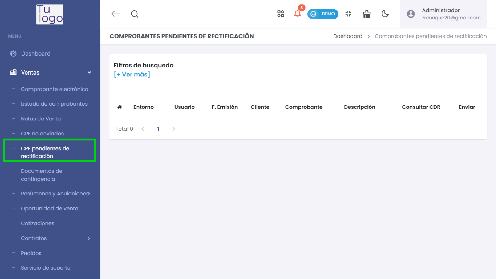
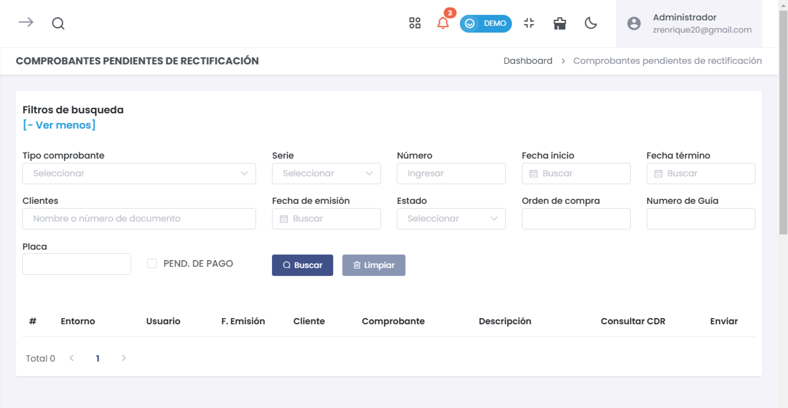

# Comprobantes Pendientes de Rectificación

La sección **Comprobantes Pendientes de Rectificación** permite gestionar los comprobantes que requieren corrección o ajustes antes de su emisión final. Esta funcionalidad es esencial para asegurar la precisión en la información de los comprobantes emitidos.

---

## **1. Acceso al Módulo**
- Desde el menú lateral, dirígete a **Ventas** y selecciona **CPE pendientes de rectificación** para acceder a la lista de comprobantes pendientes de rectificación.

   

---

## **2. Filtros de Búsqueda**
- En la parte superior de la sección, se encuentra el área de **Filtros de búsqueda**. Al hacer clic en **[+ Ver más]**, se despliegan opciones adicionales para realizar una búsqueda detallada de los comprobantes.

   

   - **Tipo comprobante**: Selecciona el tipo de comprobante a buscar (factura, boleta, etc.).
   - **Serie y Número**: Filtra por la serie y el número del comprobante.
   - **Clientes**: Busca por nombre o número de documento del cliente.
   - **Fecha de emisión, Fecha inicio y Fecha término**: Permiten filtrar comprobantes por fechas específicas.
   - **Estado**: Selecciona el estado actual del comprobante.
   - **Orden de compra**: Filtra por el número de orden de compra asociado al comprobante.
   - **Número de Guía**: Filtra por el número de guía de remisión si aplica.
   - **Placa**: Campo para filtrar por placa de vehículos (en caso de ser relevante).
   - **Pend. de pago**: Activa esta casilla para buscar comprobantes pendientes de pago.

### Acciones de Búsqueda
- **Buscar**: Ejecuta la búsqueda con los filtros aplicados.
- **Limpiar**: Restaura los filtros a su estado inicial.

---

## **3. Lista de Comprobantes Pendientes de Rectificación**
- La lista muestra los comprobantes pendientes de rectificación en columnas con la siguiente información:
  - **#**: Número de orden.
  - **Entorno**: Indica si el comprobante está en el entorno de pruebas o producción.
  - **Usuario**: Usuario que generó el comprobante.
  - **F. Emisión**: Fecha de emisión del comprobante.
  - **Cliente**: Nombre o razón social del cliente.
  - **Comprobante**: Tipo y número del comprobante.
  - **Descripción**: Detalles adicionales del comprobante.
  - **Consultar CDR**: Permite consultar el estado del comprobante en la SUNAT mediante el CDR (Constancia de Recepción).
  - **Enviar**: Opción para enviar el comprobante a la SUNAT tras la corrección.

Con estas funcionalidades, la sección **Comprobantes Pendientes de Rectificación** permite un control y gestión precisos de los comprobantes que requieren ajustes antes de su envío o emisión definitiva, garantizando la exactitud y cumplimiento con los requisitos fiscales.
