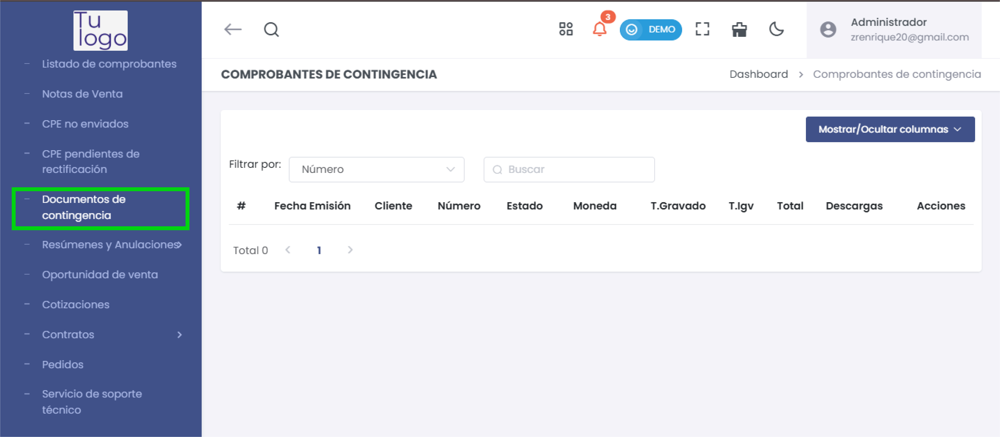

# Comprobantes de Contingencia

La sección **Comprobantes de Contingencia** permite gestionar aquellos comprobantes que fueron generados debido a situaciones de contingencia, donde no fue posible emitir el comprobante de manera regular. Estos comprobantes suelen emplearse cuando el sistema principal de emisión presenta fallos o interrupciones.

---

## **Campos de la Lista de Comprobantes de Contingencia**

En esta sección se muestra una lista de comprobantes de contingencia, organizados en las siguientes columnas:

- **#**: Número de orden de cada comprobante en la lista.
- **Fecha Emisión**: Fecha en la que se emitió el comprobante.
- **Cliente**: Nombre o razón social del cliente al que se le emitió el comprobante.
- **Número**: Número de comprobante asignado en el sistema.
- **Estado**: Estado actual del comprobante (por ejemplo, si ha sido procesado o sigue pendiente).
- **Moneda**: Tipo de moneda en la que se emitió el comprobante (Soles, Dólares, etc.).
- **T.Gravado**: Total de los montos gravados en el comprobante.
- **T.Igv**: Total del Impuesto General a las Ventas (IGV) aplicado en el comprobante.
- **Total**: Monto total del comprobante, incluyendo impuestos.
- **Descargas**: Opción para descargar el comprobante en formato PDF u otros formatos disponibles.
- **Acciones**: Opciones para realizar acciones adicionales sobre el comprobante, como editar o anular el comprobante.

   

Con esta sección, puedes gestionar los comprobantes emitidos en contingencia, asegurando que todos los documentos se encuentren registrados y disponibles para su consulta y gestión.
