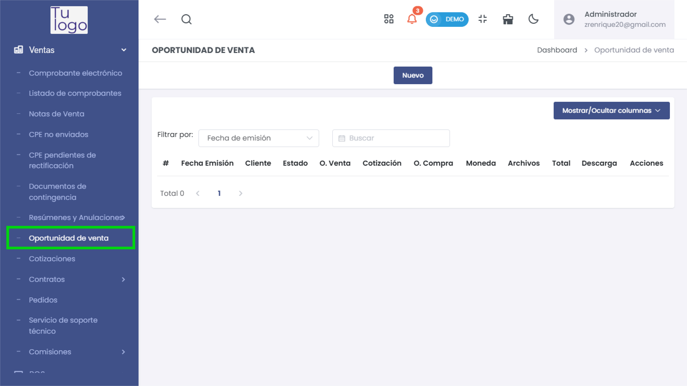
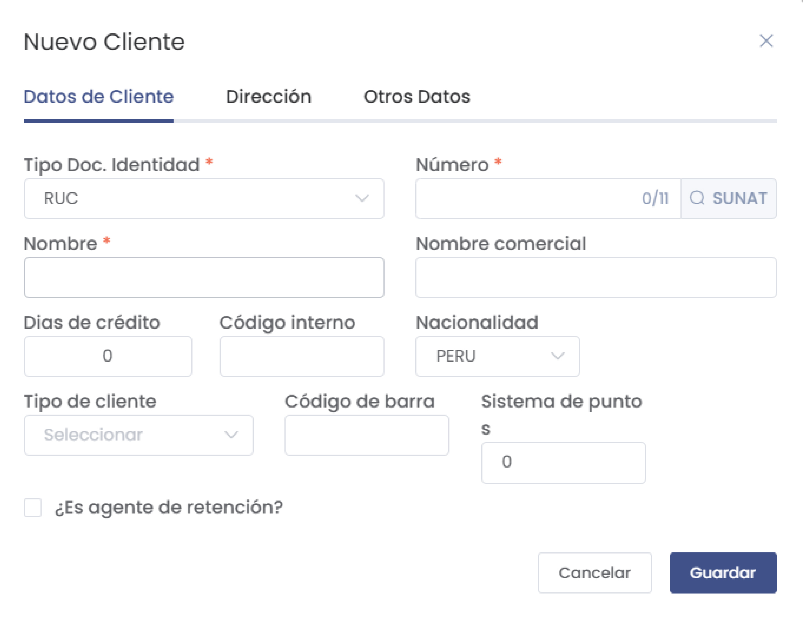
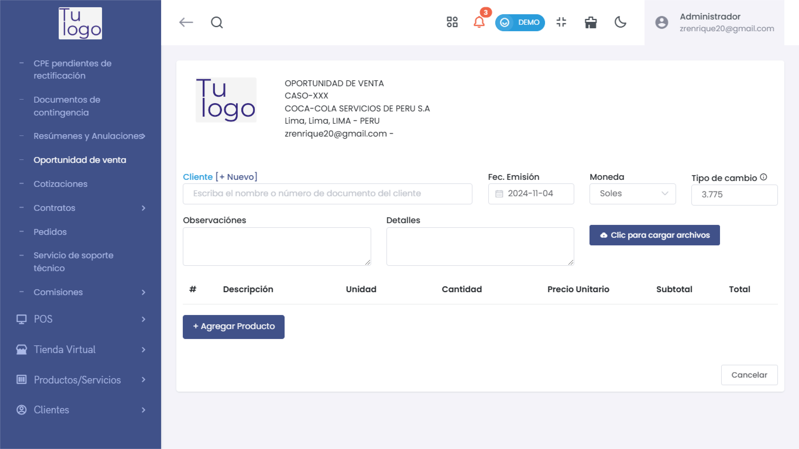

# Oportunidad de Venta

## Acceso a Oportunidades de Venta

1. Dirígete a la opción de **Ventas** en el menú lateral y selecciona **Oportunidad de venta**.
   
2. En esta sección podrás ver un listado de todas las oportunidades de venta registradas, con detalles como **Fecha de Emisión**, **Cliente**, **Estado**, **Total**, entre otros.

   

3. Puedes utilizar el filtro superior para buscar por fecha de emisión o buscar un cliente específico.

---

## Crear una Nueva Oportunidad de Venta

1. **Seleccionar Cliente**:
   - Haz clic en **+ Nuevo** para seleccionar o agregar un nuevo cliente. Completa los campos requeridos como **Tipo de Documento de Identidad**, **Número**, **Nombre**, **Nombre Comercial**, etc.
   - En esta sección, podrás también definir días de crédito y tipo de cliente, además de registrar información de retención si aplica.

     

2. **Detalles de la Venta**:
   - **Fecha de Emisión**: Define la fecha de emisión de la oportunidad de venta.
   - **Moneda**: Selecciona la moneda en la que se efectuará la transacción (ej. Soles).
   - **Tipo de Cambio**: Este campo se autocompleta en base a la moneda seleccionada.

   

3. **Agregar Producto o Servicio**:
   - Haz clic en **+ Agregar Producto** para añadir los productos o servicios a la oportunidad de venta.
   - Selecciona el producto o servicio, define la **Cantidad** y el **Precio Unitario**. También puedes especificar si el producto está afecto al IGV.

     

4. **Observaciones y Detalles**:
   - Puedes agregar observaciones o notas adicionales en el campo de **Observaciones**.
   - **Cargar Archivos**: Si es necesario, haz clic en **Clic para cargar archivos** para adjuntar documentos relevantes a la oportunidad de venta.

---

## Guardar y Gestionar Oportunidades de Venta

- Una vez que hayas completado toda la información, haz clic en **Guardar** para registrar la oportunidad de venta.
- En el listado de oportunidades de venta, podrás ver el detalle de cada una de las oportunidades y realizar acciones como descargar el archivo o editar la información.

---

Esta sección permite una gestión detallada de las oportunidades de venta, facilitando el seguimiento de cada posible venta y la integración con el cliente.
