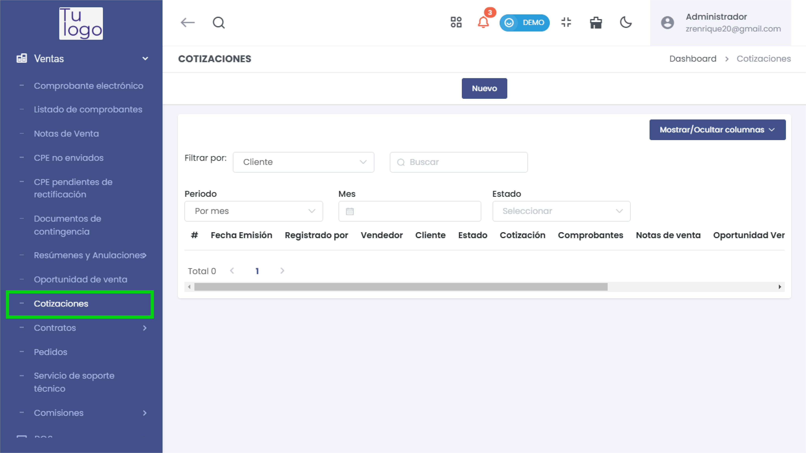
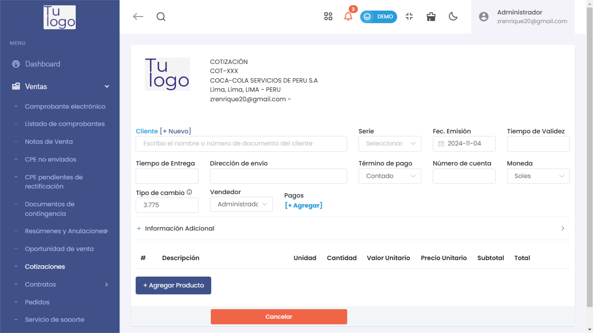
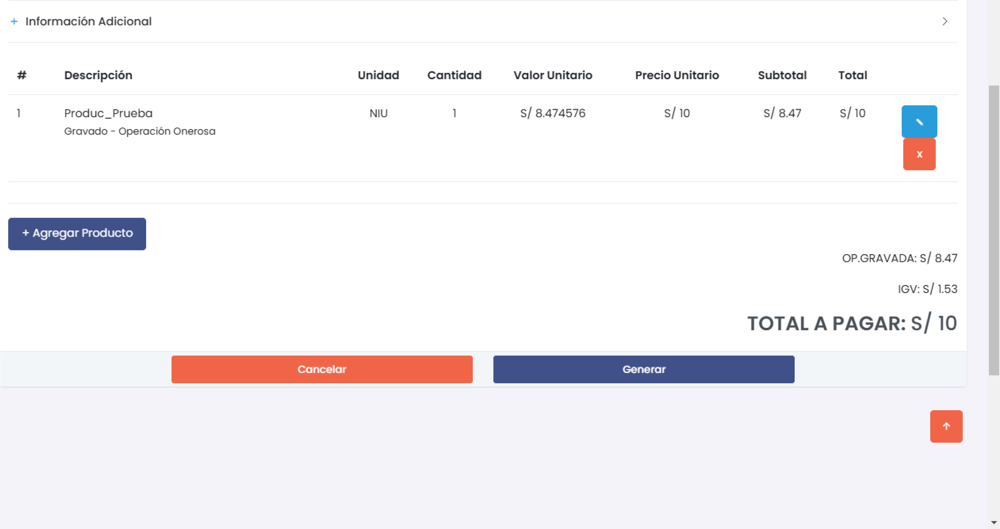

# Cotizaciones

La sección de **Cotizaciones** permite registrar, gestionar y visualizar cotizaciones para clientes en el sistema.

   

## Pantallas y Funcionalidades

### 1. Vista de Cotizaciones

Esta vista muestra una lista de todas las cotizaciones registradas con las siguientes columnas:

- **#**: Número secuencial de la cotización.
- **Fecha Emisión**: Fecha en que se emitió la cotización.
- **Registrado por**: Usuario que registró la cotización.
- **Vendedor**: Vendedor asignado a la cotización.
- **Cliente**: Nombre del cliente al que se le emitió la cotización.
- **Estado**: Estado actual de la cotización (Ej.: Enviada, Aceptada, etc.).
- **Cotización**: Número de la cotización.
- **Comprobantes**: Vinculación con comprobantes relacionados.
- **Notas de Venta**: Notas de venta asociadas a la cotización.
- **Oportunidad Venta**: Referencia a la oportunidad de venta asociada.
- **Acciones**: Opciones para ver o editar la cotización.

#### Filtros de búsqueda

Permite filtrar las cotizaciones por:
- **Cliente**
- **Período** (Ej.: por mes)
- **Mes**
- **Estado**

### 2. Registro de Nueva Cotización

Para crear una nueva cotización, se puede hacer clic en el botón **Nuevo**. Esto abrirá un formulario con los siguientes campos:

   

- **Cliente**: Campo de búsqueda para seleccionar el cliente al que se le emitirá la cotización.
- **Serie**: Selección de la serie de la cotización.
- **Fec. Emisión**: Fecha de emisión de la cotización.
- **Tiempo de Validez**: Plazo en que la cotización es válida.
- **Tiempo de Entrega**: Tiempo estimado para la entrega del producto o servicio.
- **Dirección de envío**: Dirección a donde se enviará el pedido.
- **Término de pago**: Condiciones de pago (Ej.: Contado, Crédito).
- **Número de cuenta**: Número de cuenta para pagos.
- **Moneda**: Tipo de moneda en la que se hará la cotización.
- **Tipo de cambio**: Tipo de cambio actual, si corresponde.
- **Vendedor**: Usuario encargado de la venta.
- **Pagos**: Opción para agregar detalles de pagos.

#### Información Adicional

La sección **Información Adicional** permite incluir otros detalles relevantes para la cotización.

   

#### Agregar Productos o Servicios

Cada cotización permite agregar productos o servicios con los siguientes datos:

- **Descripción**: Descripción del producto o servicio.
- **Unidad**: Unidad de medida del producto o servicio.
- **Cantidad**: Número de unidades del producto o servicio.
- **Valor Unitario**: Precio por unidad antes de impuestos.
- **Precio Unitario**: Precio total por unidad después de impuestos.
- **Subtotal**: Subtotal para cada ítem.
- **Total**: Total acumulado por ítem.

### 3. Resumen de Totales

Al final del formulario de productos, se presenta un resumen con:

- **OP.GRAVADA**: Total de operaciones gravadas.
- **IGV**: Total del impuesto general a las ventas.
- **TOTAL A PAGAR**: Suma total de la cotización.

### Botones de Acción

- **Cancelar**: Permite cancelar el registro de la cotización y volver a la lista de cotizaciones.
- **Generar**: Guarda y emite la cotización.

## Ejemplo de Uso

1. Ir a la sección **Ventas > Cotizaciones** en el menú lateral.
2. Filtrar y revisar cotizaciones previas en la lista.
3. Hacer clic en **Nuevo** para registrar una nueva cotización.
4. Completar el formulario con los datos del cliente, productos y condiciones de venta.
5. Revisar el **Resumen de Totales** y hacer clic en **Generar** para finalizar la cotización.

Este proceso permite gestionar cotizaciones de manera ágil y precisa para los clientes.

---
