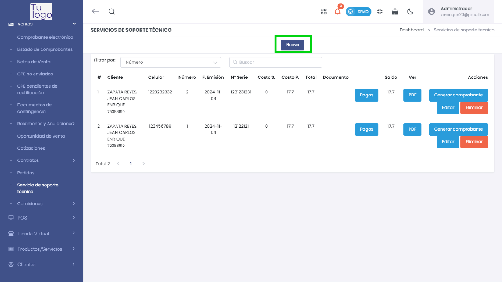
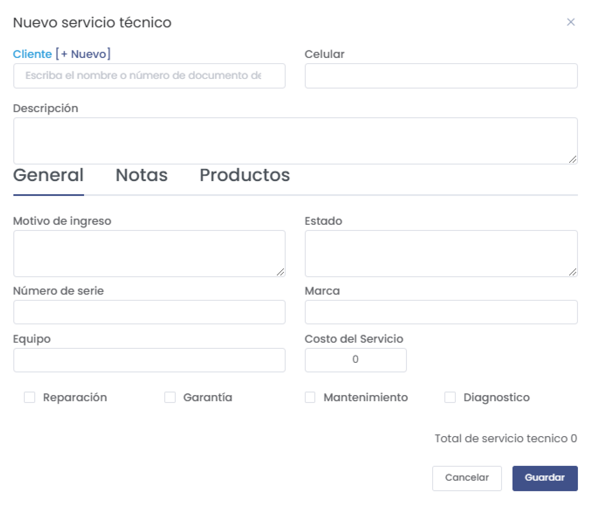
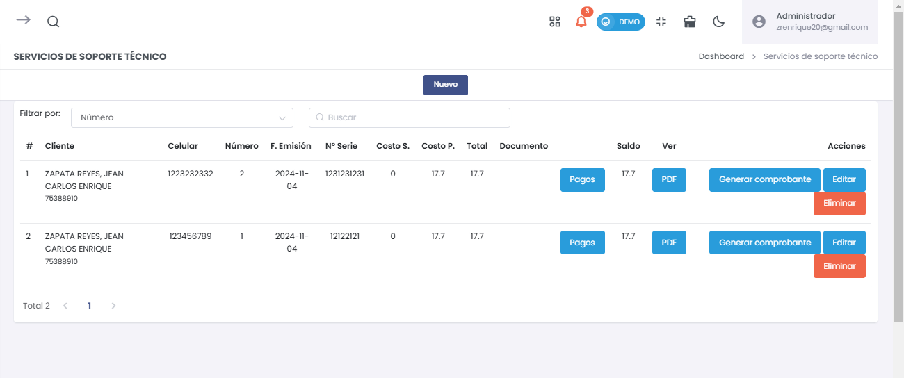
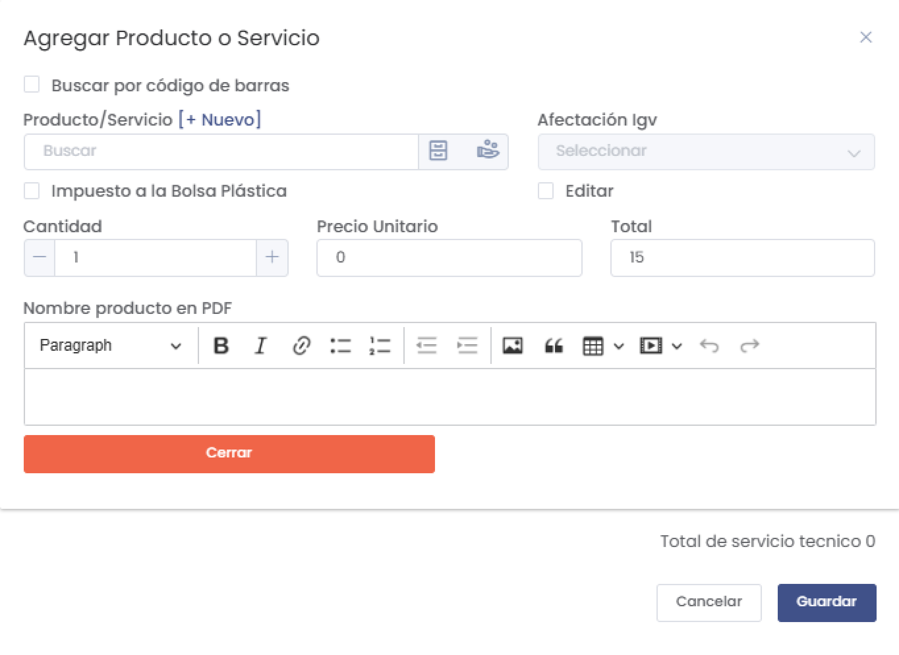
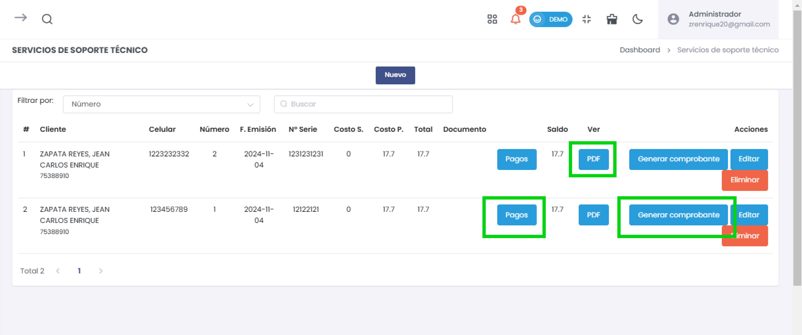

# Módulo: Servicio de Soporte Técnico

El módulo de **Servicio de Soporte Técnico** permite la gestión de servicios técnicos para clientes, incluyendo información sobre el cliente, detalles del servicio, notas y productos utilizados. Este módulo facilita el seguimiento y documentación de cada caso de soporte técnico.

## Pantallas y funcionalidades

### 1. Crear un nuevo servicio técnico
Esta pantalla permite registrar un nuevo servicio técnico para un cliente.

- **Cliente**: Campo para buscar y seleccionar el cliente. Puedes agregar uno nuevo si no existe en el sistema.
- **Celular**: Número de contacto del cliente.
- **Descripción**: Detalles del servicio requerido.
- **Pestañas**:
  - **General**: Información principal sobre el servicio (motivo de ingreso, estado, número de serie, marca, equipo, costo del servicio).
  - **Notas**: Permite añadir observaciones o detalles adicionales sobre el servicio. Puedes agregar varias notas.
  - **Productos**: Detalles de los productos o servicios utilizados en el soporte técnico, incluyendo cantidad, precio unitario y total.

### 2. Listado de servicios de soporte técnico
Esta pantalla muestra un listado de todos los servicios técnicos registrados, con la posibilidad de filtrar y buscar servicios por número.

- **Columnas**:
  - **Cliente**: Nombre y documento del cliente.
  - **Celular**: Número de contacto del cliente.
  - **Número**: Identificador único del servicio.
  - **F. Emisión**: Fecha de creación del servicio.
  - **Nº Serie**: Número de serie del equipo.
  - **Costo S.**: Costo del servicio.
  - **Costo P.**: Costo de los productos.
  - **Total**: Total del servicio.
  - **Documento**: Estado del pago del servicio.
  - **Saldo**: Saldo restante del servicio.
  - **Acciones**: Permite editar, eliminar, generar comprobante y visualizar en PDF.

### 3. Agregar Producto o Servicio
Ventana emergente que permite añadir productos o servicios al soporte técnico.

- **Campos**:
  - **Producto/Servicio**: Campo de búsqueda para seleccionar el producto o servicio.
  - **Cantidad**: Cantidad del producto o servicio.
  - **Precio Unitario**: Precio por unidad del producto o servicio.
  - **Total**: Total calculado según la cantidad y el precio unitario.
  - **Nombre producto en PDF**: Campo para personalizar el nombre del producto en el documento PDF.

### 4. Exportar e imprimir
Opciones para imprimir o descargar el comprobante en formato A4 y enviarlo por correo.

## Funcionalidades adicionales
- **Generar comprobante**: Permite crear un comprobante de pago del servicio.
- **PDF**: Genera una vista en PDF del servicio técnico.
- **Pagos**: Botón para gestionar los pagos del servicio técnico.
- **Editar/Eliminar**: Opciones para modificar o eliminar el registro del servicio.

## Navegación
Este módulo se encuentra en la sección **Ventas > Servicio de soporte técnico** del menú principal.

## Ejemplo de flujo de trabajo
1. Seleccionar **Nuevo** para crear un nuevo servicio técnico.
2. Completar la información del cliente y la descripción del servicio.
3. Agregar notas o productos necesarios.
4. Guardar el servicio.
5. Desde el listado, puedes generar el comprobante, visualizar en PDF o gestionar los pagos.

## Notas
Este módulo está diseñado para facilitar la gestión de servicios técnicos, manteniendo un registro detallado de cada caso de soporte y permitiendo el seguimiento de pagos y documentación adicional.
