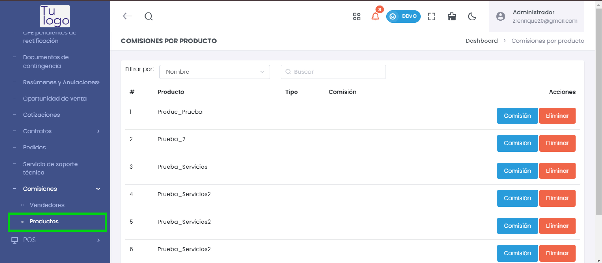
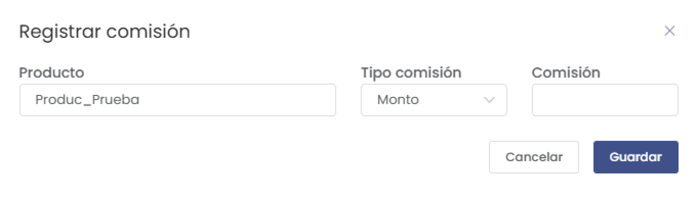

# Documentación de Comisiones por Producto

La sección **Comisiones por Producto** permite asignar comisiones específicas a cada producto o servicio, facilitando el seguimiento y administración de las comisiones que corresponden por la venta de cada uno.

## Funcionalidades Principales

### 1. Visualización de Comisiones
La pantalla principal muestra una lista de los productos con sus comisiones asignadas. Se incluyen las siguientes columnas:

- **#**: Número identificador de la fila.
- **Producto**: Nombre del producto o servicio al que se le asigna la comisión.
- **Tipo**: Tipo de comisión (porcentaje o monto fijo).
- **Comisión**: Valor de la comisión.
- **Acciones**: Botones para **Editar** y **Eliminar** la comisión asignada.

### 2. Filtros de Búsqueda
La lista cuenta con opciones de filtrado para encontrar productos específicos:

- **Filtro por**: Permite filtrar la lista por **Nombre**, **Código interno**, **Marca** o **Categoría** del producto.
- **Buscar**: Campo de texto para ingresar términos de búsqueda específicos.

### 3. Registro de Comisiones
Para registrar una nueva comisión, selecciona el botón **Comisión** al lado del producto deseado. Aparecerá un formulario donde puedes especificar:

- **Producto**: Nombre del producto o servicio (preseleccionado).
- **Tipo comisión**: Selecciona si la comisión es un **Monto** fijo o un **Porcentaje**.
- **Comisión**: Valor de la comisión.

> **Nota**: Un producto no puede tener múltiples comisiones del mismo tipo. Cada tipo de comisión se puede registrar una única vez para cada producto.

### 4. Acciones Disponibles
Cada producto listado tiene opciones específicas de acción:

- **Comisión**: Abre el formulario para registrar una comisión.
- **Eliminar**: Permite borrar la comisión asignada al producto.

Al completar los datos y seleccionar **Guardar**, la comisión se aplicará al producto y estará disponible en la lista de comisiones.

## Reglas de Uso

- **Unicidad de Comisiones**: No se permite asignar múltiples comisiones del mismo tipo (por ejemplo, dos comisiones de tipo "Monto") a un mismo producto.
- **Edición de Comisiones**: Las comisiones asignadas pueden ser modificadas en cualquier momento desde el botón **Editar** en la lista principal.
- **Eliminación de Comisiones**: Para eliminar una comisión, utiliza el botón **Eliminar** en la lista principal, al lado del producto correspondiente.

Este módulo facilita la gestión de comisiones asociadas a productos, permitiendo un control preciso y sencillo sobre los incentivos de venta asignados a cada ítem en el sistema.
