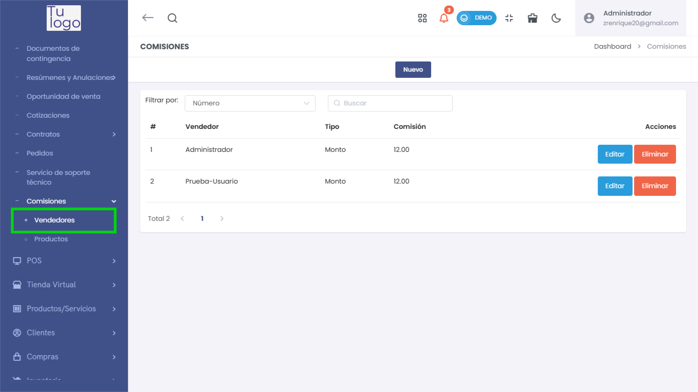
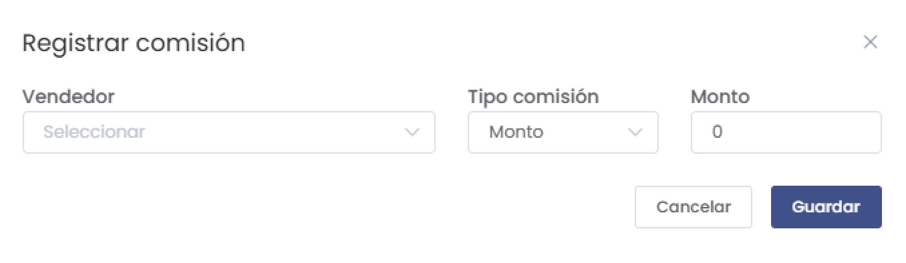

# Comisiones - Vendedores

## Vista General
La sección "Comisiones - Vendedores" permite gestionar las comisiones asignadas a cada vendedor. En esta vista, puedes ver una tabla que muestra los vendedores registrados junto con el tipo de comisión y el monto asignado. Además, proporciona opciones para **editar** o **eliminar** cada registro de comisión.

- **#**: Número de orden del registro.
- **Vendedor**: Nombre del vendedor al que se ha asignado la comisión.
- **Tipo**: Tipo de comisión (Ej. "Monto", "Porcentaje").
- **Comisión**: Monto o porcentaje asignado como comisión.
- **Acciones**: Opciones para editar o eliminar el registro de comisión.

## Registrar Comisión

Para registrar una nueva comisión, haz clic en el botón **Nuevo** en la parte superior de la vista de comisiones. Aparecerá un formulario con los siguientes campos:

- **Vendedor**: Selecciona el vendedor al que deseas asignar la comisión.
- **Tipo comisión**: Define si la comisión será en **monto** o **porcentaje**.
- **Monto**: Especifica el valor de la comisión asignada.

> **Nota:** No se puede registrar al mismo vendedor más de una vez en esta sección. Si intentas registrar una comisión para un vendedor que ya está en la lista, el sistema mostrará un mensaje de error indicando que el vendedor ya tiene una comisión asignada.
