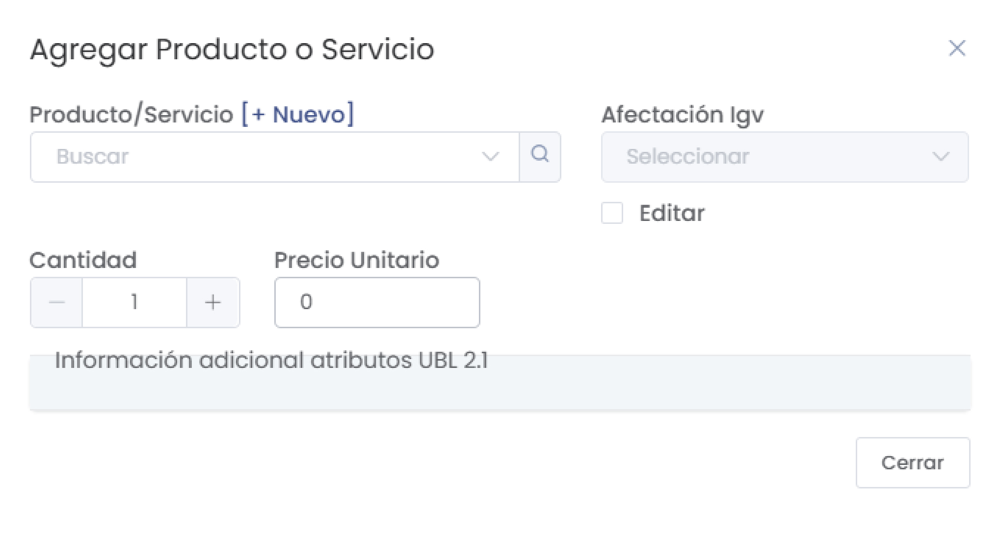

# Módulo de Contratos

Este módulo permite la gestión y creación de contratos con clientes en la plataforma.

## Pantalla de Contrato Nuevo

En esta pantalla, se pueden ingresar los detalles de un nuevo contrato con un cliente.

### Campos Principales

- **Cliente**: Nombre o número de documento del cliente. Opción de agregar un nuevo cliente si no está en la base de datos.
- **Fec. Emisión**: Fecha en que se emite el contrato.
- **Fec. Vencimiento**: Fecha de vencimiento del contrato.
- **Fec. Entrega**: Fecha de entrega del producto o servicio.
- **Moneda**: Selección de la moneda en que se realizará el contrato.
- **Tipo de cambio**: Tipo de cambio aplicable al contrato.

### Detalles de Productos/Servicios

- **Descripción**: Descripción del producto o servicio a incluir en el contrato.
- **Unidad**: Unidad de medida del producto.
- **Cantidad**: Cantidad del producto o servicio.
- **Valor Unitario**: Valor unitario antes de impuestos.
- **Precio Unitario**: Precio unitario después de impuestos.
- **Subtotal**: Subtotal antes de impuestos.
- **Total**: Total del producto o servicio.

### Opciones

- **Agregar Producto**: Permite agregar productos o servicios al contrato.
- **Método de pago**: Método de pago elegido para el contrato.
- **Destino**: Destino del pago (por ejemplo, "Caja General").
- **Monto**: Monto a pagar por el cliente.

---

## Listado de Contratos

En esta pantalla se pueden visualizar y filtrar los contratos existentes.

### Filtros de Búsqueda

- **Fecha de emisión**: Filtra los contratos según su fecha de emisión.
- **Cliente**: Permite buscar contratos asociados a un cliente específico.
- **Estado**: Filtra los contratos por su estado actual (ejemplo: registrado, pendiente, etc.).
- **Moneda**: Filtra los contratos según la moneda seleccionada.

### Campos en la Tabla

- **#**: Número de contrato.
- **Fecha Emisión**: Fecha en que se emitió el contrato.
- **Vendedor**: Vendedor asignado al contrato.
- **Cliente**: Cliente asociado al contrato.
- **Estado**: Estado actual del contrato.
- **Contrato**: Identificador del contrato.
- **Cotización**: Referencia a la cotización asociada, si aplica.
- **Moneda**: Moneda en la que se estableció el contrato.
- **T.Gravado**: Total gravado del contrato.
- **T.Igv**: Total IGV del contrato.
- **Total**: Monto total del contrato.

---

## Agregar Producto o Servicio

Este formulario permite añadir un nuevo producto o servicio al contrato.

### Campos

- **Producto/Servicio**: Selección del producto o servicio a agregar.
- **Cantidad**: Cantidad del producto o servicio.
- **Precio Unitario**: Precio unitario del producto o servicio.
- **Afectación IGV**: Selección de la afectación de IGV para el producto o servicio.

---

## Funcionalidad de Generación

El botón **Generar** permite finalizar y generar el contrato con los productos y servicios añadidos.

---

## Opciones de Impresión y Descarga

En esta sección, el usuario tiene opciones para imprimir o descargar el contrato en formato A4 y enviarlo por correo electrónico.

- **Imprimir A4**: Genera una vista para imprimir el contrato en formato A4.
- **Descargar A4**: Permite descargar el contrato en formato A4.
- **Enviar por correo**: Introduce el correo electrónico en el campo de texto y selecciona **Enviar** para enviar el contrato a la dirección ingresada.

-------------

## Funcionalidades Adicionales

- **Cancelar**: Cancela la creación o edición del contrato.
- **Descargar PDF**: Opción para descargar el contrato en formato PDF.
- **Agregar Información Adicional**: Permite incluir detalles adicionales en el contrato, como notas u observaciones específicas.

---

Para más información o ayuda sobre el uso de este módulo, contacta con el administrador de la plataforma.
