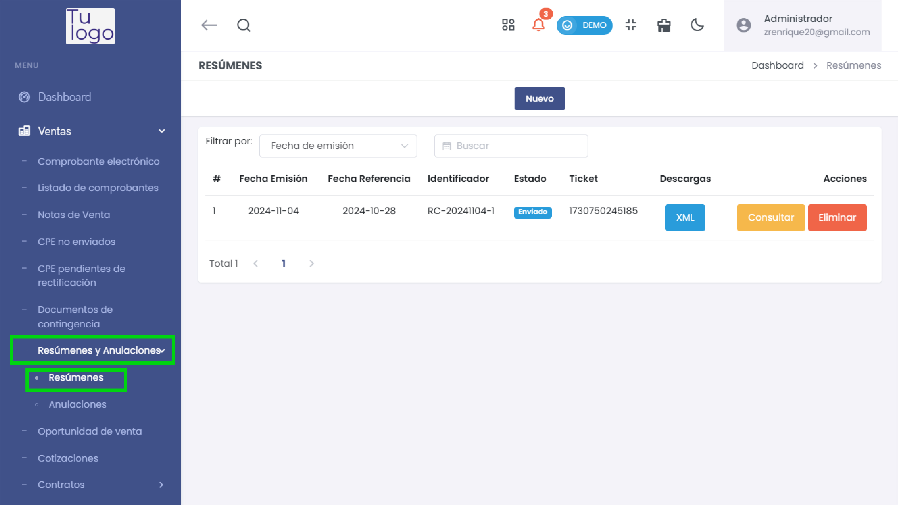
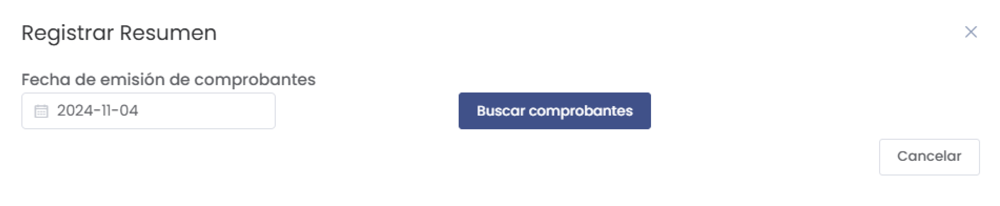
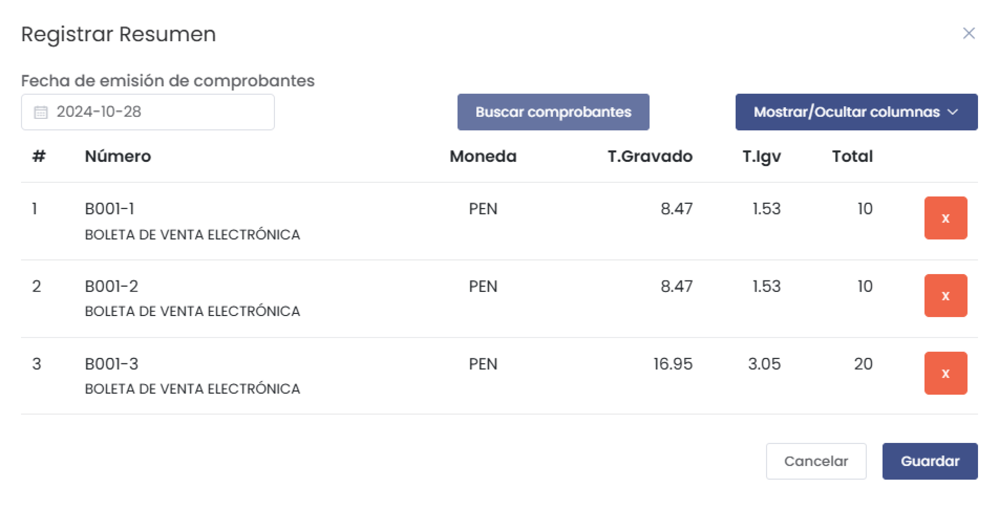
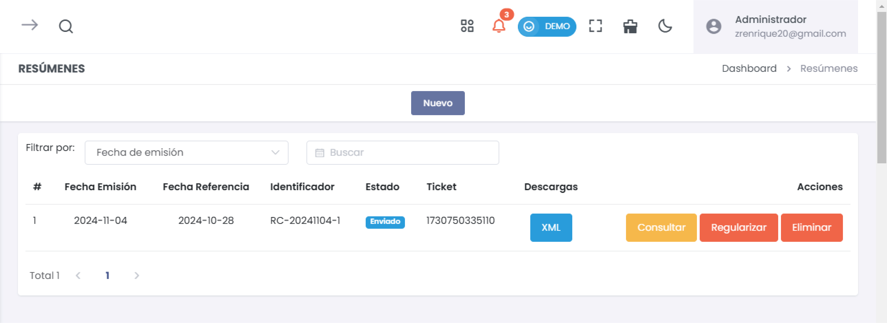

# Resúmenes

La sección **Resúmenes** permite gestionar los resúmenes diarios de comprobantes de venta electrónicos. Esto es útil para consolidar la información de varios comprobantes en un solo resumen que se envía a la SUNAT (Superintendencia Nacional de Aduanas y de Administración Tributaria).

   

---

## **Registrar Resumen**

   

Para registrar un nuevo resumen, debes ingresar la **Fecha de emisión de comprobantes** que deseas consolidar y luego hacer clic en **Buscar comprobantes**. Esto mostrará los comprobantes correspondientes a esa fecha, con los siguientes campos:

- **#**: Número de orden del comprobante en la lista.
- **Número**: Número del comprobante, incluyendo el tipo (por ejemplo, Boleta de Venta Electrónica).
- **Moneda**: Moneda en la que se emitió el comprobante.
- **T.Gravado**: Total de los montos gravados en el comprobante.
- **T.Igv**: Total del IGV aplicado en el comprobante.
- **Total**: Monto total del comprobante, incluyendo impuestos.

Una vez que se han revisado los comprobantes, puedes hacer clic en **Guardar** para consolidar el resumen.

   

---

## **Lista de Resúmenes**

En esta sección se muestra una lista de resúmenes registrados, con los siguientes campos:

- **#**: Número de orden del resumen en la lista.
- **Fecha Emisión**: Fecha en la que se emitió el resumen.
- **Fecha Referencia**: Fecha a la que corresponde el resumen de los comprobantes.
- **Identificador**: Código único asignado al resumen.
- **Estado**: Estado actual del resumen (Ej.: Enviado).
- **Ticket**: Número de ticket asociado al resumen.
- **Descargas**: Opción para descargar el resumen en formato XML.
- **Acciones**:
  - **Consultar**: Permite revisar el estado del resumen en SUNAT.
  - **Eliminar**: Opción para eliminar el resumen si es necesario.

   

Esta funcionalidad permite gestionar de forma eficiente el envío y verificación de resúmenes diarios ante la SUNAT, asegurando que los comprobantes de venta estén correctamente consolidados y enviados.
