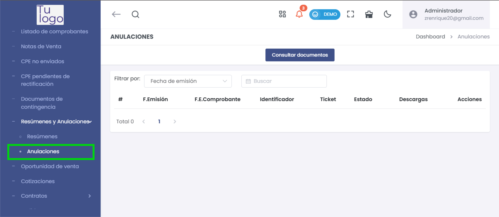

# Anulaciones

La sección **Anulaciones** permite gestionar las solicitudes de anulación de comprobantes emitidos. Aquí se pueden ver los detalles de cada solicitud de anulación y su estado en el sistema.

---

## **Consultar Documentos de Anulación**

Para consultar un documento de anulación, ingresa a esta sección y selecciona el filtro por **Fecha de emisión** o realiza una búsqueda específica en el campo de búsqueda. Luego, presiona el botón **Consultar documentos** para actualizar la lista de anulación.

### Campos en la lista de Anulaciones:

- **#**: Número de orden de la anulación en la lista.
- **F.Emisión**: Fecha en que se emitió el comprobante que se desea anular.
- **F.E.Comprobante**: Fecha de emisión del comprobante original.
- **Identificador**: Código único que identifica la solicitud de anulación.
- **Ticket**: Número de ticket generado para el seguimiento de la anulación.
- **Estado**: Estado actual de la solicitud de anulación (Ej.: Enviado, Procesado, etc.).
- **Descargas**: Opciones para descargar los documentos relacionados a la anulación, si están disponibles.
- **Acciones**: Acciones adicionales que se pueden realizar, como consultar detalles específicos de la anulación.

   

Esta funcionalidad permite a los usuarios gestionar y verificar el estado de las solicitudes de anulación de comprobantes, asegurando que todos los documentos se manejen de manera eficiente en el sistema.
