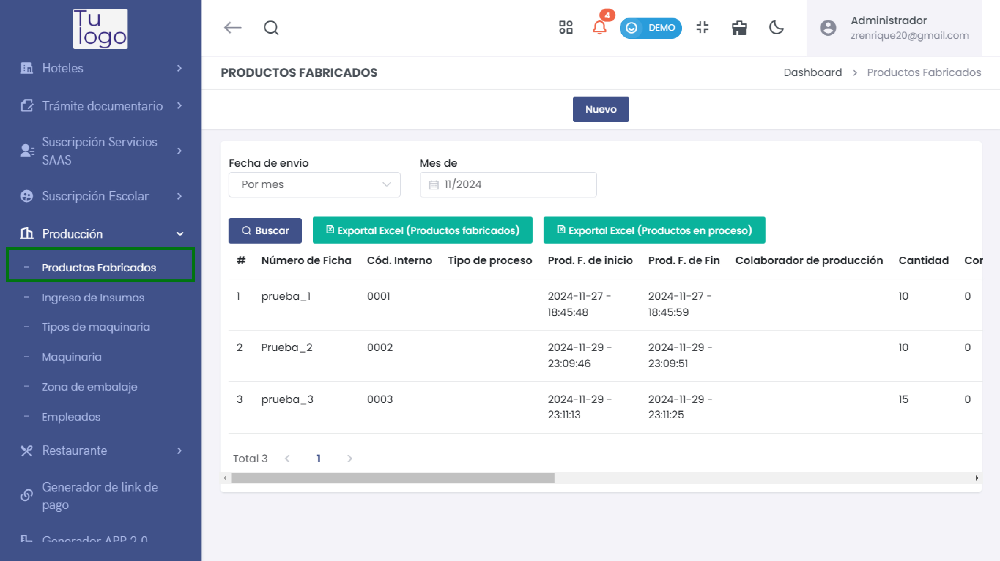
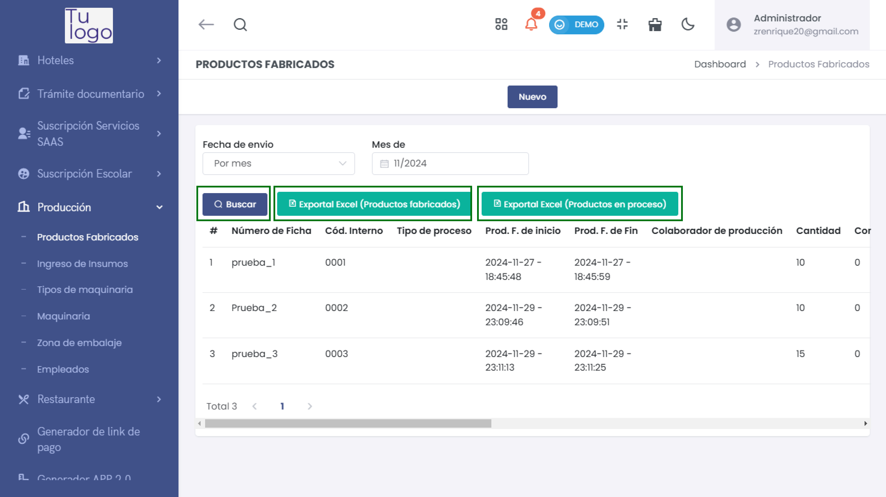
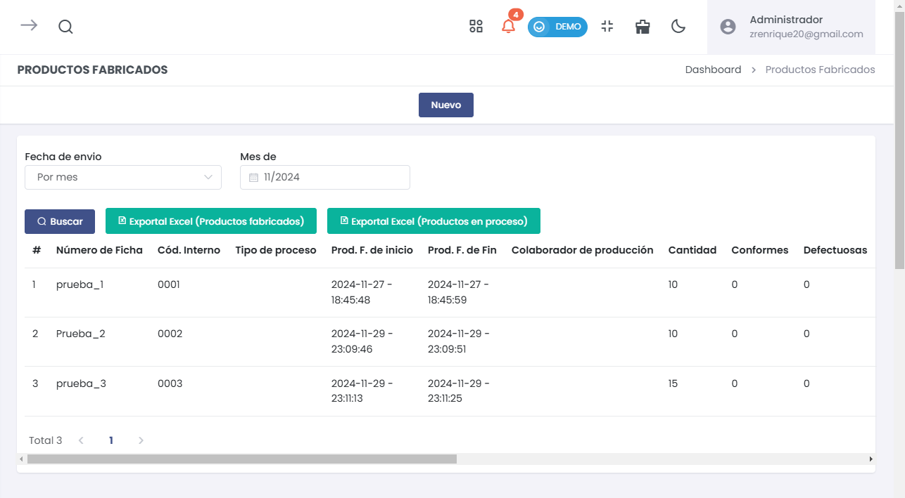
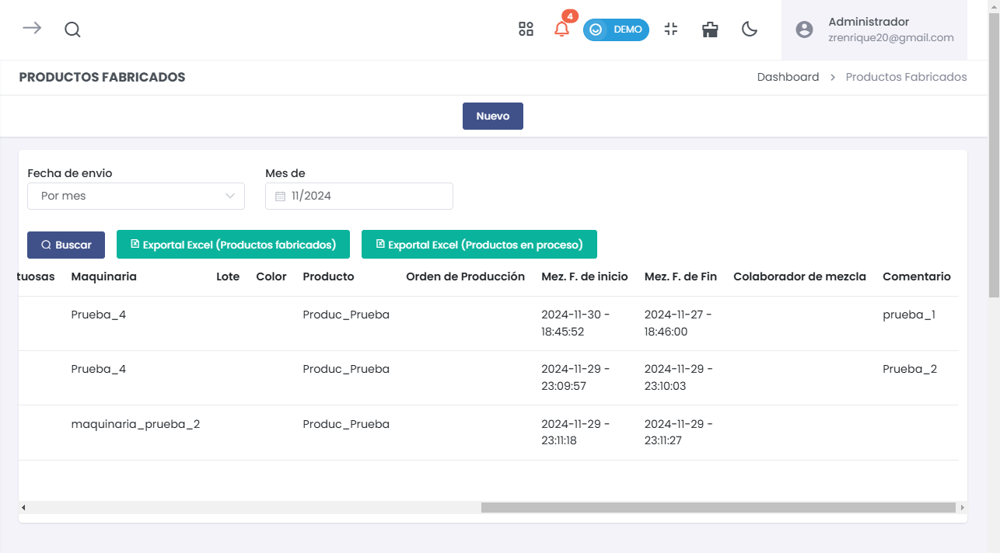
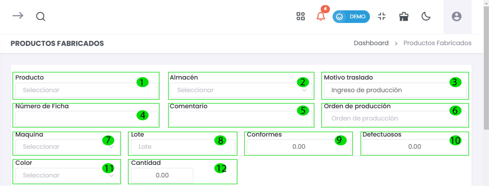
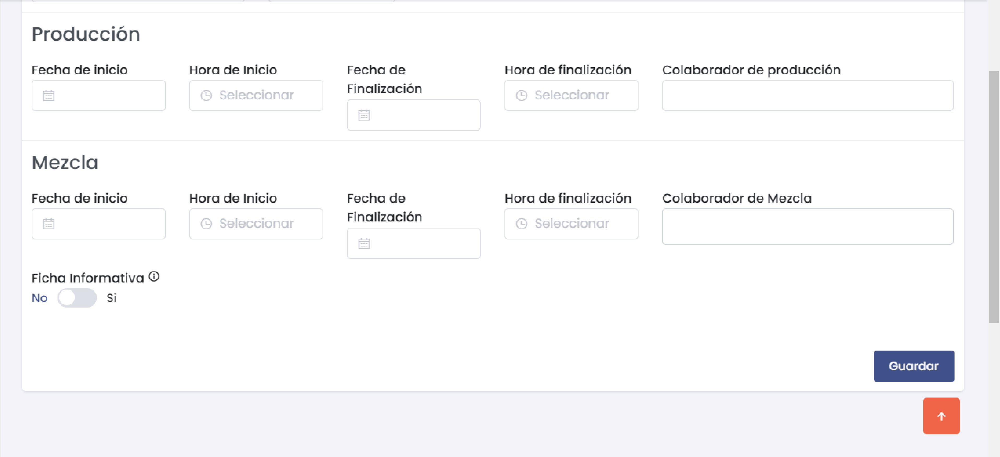

# Productos Fabricados  

En esta sección se abordará el manejo de los productos fabricados dentro de la aplicación, permitiendo una gestión eficiente de los datos relacionados con el proceso de producción.  

## Acceso a la Sección de Productos Fabricados  

Para acceder a la sección de productos fabricados, sigue estos pasos:  

1. **Menú Principal**: Dirígirse al menú principal en el lado izquierdo de la pantalla.  
2. **Seleccionar Módulo**: Busca y selecciona el módulo de **Producción**.  
3. **Navegar a Productos Fabricados**: En el submenú, selecciona **Productos Fabricados** para acceder a la pantalla donde podrás gestionar los productos.  

## Pantalla Principal de Productos Fabricados  

### Vista General  
En la pantalla principal, se puede visualizar la lista de productos fabricados, junto con la opción de crear un nuevo registro. También hay herramientas para exportar los datos a Excel y filtros para buscar información específica.  

  

### Componentes de la Pantalla  

- **Buscar**: Herramienta para localizar información específica.  
- **Exportar Excel**: Opciones para exportar tanto productos fabricados como productos en proceso a un archivo Excel.  
- **Nuevo**: Botón para crear un nuevo producto fabricado.  

 

## Listado de Productos Fabricados  

A continuación se presenta un listado de ejemplos de productos fabricados, cada uno con su respectiva información básica.  

### Imagen 1: Listado de Productos   

  

- **Columnas**:  
  - **Número de Ficha**: Identificación única del producto.  
  - **Cód. Interno**: Código interno asignado para referencia.  
  - **Tipo de proceso**: Tipo de producción involucrado.  
  - **Prod. F. de inicio**: Fecha y hora de inicio de producción.  
  - **Prod. F. de Fin**: Fecha y hora de finalización de producción.  
  - **Colaborador de producción**: Persona encargada de la producción.  
  - **Cantidad**: Cantidad producida.  
  - **Conformes**: Número de productos conformes.  
  - **Defectuosas**: Número de productos defectuosos. 

### Imagen 2: Listado de Productos   

  

- **Columnas**:  
  - **Maquinaria**: Indica la máquina utilizada en el proceso.  
  - **Lote**: Número de lote asignado al producto.  
  - **Color**: Color del producto fabricado.  
  - **Producto**: Nombre del producto.  
  - **Orden de Producción**: Registro de la orden de producción iniciada.  
  - **Mez. F. de inicio**: Fecha y hora de inicio del proceso de mezcla.  
  - **Mez. F. de Fin**: Fecha y hora de finalización del proceso de mezcla.  
  - **Colaborador de mezcla**: Persona encargada de la mezcla.  
  - **Comentario**: Notas adicionales del proceso.  

---  

## Formulario para Productos Fabricados  

### Sección de Creación de Productos  

Al seleccionar "Nuevo", se desplegará un formulario donde se podrán introducir los datos del producto a fabricar.  

  

### Campos del Formulario  

1. **Producto**: Seleccionar el tipo de producto a fabricar.  
2. **Almacén**: Seleccionar el almacén donde se almacenará el producto.  
3. **Motivo de Traslado**: Especificar el motivo del traslado de producción.  
4. **Número de Ficha**: Asignar un número único para identificar la ficha del producto.  
5. **Comentario**: Agregar notas relevantes sobre el producto.  
6. **Orden de Producción**: Indicar el número o referencia de la orden de producción.  
7. **Máquina**: Seleccionar la máquina que será utilizada en la producción.  
8. **Lote**: Ingresar el número de lote correspondiente.  
9. **Conformes**: Especificar la cantidad de productos conformes producidos.  
10. **Defectuosos**: Indicar la cantidad de productos defectuosos.  
11. **Color**: Seleccionar el color del producto.  
12. **Cantidad**: Ingresar la cantidad que se desea producir.

### Sección de Producción y Mezcla  

 

#### Producción  

- **Fecha de Inicio**: Fecha en que comienza el proceso de producción.  
- **Hora de Inicio**: Hora de inicio del proceso.  
- **Fecha de Finalización**: Fecha en que se espera finalizar la producción.  
- **Hora de Finalización**: Hora de finalización de la producción.  
- **Colaborador de Producción**: Nombre del colaborador encargado de esta tarea.  

#### Mezcla  

- **Fecha de Inicio**: Fecha en que comienza el proceso de mezcla.  
- **Hora de Inicio**: Hora de inicio del proceso de mezcla.  
- **Fecha de Finalización**: Fecha en que se espera finalizar la mezcla.  
- **Hora de Finalización**: Hora de finalización del proceso de mezcla.  
- **Colaborador de Mezcla**: Nombre del colaborador encargado de la mezcla.  
- **Ficha Informativa**: Opción para indicar si se requiere una ficha informativa.  

## Guardar Productos  

Para finalizar el registro, asegúrate de revisar toda la información introducida y selecciona el botón **Guardar** para guardar el nuevo producto fabricado.  

---  

# Resumen de Funcionalidades  

- **Gestión de Productos**: Permite añadir, editar y visualizar productos fabricados.  
- **Exportación a Excel**: Facilita la obtención de informes en formato Excel.  
- **Registro Eficiente**: Los campos bien definidos garantizan que toda la información necesaria esté disponible para una adecuada gestión del proceso de producción.  
