# Ingreso de Insumos  

Antes de registrar un insumo, es necesario realizar una configuración previa en el módulo de **Productos/Servicios**. Esto garantiza que todos los insumos necesarios estén correctamente definidos y asociados a los productos que se utilizarán en la producción.   

### 1. Configuración Previa  

Para que un producto pueda utilizar insumos, es fundamental que esté adecuadamente configurado. A continuación se presentan las imágenes que ilustran el proceso de configuración en el módulo de **Productos/Servicios**:  

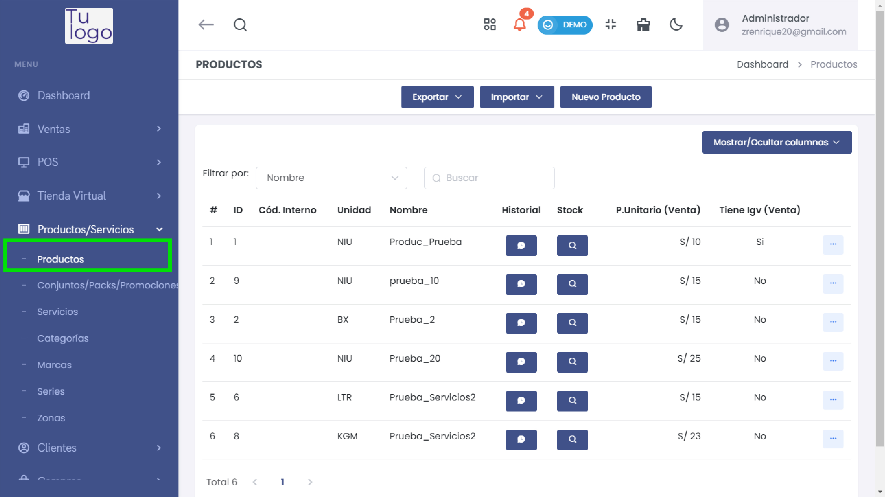  

1. **Acceder a la gestión de productos**: Aquí podrás ver un listado de todos los productos existentes.  

2. **Seleccionar un producto**: Haz clic en el producto que deseas configurar.  

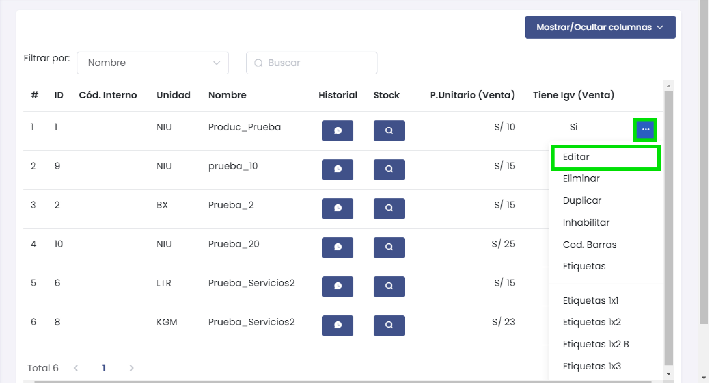 

3. **Editar Producto**: En la sección de edición del producto, asegúrate de que se marque la opción "Este producto, ¿requiere insumos?" y agrega los insumos necesarios para la producción.  

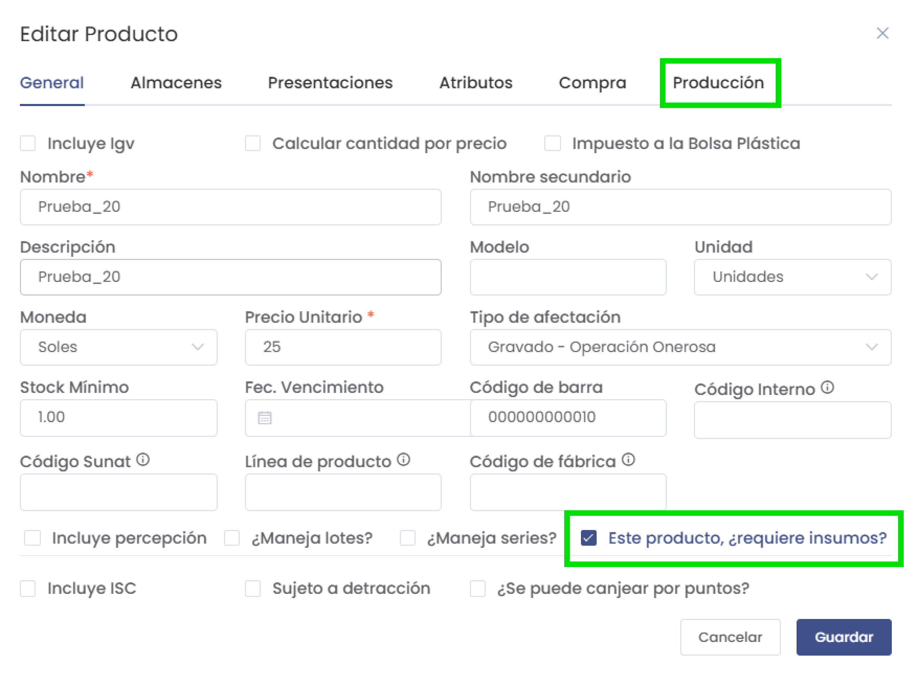   

4. **Configurar Produccion**: Aquí puedes añadir un insumo para el producto.  
 
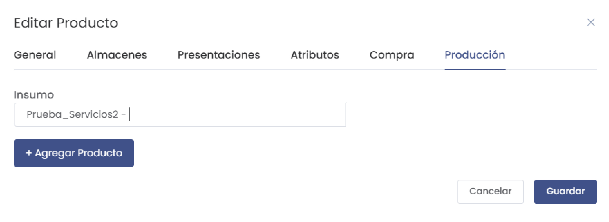 

5. **Guardar cambios**: Asegúrate de guardar los cambios realizados en la configuración del producto.

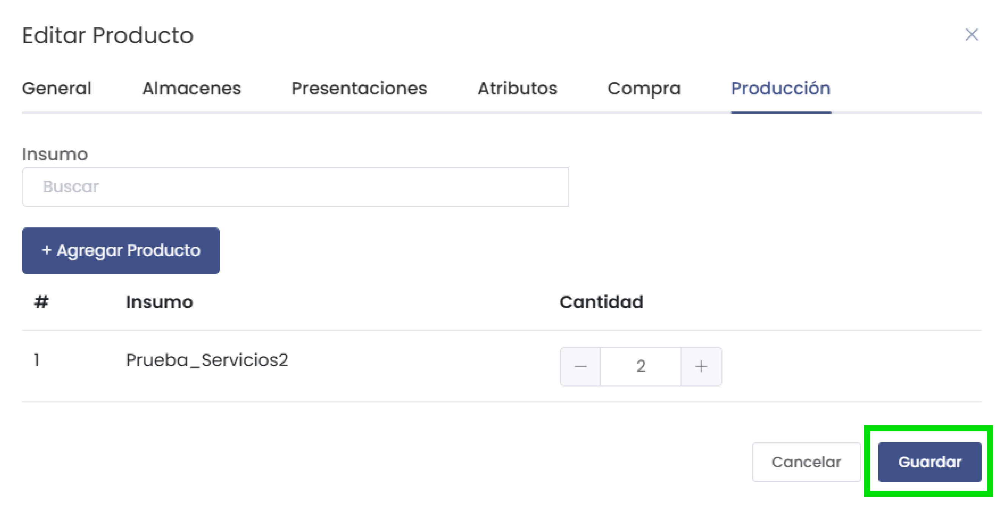 

### 2. Registro de Ingresos de Insumos  

Una vez que la configuración del producto esté completa, puedes proceder a registrar el ingreso de insumos. Para acceder al módulo de **Ingreso de Insumos**:  

1. Desde el panel principal, dirígete a la sección de **Producción**.  
2. Selecciona **Ingreso de Insumos**.  

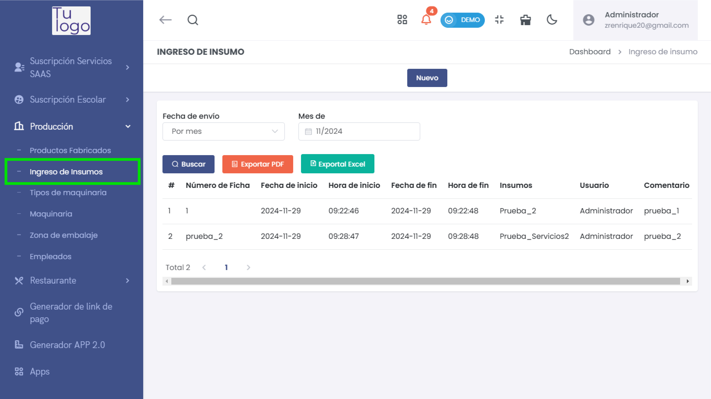  

### 3. Agregar un Nuevo Ingreso de Insumos  

Una vez en el módulo de **Ingreso de Insumos**, sigue estos pasos:  

1. Haz clic en el botón **Nuevo** para iniciar el registro de un nuevo ingreso.  

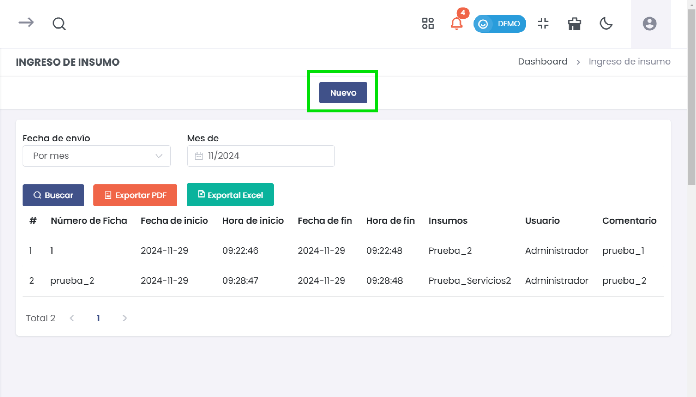  

2. Completa los siguientes campos en el formulario que aparecerá: 

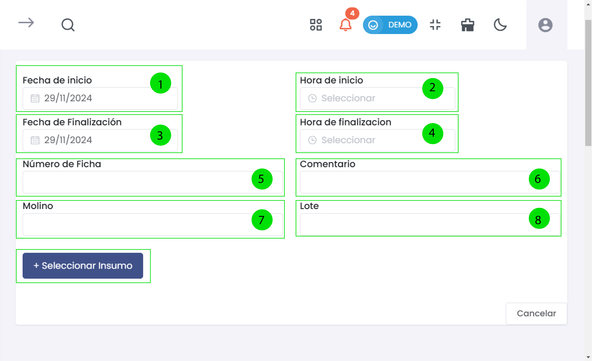 

   - **Fecha de inicio**: Selecciona la fecha en la que comienza el ingreso.  
   - **Hora de inicio**: Selecciona la hora de inicio del ingreso.  
   - **Número de Ficha**: Introduce un número de referencia único para el ingreso.  
   - **Comentario**: Agrega notas relevantes sobre el ingreso de insumos.  
   - **Molino**: Indica el molino asociado al ingreso (si aplica).  
   - **Lote**: Introduce el número de lote correspondiente al ingreso.  

   Asegúrate de seleccionar los insumos que se están ingresando usando el botón **+ Seleccionar Insumo**.  

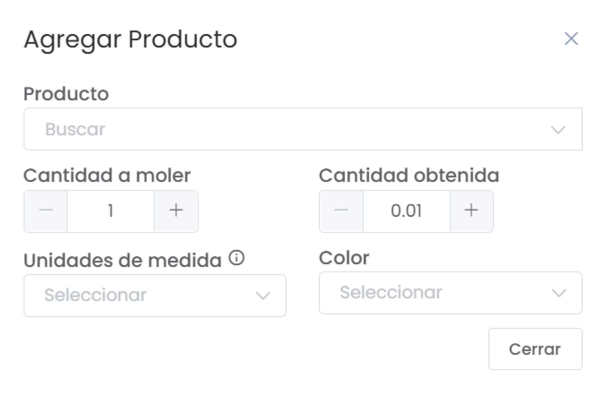  

3. Completa los detalles del insumo que se está registrando, como **Cantidad a moler** y **Cantidad obtenida**.  

4. Revisa todos los campos y haz clic en **Generar** para completar el registro del ingreso.  

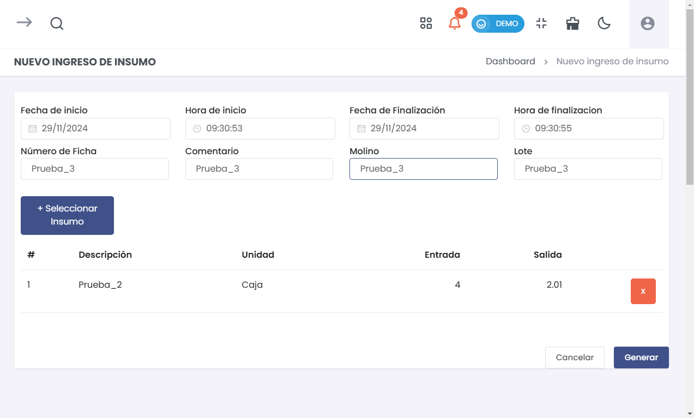  

### 4. Visualizar los Registros de Ingreso  

Una vez registrado, puedes visualizar todos los ingresos de insumos desde el listado principal. Aquí podrás buscar por número de ficha y exportar los datos a PDF o Excel si es necesario.  

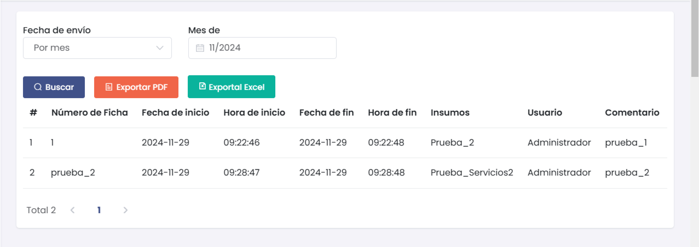  

### Resumen  

La configuración correcta de los productos en el módulo de **Productos/Servicios** es esencial para optimizar el ingreso de insumos. Asegúrate de completar adecuadamente cada paso para facilitar el proceso de producción y garantizar que todos los insumos estén disponibles para el uso en el momento necesario.