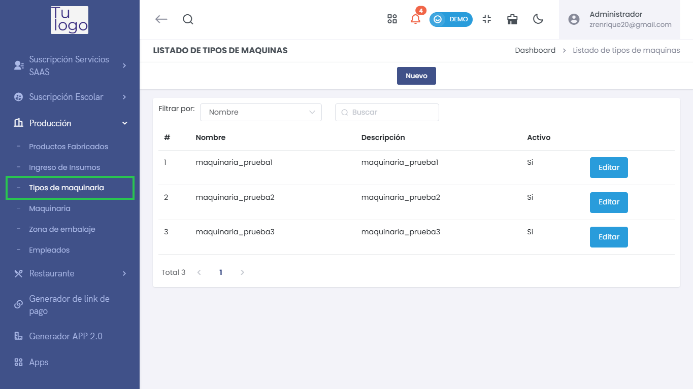
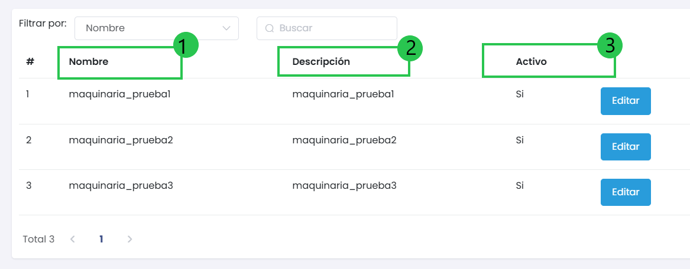
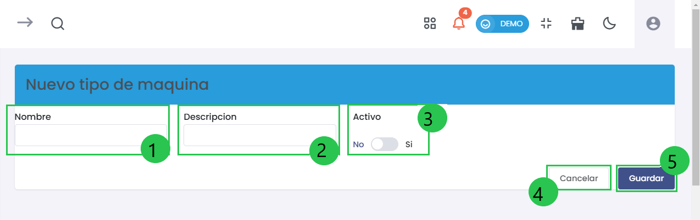

# Tipos de Maquinaria  

El submódulo de **Tipos de Maquinaria** dentro del módulo de **Producción** permite gestionar y registrar diferentes tipos de maquinaria utilizados en los procesos productivos. A continuación, se detallan las opciones disponibles para añadir y editar tipos de maquinaria.  

  

---  

## 1. Listado de Tipos de Maquinaria  

Al acceder a la sección de **Tipos de Maquinaria**, verás un listado con los tipos de maquinaria actualmente registrados en el sistema.  

  

### Columnas del Listado:  
- **#**: Número de registro.  
- **Nombre**: Nombre del tipo de maquinaria.  
- **Descripción**: Breve descripción del tipo de maquinaria.  
- **Activo**: Estado del tipo de maquinaria (Si/No) que indica si está disponible para uso.  

Puedes utilizar los filtros disponibles para buscar tipos de maquinaria específicos.  

---  

## 2. Agregar Nuevo Tipo de Maquinaria  

Para agregar un nuevo tipo de maquinaria, selecciona el botón **Nuevo** ubicado en la parte superior derecha de la pantalla principal. Esto abrirá un formulario para ingresar los detalles del nuevo tipo.  

  

### Elementos del Formulario:  
- **1. Nombre**: Introduce el nombre que identificaría al nuevo tipo de maquinaria.  
- **2. Descripción**: Proporciona una breve descripción que explique las características del tipo de maquinaria.  
- **3. Activo**: Selecciona el estado como **Sí** o **No** para determinar si el tipo de maquinaria está activo.  

##### Botones Disponibles:  
- **4. Cancelar**: Cierra el formulario sin guardar.  
- **5. Guardar**: Al hacer clic, se registrará el nuevo tipo de maquinaria en el listado.  

---  

## 3. Editar un Tipo de Maquinaria Existente  

En el listado de tipos de maquinaria, cada entrada cuenta con un botón **Editar**. Al seleccionar este botón, podrás modificar los detalles del tipo de maquinaria seleccionado.  
 
