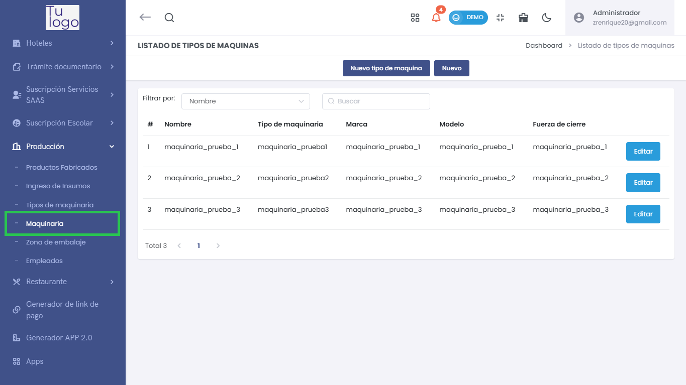
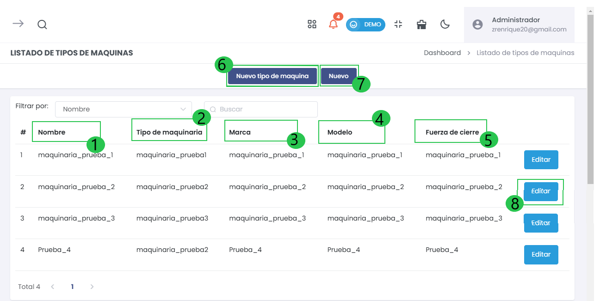
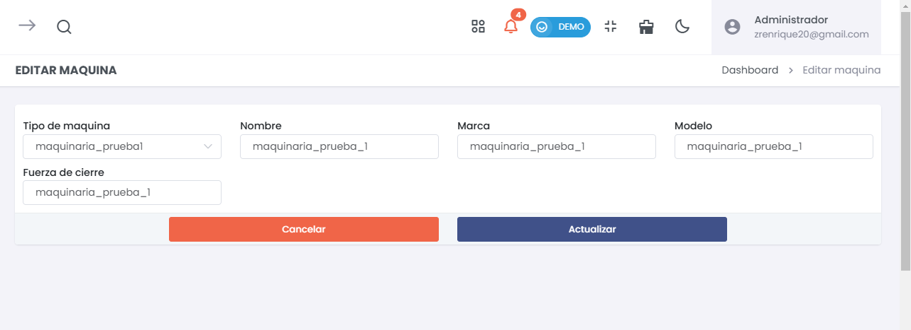
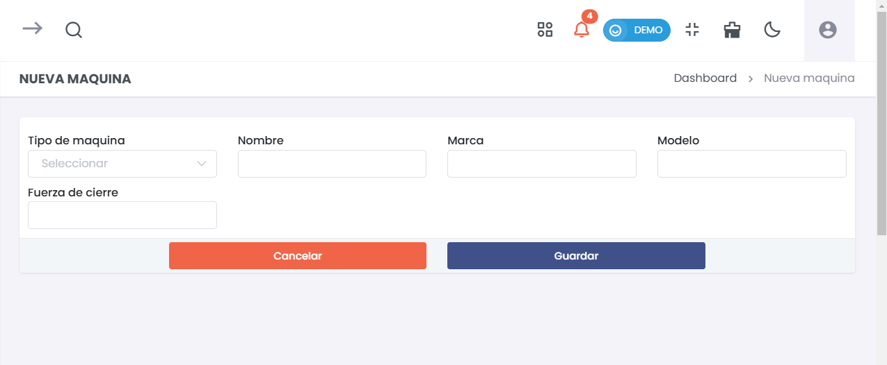

# Maquinaria  

La sección de Maquinaria permite gestionar diversos tipos de máquinas utilizadas en los procesos de producción. Puedes agregar nuevos tipos de maquinaria, así como visualizar y editar la información existente de las máquinas registradas en el sistema.  

---  

### 1. Acceso al Módulo de Maquinaria  
Para acceder a esta sección, dirígete desde el menú lateral a **Producción > Maquinaria**. Desde allí, podrás administrar todas las entradas relacionadas con la maquinaria.  

  

---  

### 2. Listado de Maquinaria  
En la pantalla principal de la maquinaria, verás un listado que incluye: 

 

#### Columnas del Listado:  
- **#**: Número de registro.  
- **1. Nombre**: Nombre del tipo de maquinaria.  
- **2. Tipo de maquinaria**: Categoría o tipo específico de la máquina.  
- **3. Marca**: Marca del fabricante de la máquina.  
- **4. Modelo**: Modelo específico de la máquina.  
- **5. Fuerza de cierre**: Capacidad de la máquina en términos de fuerza.  

Puedes buscar maquinaria específica mediante el filtro que ofrece la barra superior. Además, se incluye la opción de agregar:

- **6. Nuevo Tipo de Maquinaria**  
- **7. Nuevo**.  

- **8. Edición de Maquinaria Existente**
Cada entrada en el listado de maquinaria tiene un botón **Editar**, que te permite modificar los detalles de la maquinaria específica seleccionada. Simplemente haz clic en este botón para acceder al formulario de edición.  

  

---  

### 3. Nueva Maquinaria  
Para agregar una nueva maquinaria, haz clic en el botón **Nuevo**. Esto abrirá el siguiente formulario:  

  

#### Elementos del Formulario:  
- **Tipo de máquina**: Selecciona la categoría correspondiente de la máquina.  
- **Nombre**: Ingresa un nombre identificativo para la maquinaria.  
- **Marca**: Especifica la marca del fabricante.  
- **Modelo**: Indica el modelo específico de la maquinaria.  
- **Fuerza de cierre**: Introduce la fuerza de cierre de la máquina.  

##### Botones Disponibles:  
- **Cancelar**: Cierra el formulario sin guardar cambios.  
- **Guardar**: Al hacer clic, se guardará la nueva entrada en el listado de maquinaria.  

Para más información sobre cómo gestionar los **tipos de maquinaria**, visualice el siguiente **[artículo](https://fastura.github.io/documentacion/Pro-X/Produccion/Tipos-de-Maquinaria)**.  

